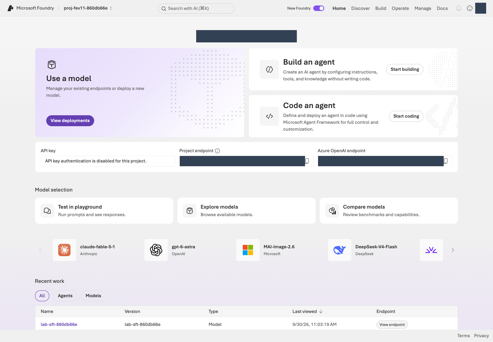
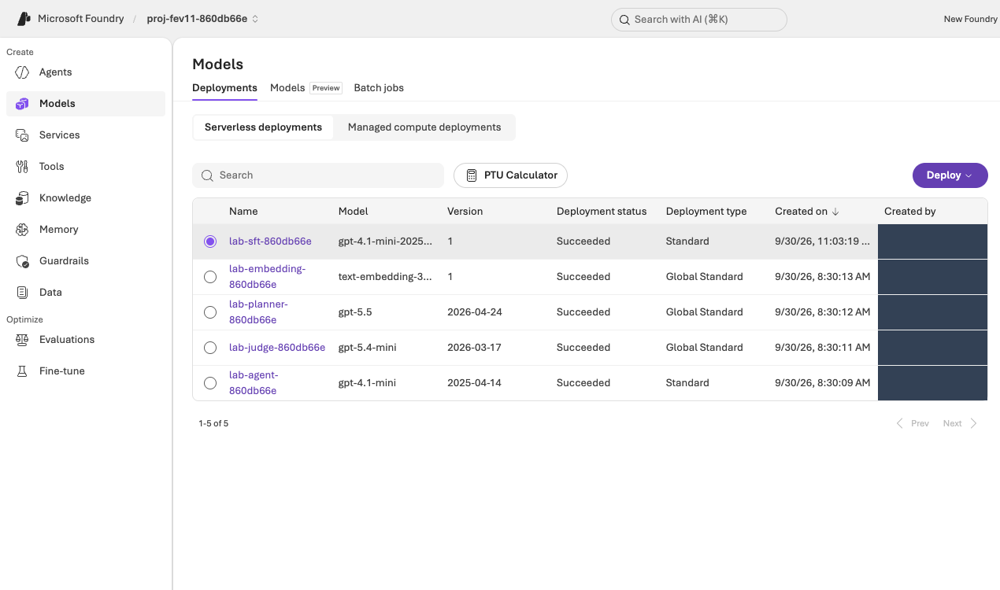

# 운영자 준비·승인·정리 안내 {#operator-guide}

[처음부터 진행하는 10단계](handbook.md#setup) · [강사 안내](facilitator.md#prepare) · [실행 이슈](troubleshooting.md) · [최신 v2 검증](verification.md)

이 문서는 참가자 가이드의 **02 생성 승인, 03 Agent 준비, 10 삭제**에 필요한 운영자 참고 자료입니다. 직접 준비하는 참가자도 사용할 수 있습니다. 실습을 시작할 수 없는 빈칸을 남기지 않도록 실제 값과 완료 상태를 인수표에 기록합니다.

## 새 환경과 준비된 환경을 구분합니다 {#start}

| 상황 | 진행 방법 |
|---|---|
| 사용할 프로젝트가 없습니다. | [01 계정 준비](handbook.md#setup)부터 시작하고 승인된 `bootstrap plan → preflight → apply → status` 경로로 생성합니다. |
| 운영자가 같은 실습을 미리 준비했습니다. | 실제 프로젝트·Agent·데이터·권한을 [인수표](#handoff)로 전달합니다. 참가자는 중복 생성하지 않습니다. |
| 조직의 기존 공유 프로젝트만 있습니다. | 자동 bootstrap은 기존 그룹을 임의로 인수하지 않습니다. 소유 운영자가 별도 준비·변경 범위를 정하고 프로젝트별 역할을 승인합니다. |

CLI·SDK·포털의 계정·테넌트·구독을 각각 확인합니다. 다른 사용자에게 운영자의 토큰이나 로그인 세션을 넘기지 않습니다. bootstrap에 묶인 생성 명령은 소유 운영자가 실행합니다. 다른 참가자는 본인에게 부여된 포털 권한을 사용하며, SDK를 사용할 경우 본인의 신원에 맞는 별도 설정과 권한이 필요합니다.

**Azure·Foundry를 처음 사용하는 단체 수업에는 운영자 사전 준비를 권장합니다.** 참가자는 01의 본인 계정·PC 확인 후 02–03의 완료 근거를 인수하고 04부터 진행합니다. 참가자용 SDK 설정을 제공하지 않는다면 운영자가 06의 ID 조회, 09의 v2 생성·재평가 명령, 10의 소유 객체 정리를 맡습니다. 참가자는 본인의 포털 권한으로 설정·결과를 읽습니다.

개별 실습은 참가자별 환경·Agent를 구분합니다. 하나의 Agent를 함께 쓰는 조별 실습은 **v2 생성과 유료 제출을 담당할 한 명**을 지정합니다. 여러 사람이 같은 Agent의 v2를 각각 만들거나 같은 평가를 중복 제출하지 않도록 인수표에 적습니다.

기본 Agent 이름은 한국어 **`lab-ko-iq`**, 영어 **`lab-en-iq`**입니다. 환경 이름을 바꾼 경우 CLI가 출력한 실제 이름을 사용하고 인수표에 기록합니다.

<figure class="portal-shot" id="portal-resource-group">

<figcaption><strong>실습 프로젝트를 확인합니다.</strong> 프로젝트 이름과 endpoint를 인수표의 값과 대조합니다. 리소스 그룹은 Azure Portal의 Resource groups에서 같은 구독과 그룹 이름으로 확인합니다. <a href="../web/assets/portal/01-project-overview.png" target="_blank" rel="noopener">원본 크기로 보기</a></figcaption>
</figure>

## 모델 역할과 실제 배포를 확인합니다 {#prepare}

| 역할 | 설정 키 | 기본 모델·버전 |
|---|---|---|
| Agent | `MODEL_DEPLOYMENT` | **`gpt-6-sol` / `2026-09-22`**, GlobalStandard 20입니다. |
| 관리형 평가 Judge | `JUDGE_DEPLOYMENT` | **`gpt-6-luna` / `2026-09-22`**, GlobalStandard 20입니다. |
| Optimizer·검색 planner | `OPTIMIZER_DEPLOYMENT`·`IQ_PLANNER_DEPLOYMENT` | **`gpt-5.5` / `2026-04-24`**, 같은 GlobalStandard 20 배포를 사용합니다. |
| 정책 embedding | `EMBEDDING_DEPLOYMENT` | **`text-embedding-3-small` / `1`**, GlobalStandard 10입니다. |

숫자는 ARM 요청 용량 단위이며 모든 모델에서 같은 TPM을 뜻하지 않습니다. 이것은 사용 가능한지 확인해야 할 기본 계획이지 모든 구독의 배포 보장이 아닙니다. Foundry의 **Models + endpoints/Build → Models**에서 배포 이름·모델·버전·상태를 대조합니다. `.env`에는 모델 제품명이 아니라 실제 배포 이름이 들어갑니다.

[03의 실제 응답 확인](handbook.md#agent)으로 Agent와 `knowledge_base_retrieve` 호출을 확인합니다. Optimizer는 별도 [지원 모델 목록](https://learn.microsoft.com/azure/foundry/agents/concepts/agent-optimizer-overview#models)을 따릅니다. Agent나 Judge로 동작한다고 최적화 생성 모델로 지원된다고 가정하지 않습니다.

<figure class="portal-shot" id="portal-models">

<figcaption><strong>모델·버전·상태를 확인합니다.</strong> 각 배포를 역할 표의 Agent·Judge·Optimizer·embedding과 대조합니다. 배포 이름은 <code>.env</code>와 같아야 하며, 준비된 배포의 실제 호출도 확인합니다. <a href="../web/assets/portal/02-model-deployments.png" target="_blank" rel="noopener">원본 크기로 보기</a></figcaption>
</figure>

## Agent를 실제로 준비합니다 {#bootstrap}

Python 설치·가상환경 생성·로그인·언어 변수 설정은 [01의 복사 가능한 명령](handbook.md#setup-local)을 먼저 수행합니다. 아직 없는 `.venv`를 활성화하거나 `.env.example`의 가짜 식별자를 실환경으로 사용하지 않습니다.

한국어 기준선은 `prompts/baseline.txt`, 영어는 `prompts/en/baseline.txt`입니다. 지침을 약화하여 개선 폭을 만들지 않습니다. `iq prepare → iq probe`가 완료된 뒤 다음 명령으로 정책 도구를 연결한 v1을 만듭니다.

```bash
python -m lab --config .lab/lab-ko/.env native-agent --version 1 --confirm
```

`native-agent`는 `ensure_fixed_release`를 사용하여 **1·2만 허용**하고, 소유 workspace를 원격 metadata와 대조합니다. 같은 구성은 재사용하며 다른 v2를 덮어쓰거나 v3를 만들지 않습니다. 모델 배포 snapshot도 보관하고 변경 시 비교를 차단합니다. `agents/native-v1.json`, `agents/native-v2.json`, `agents/native-model.json`은 해당 환경의 artifacts 폴더에 기록됩니다.

`native_response_format()`은 공통 스키마를 엄격한 생성 스키마의 지원 범위로 변환합니다. 인용 중복과 `needs_human`·route 일관성은 생성 후에도 확인합니다. 유효한 JSON만으로 정책 정확성이 보장되지는 않습니다.

<a id="sdk-prerequisites"></a>

**v2 생성은 평가 완료가 아닙니다.** 기본 경로는 검토한 지침으로 미게시 v2를 한 번 만들고 같은 관리형 평가를 실행한 뒤 채택 여부를 판단합니다. 기존 리허설처럼 숙련된 운영자가 `draft-…`를 먼저 평가할 수도 있지만 구독별 지원을 확인해야 하며 기본 경로의 숨은 필수 조건으로 두지 않습니다.

```bash
python -m lab --config .lab/lab-ko/.env native-agent --version 2 --prompt .lab/lab-ko/candidate.txt --confirm
```

포털 Promote와 CLI 생성을 중복 실행하지 않습니다. v1·v2는 Agent 전체 구성 버전이며 같은 Agent·모델·도구·출력 설정에서 지침만 달라야 합니다.

평가 ID를 찾을 때는 `native-evals --name lab-ko-learning-loop`를 사용합니다. 재평가 helper는 기준선 data source를 복사하고 **원격** 계약을 검증합니다. 오래된 로컬 `JUDGE_DEPLOYMENT`로 원격 정의를 바꾸지 않습니다.

## 비교 조건을 고정합니다 {#scope}

| 항목 | 고정 조건 |
|---|---|
| 데이터 | 선택한 언어의 같은 dev12 바이트·등록·버전·질문·참고 답변입니다. |
| Relevance | 관리형 `builtin.relevance`, 1–5점, 임계값 **4** |
| TaskAdherence | 관리형 `builtin.task_adherence`, 이진 0/1, 통과 **1** |
| Judge | 두 평가기 정의에 같은 명시적 Luna 배포 |
| Agent | 같은 Sol 모델·버전, 도구, 추론, 엄격한 출력 스키마 |
| 변경 대상 | 지침만 변경, 정식 버전은 v1/v2 |
| Optimizer | Instruction만 선택, 모델·도구 설명 변경 끄기, 후보 수 제한 |
| 공개 보고 | 최신 v2·고정 v1 대조군과 12건 전체의 민감정보 제거 결과 |

카탈로그 평가기 버전은 비공개 서비스 루브릭이 완전히 고정됐다는 증거가 아닙니다. 실제 정의·설정과 이 한계를 남깁니다. 재사용 dev12의 개선은 향후 점수·독립적 일반화·운영 승인을 보장하지 않습니다.

### 평가 응답 매핑을 점검합니다 {#evaluation-mapping}

참가자는 [05의 두 평가기·Judge 선택](handbook.md#prepare)을 수행하고 자동 매핑을 유지합니다. Raw JSON(원시 설정)을 해석하거나 SDK 내부 필드를 추측하는 일을 초보자의 필수 단계로 두지 않습니다.

| 확인할 설정 | 유지할 값 |
|---|---|
| Agent 사용자 입력 | `{{item.query}}`만 사용하고 지침 override는 비웁니다. |
| Relevance 응답 | `response={{sample.output_text}}` |
| TaskAdherence 응답 | `response={{sample.output_items}}` |
| Judge·임계값 | 실제 `JUDGE_DEPLOYMENT`, Relevance 4·TaskAdherence 이진 통과 1 |

필수 항목이 **Unassigned**이면 원격 정의·대상 Agent·데이터 열을 대조합니다. 참고 답변을 response에 넣거나 이전 UI의 매핑을 복사하지 않습니다. [공식 포털 평가 안내](https://learn.microsoft.com/azure/foundry/how-to/evaluate-generative-ai-app)를 참고하되 이 실습의 고정 조건은 바꾸지 않습니다. 09의 helper도 원격 계약을 검사하며, 오류를 숨겨 제출하지 않습니다.

## 실제 승인에 맞춰 승인서를 작성합니다 {#approval}

`approval.example.json`을 편집기에서 열어 **approval.json으로 따로 저장**합니다. 다음 표는 필드 작성 설명이며 승인된 문서 자체가 아닙니다. 조직의 실제 승인 근거를 비공개로 보관합니다. JSON 문자열에는 큰따옴표를 사용하고 숫자·true·false·null에는 따옴표를 붙이지 않습니다.

| 필드 | 작성 방법 |
|---|---|
| `schema_version`, `scope_sha256`, `models`, `retention_days` | 생성된 값을 그대로 유지합니다. `models` 배열이나 계획을 편집하면 기존 승인은 유효하지 않습니다. |
| `approved` | 실제 승인 후에만 `true`로 변경합니다. |
| `approved_by` | `config.json`의 `expected_user`와 같은 운영자 로그인 이름입니다. |
| `approved_at`, `expires_at` | 실제 승인 시작·만료 시각입니다. `2026-10-03T09:00:00+09:00` 형식의 시간대 포함 ISO 8601을 사용합니다. 예시 날짜를 그대로 복사하지 않습니다. 현재 시각이 두 시각 사이여야 합니다. |
| `currency`, `budget_amount`, `budget_policy` | 승인 통화의 세 글자 코드와 양수 예산입니다. 예산 정책은 `BOUNDED`로 유지합니다. 금액은 담당자가 결정합니다. |
| `acknowledge_no_monetary_cap` | `false`로 유지합니다. 이 실습에서 무제한 지출을 기본으로 설정하지 않습니다. |
| `max_hosting_hours` | 승인된 양의 정수 시간입니다. 예를 들어 8이면 승인 시작부터 만료까지도 8시간 이하여야 합니다. |
| `max_wait_seconds` | 양의 정수 대기 한도입니다. 예를 들어 3600입니다. 대기 종료는 원격 작업 취소가 아닙니다. |
| `max_calls`, `max_candidates` | 승인된 호출·후보 한도입니다. 후보 예시는 2입니다. 내부 Agent·Judge·검색 호출까지 고려하여 호출 한도를 정합니다. |
| `allow_global_inference` | GlobalStandard의 처리 경계를 승인한 경우 `true`입니다. NCUS 내부 처리만 보장하지 않습니다. |
| `allow_resource_creation`, `allow_rbac_assignments` | 해당 계획의 리소스 생성·리소스 범위 역할 할당을 승인한 경우 각각 `true`입니다. |
| `acknowledge_continuous_hosting`, `acknowledge_unknown_cost` | 지속 과금 가능성과 확정되지 않은 총비용을 확인한 경우 각각 `true`입니다. |
| `allow_training`, `allow_global_training` | 이 경로는 `false`입니다. |
| `max_epochs`, `max_training_jobs` | 이 경로는 `0`입니다. |
| `accept_deprecated_models` | 기본 `false`입니다. 서비스가 지원 종료를 알리면 별도 검토 없이 바꾸지 않습니다. |

`preflight --approval ...`로 파일을 검증합니다. 오류가 있으면 `approval_reason`을 확인합니다. 한 파일의 승인은 정확한 계획 해시·모델·보존 범위에만 적용되며 다른 수업·재시도·삭제 승인을 포함하지 않습니다.

**강제 범위를 구분합니다.** bootstrap은 승인 유효기간·생성 범위·대기 시간을 검사하지만 JSON 예산과 호출 한도가 Azure Portal·Optimizer 전체의 지출을 자동 차단하지 않습니다. 비용 알림도 차단 장치가 아닙니다. 운영자는 실제 사용량을 확인하고 필요할 때 작업 취소·리소스 삭제를 수행합니다.

## 권한과 공급자 등록을 확인합니다 {#rbac}

[현재 Foundry RBAC 안내](https://learn.microsoft.com/azure/foundry/concepts/rbac-foundry)를 기준으로 권한을 확인합니다. **Foundry User/Owner/Account Owner/Project Manager**는 이전 **Azure AI User/Owner/Account Owner/Project Manager** 이름으로 보일 수 있습니다.

포털의 **Access control (IAM) → Check access**에서 활성 할당과 Scope를 확인합니다. 이전 UI의 View my access와 위치가 다를 수 있습니다. [01의 실제 구독·권한 그림](handbook.md#portal-check-access)은 기존 권한을 읽는 예시이며 역할 추가 안내가 아닙니다.

| 작업 주체 | 확인할 범위 |
|---|---|
| 새 환경 생성 운영자 | 이 bootstrap은 구독에서 리소스 그룹·배포·각 리소스 생성과 `Microsoft.Authorization/roleAssignments/write` 유효 권한을 확인합니다. 기존 승인된 프로비저닝 담당자가 수행합니다. |
| 포털 실습 참가자 | 지정 프로젝트의 Agent·평가 작업 권한입니다. Foundry User 등 실제 필요한 역할을 관리자가 프로젝트 범위에서 검토합니다. |
| 정책 준비 운영자 | 해당 Search의 Search Service Contributor와 Search Index Data Contributor 등 스키마·업로드 권한입니다. |
| 프로젝트 관리 ID | 해당 Search의 Search Index Data Reader, 모델 호출과 해당 관측 리소스 전송 권한입니다. |
| Search 관리 ID | 해당 Foundry 리소스의 모델 호출 권한입니다. |
| 로그 확인자 | 해당 Application Insights·Log Analytics를 읽는 권한입니다. 구독 전체 로그 접근을 기본으로 요구하지 않습니다. |

Azure Portal → **Subscriptions → 지정 구독 → Resource providers**에서 `Microsoft.CognitiveServices`, `Microsoft.Search`, `Microsoft.OperationalInsights`, `Microsoft.Insights`가 **Registered**인지 확인합니다. 미등록이면 구독 관리자가 조직 절차에 따라 등록합니다. bootstrap은 공급자를 자동 등록하거나 권한을 확대하지 않습니다.

등록·역할 전파를 기다린 뒤 같은 preflight를 다시 실행합니다. `403`이 계속되면 계정·역할 scope·네트워크를 대조합니다. 편의를 위해 구독 Owner를 새로 부여하거나 네트워크 제한·조직 정책을 해제하거나 토큰을 옮기지 않습니다.

## 비용과 운영 경계를 정합니다 {#cost}

평가는 Agent·Judge를 호출하고 최적화에는 추가 내부 호출이 있습니다. Search·모니터링은 실습 화면을 닫아도 비용이 남을 수 있습니다. 관측 토큰·예상 비용·실제 청구를 구분하고 미확인 비용을 0원으로 표시하지 않습니다.

Azure Portal → **Cost Management → Cost analysis**에서 구독·리소스 그룹·기간을 확인합니다. 필요하면 조직의 비용 알림을 설정하지만 이것을 강제 상한으로 설명하지 않습니다. 비용·삭제 담당자와 종료 시각은 인수표에 기록합니다.

## 빈칸 없이 인수 정보를 전달합니다 {#handoff}

다음 표를 비공개 수업 기록에 복사하고 자신의 실제 값으로 채웁니다. “준비됨”이라는 문장만 전달하지 않습니다.

| 필수 항목 | 기록할 실제 값·완료 근거 |
|---|---|
| 로그인 범위 | 사용자, tenant ID, subscription ID입니다. 비밀번호·토큰은 포함하지 않습니다. |
| 실행 담당 | 생성·06 ID 조회·09 v2 생성/재평가·포털 실습·비용·삭제 담당자를 기록합니다. 공동 Agent라면 유료 제출 담당 한 명을 지정합니다. |
| 로컬 경로 | 환경 이름, bootstrap config 경로, 런타임 `.env` 경로, `LAB_LANGUAGE`, `LAB_ARTIFACTS_DIR`입니다. 참가자용 설정 제공 여부와 명령 실행 PC도 구분합니다. |
| Azure 환경 | 리소스 그룹·Foundry account·project·project endpoint·Search 이름입니다. |
| 모델 | 네 배포의 실제 이름·제품명·버전·SKU·용량입니다. |
| 정책 검색 | 정책 원본·언어, 업로드 8건, knowledge base·connection 이름, `retrieval_verified`입니다. |
| Agent | 실제 이름, 고정 버전 1, 엄격한 출력 형식, 실제 Agent 도구 호출 확인입니다. |
| 데이터 | JSONL 경로, 12행, SHA-256, 등록 이름·버전입니다. |
| 평가 | Relevance 4·TaskAdherence 1, Judge 배포, query 전용 입력입니다. 첫 평가 뒤 실제 evaluation ID·v1 run ID도 추가합니다. |
| 승인 | 계획 해시, 승인 만료·예산·후보 한도·보존 기간입니다. |
| 종료 | 삭제 가능한 정확한 그룹/객체, 삭제 승인 담당자, 삭제 예정 시각입니다. 공유 자원 보존 여부도 기록합니다. |

현재 리허설 결과는 [검증 기록](verification.md)에서 별도로 확인합니다. 원본 영어·한국어 데이터는 분리하며 영어 실측을 한국어 실행으로 바꾸어 표시하지 않습니다.

원본 서비스 파일에는 계정 메타데이터·토큰·서명된 URL이 포함될 수 있어 로컬에서 보관합니다. **합성 평가 결과 자체가 비밀인 것은 아닙니다.** 성공·실패를 모두 포함한 허용 필드만 공개하고, 불리한 결과가 아니라 자격 증명을 제외합니다. 과거 시도는 원본 감사 기록으로 보존하되 현재 버전 보고서에 계속 누적하지 않습니다.

## 삭제와 보존을 확인합니다 {#cleanup}

[10의 삭제 절차](handbook.md#cleanup)를 종료 체크리스트로 사용합니다. 생성 승인은 삭제 승인이 아니며 실습 자료만으로 타인의 자원을 삭제하지 않습니다.
{: .print-with-table}

| 대상 | 삭제 또는 인계 확인 |
|---|---|
| 실행 중인 평가·Optimizer | 취소 가능 여부, 실제 종료 상태, 남은 job ID를 기록합니다. |
| 로컬 소유 객체 | `cleanup` 계획의 정확한 대상과 실행 후 부재 상태를 확인합니다. |
| 포털 생성 객체 | 데이터셋·평가·대화·Optimizer·남은 빈 Agent 항목을 개별 확인합니다. |
| 전용 리소스 그룹 | 전체 인벤토리를 검토하고 승인 후 삭제합니다. 성공한 `az group exists`의 `false`를 확인합니다. |
| 공유·외부 자원 | 삭제하지 않은 항목의 이름·이유·담당자·보존 종료일을 기록합니다. |
| 비용·soft delete | 청구 지연과 이미 발생한 요금을 확인하고, 서비스별 보존·영구 삭제 정책을 별도로 적용합니다. |
| 증빙 | 결과와 실패 기록을 필요한 기간 비공개로 보관하며 로컬 `.lab`부터 삭제하지 않습니다. |
