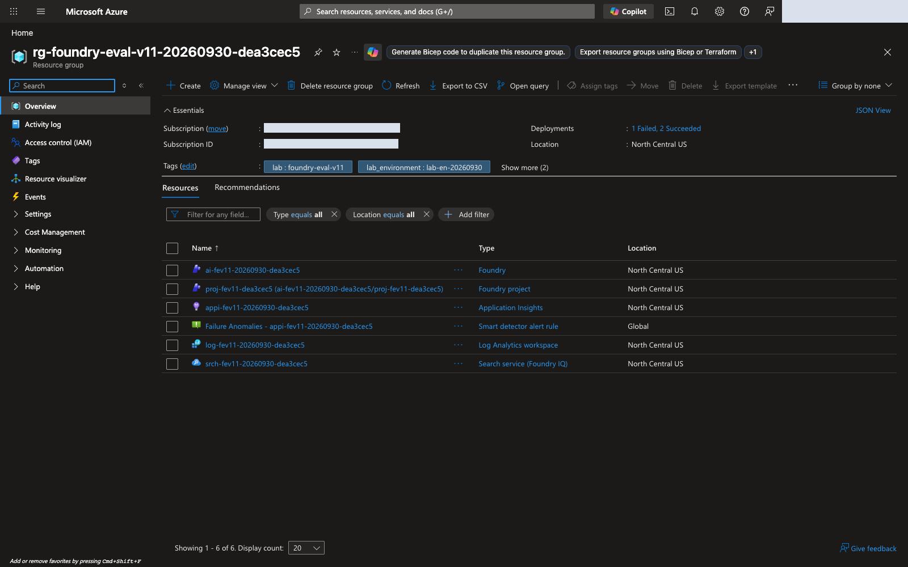
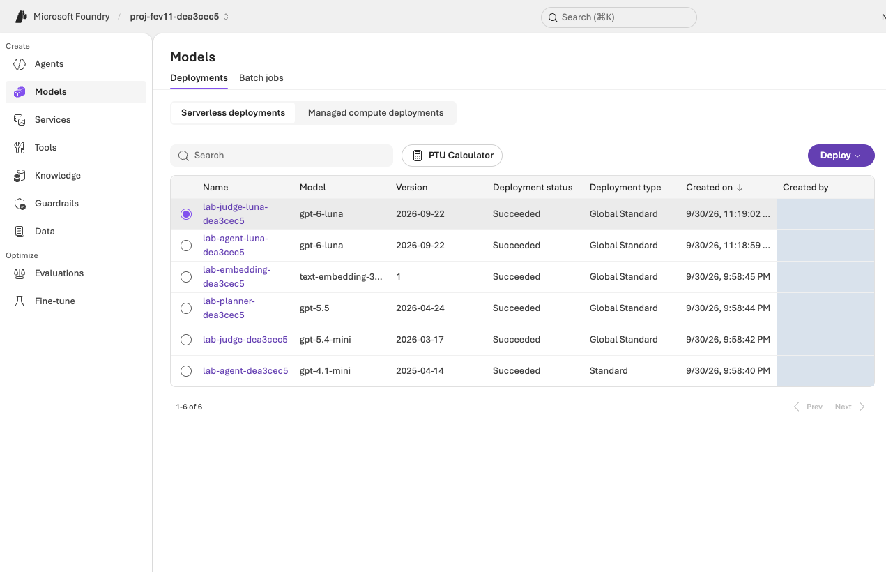

# Operator setup, authorization, and cleanup {#operator-guide}

[Ten steps from the beginning](handbook.md#setup) · [Facilitator](facilitator.md#prepare) · [Troubleshooting](troubleshooting.md)

Use this reference for participant steps **02 provisioning authorization, 03 Agent setup, and 10 deletion**. Participants preparing their own environments can use it too. Supply actual values and completion evidence rather than leaving prerequisites implicit.

## Distinguish new and prepared environments {#start}

| Situation | Action |
|---|---|
| No project exists | Start with [01 account setup](handbook.md#setup) and use the authorized `bootstrap plan → preflight → apply → status` path. |
| The operator already prepared this lab | Supply actual project, Agent, data, and access through the [handoff](#handoff); participants do not duplicate creation. |
| Only an existing shared project is available | Bootstrap does not silently adopt existing groups. Its owner must define the preparation/change scope and approve project-specific access. |

Verify CLI, SDK, and portal identities separately. Never transfer the operator's token or sign-in session to a participant. The owning operator runs bootstrap-bound creation commands. Other participants use their own assigned portal roles; SDK access requires separate configuration and permissions matching their own identity.

**For groups new to Azure and Foundry, operator-prepared environments are recommended.** Participants check their own account/computer in 01, receive completion evidence for 02–03, and continue at 04. Without participant-specific SDK configuration, the operator handles ID lookup in 06, v2 creation/reevaluation commands in 09, and owned-object cleanup in 10. Participants inspect settings/results using their own portal access.

Use separate environments/Agents for individual labs. For a group sharing one Agent, designate **one person to create v2 and submit paid jobs**. Record that responsibility so several participants do not attempt different v2 releases or duplicate the same evaluation.

Default Agent names are **`lab-en-iq`** for English and **`lab-ko-iq`** for Korean. If the environment name changes, use the actual name returned by the CLI and record it in the handoff.

<figure class="portal-shot" id="portal-resource-group">

<figcaption><strong>Check the isolated resource group.</strong> Open the group named in the handoff and confirm its subscription, region, and resource inventory. Verify that the Foundry project and supporting resources belong to this lab. <a href="../../web/assets/portal/en/00-resource-group.png" target="_blank" rel="noopener">View full-size image</a></figcaption>
</figure>

## Verify model roles and actual deployments {#prepare}

| Role | Configuration key | Default model/version |
|---|---|---|
| Agent | `MODEL_DEPLOYMENT` | **`gpt-6-sol` / `2026-09-22`**, GlobalStandard 100 |
| Managed Evaluation Judge | `JUDGE_DEPLOYMENT` | **`gpt-6-luna` / `2026-09-22`**, GlobalStandard 100 |
| Optimizer/search planner | `OPTIMIZER_DEPLOYMENT` / `IQ_PLANNER_DEPLOYMENT` | **`gpt-5.5` / `2026-04-24`**, one shared GlobalStandard 100 deployment |
| Policy embeddings | `EMBEDDING_DEPLOYMENT` | **`text-embedding-3-small` / `1`**, GlobalStandard 10 |

Numbers are requested ARM capacity units, not a universal TPM conversion. These defaults require availability checks; they are not a deployment guarantee for every subscription. Inspect deployment names, model names, versions, and readiness in Foundry **Models + endpoints/Build → Models**. `.env` contains actual deployment names rather than product names.

**Distinguish additional monitoring resources.** Application Insights can automatically add a [default Failure Anomalies alert and Smart Detection action group](https://learn.microsoft.com/azure/azure-monitor/alerts/proactive-failure-diagnostics#alert-rule-creation). Bootstrap checks read-only that the alert targets only the owned Application Insights component and that the linked action group uses only the default role receivers. It does not adopt resources by name or modify/delete a shared action group in another resource group. If those links are not yet observable during provisioning, inspect the same `bootstrap status` again; do not edit the manifest or delete the alert to bypass the check.

### Set TPM before starting model calls {#throughput}

The [participant step-02 recommendations](handbook.md#resources-tpm) require **100,000 TPM** per Agent, Judge, and shared Optimizer/planner deployment, and **10,000 TPM** for embeddings. This assumes sequential jobs in one environment; quota pools remain model/SKU/region-specific. For simultaneous English/Korean environments, sum both allocations for each model. Do not count two roles sharing one deployment as two deployments.

1. **New dedicated environment:** Check generative capacity 100 and embedding capacity 10 in the updated `bootstrap plan`, then authorize and provision that exact plan. Existing plans do not change automatically. For an unprovisioned lower-capacity plan, prepare a new environment name and authorization rather than editing the hashed plan.
2. **Separately managed prepared deployment:** Its owner checks **Tokens per Minute Rate Limit** under Foundry **Build → Models → Deployments → deployment name → Details**. Use **Edit** to meet these values only when the change is authorized. If the UI uses thousands of tokens, also check the final TPM display, save, and allow propagation. **Portal-only changes to a bootstrap-managed environment cause plan drift.** Do not edit hashes/approvals to bypass it; prepare a newly authorized dedicated environment with sufficient capacity when necessary.
3. **Verify the setting:** With that environment's `.env` and language-specific artifacts path, run the read-only check below. Inspect each `*_tpm` entry's `observed`, `expected`, and `reason`.

```sh
python -m lab --config .lab/lab-en/.env preflight
```

Continue to step-03 smoke/retrieval and later evaluation/Optimizer only after overall `status: PASS` and all five TPM checks pass. The checker reads the actual deployment's `rateLimits` entry with `key: token`. If the CLI omits labels, it reads raw ARM metadata for that same deployment instead of guessing TPM from request counts or `sku.capacity`. Unverifiable limits are `BLOCKED`.

TPM accounting uses estimates rather than average billed tokens; **RPM and short-window burst limits** also apply. Allow more headroom for longer inputs/maximum outputs, shared users, and overlapping evaluation/optimization. These recommended minimums do not guarantee a 429-free run. See [official rate-limit guidance](https://learn.microsoft.com/azure/foundry/openai/how-to/quota#understanding-rate-limits).

Use the [real response check in 03](handbook.md#agent) to verify Agent and `knowledge_base_retrieve` calls. Optimizer has a separate [supported-model list](https://learn.microsoft.com/azure/foundry/agents/concepts/agent-optimizer-overview#models); Agent/Judge availability does not establish generator support.

<figure class="portal-shot" id="portal-models">

<figcaption><strong>Check model, version, and status.</strong> Map each deployment to the Agent, Judge, Optimizer, and embedding roles. Deployment names must match <code>.env</code>; verify actual calls to the prepared deployments as well. <a href="../../web/assets/portal/en/02-model-deployments.png" target="_blank" rel="noopener">View full-size image</a></figcaption>
</figure>

## Prepare an executable Agent {#bootstrap}

First complete Python installation, virtual-environment creation, login, and language variables using the [copyable commands in 01](handbook.md#setup-local). Do not activate a nonexistent `.venv` or treat fake IDs in `.env.example` as a live environment.

Use `prompts/en/baseline.txt` for English and `prompts/baseline.txt` for Korean. Never weaken the baseline to manufacture improvement. After `iq prepare → iq probe` succeeds, create a policy-connected v1:

```bash
python -m lab --config .lab/lab-en/.env native-agent --version 1 --confirm
```

`native-agent` uses `ensure_fixed_release` to allow only **1 and 2**, comparing local workspace ownership with remote metadata. It reuses matching configurations, rejects a different v2, and never creates v3. It also retains a model-deployment snapshot and rejects drift. Receipts `agents/native-v1.json`, `agents/native-v2.json`, and `agents/native-model.json` belong to that environment's artifacts folder.

`native_response_format()` projects the common schema into the supported strict-generation subset. Citation uniqueness and `needs_human`/route consistency still require post-generation checks. Valid JSON does not establish policy correctness.

<a id="sdk-prerequisites"></a>

**Creating v2 is not completing evaluation.** The default path creates one unpublished v2 from reviewed instructions, runs the same managed evaluation, and then decides whether to accept it. Experienced operators may first test `draft-…` versions as in the historical rehearsal, but must verify subscription support. Draft validation is not an unstated prerequisite for the default path.

```bash
python -m lab --config .lab/lab-en/.env native-agent --version 2 --prompt .lab/lab-en/candidate.txt --confirm
```

Do not combine portal Promote and CLI creation. V1/v2 are complete Agent versions; the same Agent, model, tools, and output settings must differ only in instructions.

Retrieve IDs with `native-evals --name lab-en-learning-loop`. The reevaluation helper copies the baseline data source and checks the **remote** contract. Do not replace the remote definition with a stale local `JUDGE_DEPLOYMENT`.

## Freeze the comparison conditions {#scope}

| Item | Fixed requirement |
|---|---|
| Data | Same selected-language dev12 bytes, registration/version, questions and references |
| Relevance | Managed `builtin.relevance`, scale 1–5, threshold **4** |
| TaskAdherence | Managed `builtin.task_adherence`, binary 0/1, pass **1** |
| Judge | Same explicit Luna deployment in both evaluator definitions |
| Agent | Same Sol model/version, tools, reasoning and strict output schema |
| Change | Instructions only; releases remain v1/v2 |
| Optimizer | Instruction target only, model/tool-description changes off, bounded candidate count |
| Lab records | Keep same-condition v1/candidate results for all twelve cases in private run folders, separate from reusable guides |

Catalog evaluator versions are not proof that the private service rubric is fully pinned. Preserve the actual definition, settings and this limitation. A passing gate on reused dev12 does not guarantee future scores, independent generalization or production approval.

The standalone `scripts/compare_foundry_eval.py` selects report language and the default dev12 file using `LAB_LANGUAGE` or `--language ko`/`--language en`. Match explicitly supplied datasets to that language; do not relabel another corpus's results.

### Check evaluation response mappings {#evaluation-mapping}

Participants select the [two evaluators and Judge in 05](handbook.md#prepare) and preserve automatic mappings. Reading Raw JSON or guessing SDK fields is not a beginner prerequisite.

| Setting | Required value |
|---|---|
| Agent user input | Only `{{item.query}}`; leave the instruction override unset |
| Relevance response | `response={{sample.output_text}}` |
| TaskAdherence response | `response={{sample.output_items}}` |
| Judge/thresholds | Actual `JUDGE_DEPLOYMENT`; Relevance 4, TaskAdherence binary pass 1 |

If a required field is **Unassigned**, compare the remote definition, target Agent, and data columns. Never map the reference answer as the response or copy old UI bindings. Consult the [official portal evaluation guide](https://learn.microsoft.com/azure/foundry/how-to/evaluate-generative-ai-app) without changing this lab's fixed conditions. The helper in 09 checks the remote contract too and does not suppress errors to submit a run.

## Complete the actual authorization file {#approval}

Open `approval.example.json` and **Save As approval.json**. This worksheet explains fields; it is not an approved request. Keep the actual organizational authorization private. Use double quotes for JSON strings, but not for numbers, true, false, or null.

| Field | How to complete it |
|---|---|
| `schema_version`, `scope_sha256`, `models`, `retention_days` | Preserve generated values. Editing the model array or plan invalidates existing authorization. |
| `approved` | Set `true` only after actual approval. |
| `approved_by` | The operator sign-in name matching `expected_user` in `config.json`. |
| `approved_at`, `expires_at` | Actual authorization start/end in timezone-aware ISO 8601, such as `2026-10-03T09:00:00+09:00`. Do not reuse the example date. The current time must fall within the interval. |
| `currency`, `budget_amount`, `budget_policy` | Approved three-letter currency and positive numeric budget. Keep policy `BOUNDED`; the budget owner determines the amount. |
| `acknowledge_no_monetary_cap` | Keep `false`. Unlimited spending is not the default lab policy. |
| `max_hosting_hours` | Approved positive integer hours. If 8, the approval interval must also be no longer than 8 hours. |
| `max_wait_seconds` | Positive integer wait limit, for example 3600. Ending the wait does not cancel a remote job. |
| `max_calls`, `max_candidates` | Approved call/candidate limits. The candidate example is 2; consider internal Agent, Judge, and search calls when setting the call limit. |
| `allow_global_inference` | `true` only when GlobalStandard processing is authorized; it is not NCUS-only processing. |
| `allow_resource_creation`, `allow_rbac_assignments` | Each is `true` only when this plan's resources and resource-scoped role assignments are authorized. |
| `acknowledge_continuous_hosting`, `acknowledge_unknown_cost` | Each is `true` only after acknowledging continuing hosting charges and an unconfirmed final cost. |
| `allow_training`, `allow_global_training` | `false` for this path. |
| `max_epochs`, `max_training_jobs` | `0` for this path. |
| `accept_deprecated_models` | Default `false`; do not change it without reviewing a service deprecation notice. |

Validate with `preflight --approval ...` and read `approval_reason` on failure. Authorization covers only the exact plan hash, models, and retention scope. It does not authorize another class, an automatic retry, or deletion.

**Enforcement boundary:** Bootstrap checks authorization validity, provisioning scope, and its wait bound. JSON budget and call limits do not automatically cap all Azure Portal or Optimizer spending. Budget alerts are not cutoffs. The operator monitors actual usage and cancels jobs or removes resources when required.

## Verify permissions and provider registration {#rbac}

Follow the [current Foundry RBAC guidance](https://learn.microsoft.com/azure/foundry/concepts/rbac-foundry). **Foundry User/Owner/Account Owner/Project Manager** may still appear under their former **Azure AI User/Owner/Account Owner/Project Manager** names.

Use **Access control (IAM) → Check access** to inspect active assignments and Scope. Older UI versions may use View my access. The [actual subscription/access illustration in 01](handbook.md#portal-check-access) demonstrates inspection of existing access, not adding roles.

| Identity or task | Required scope to verify |
|---|---|
| New-environment operator | This bootstrap checks effective subscription permissions for group/deployment/resource writes and `Microsoft.Authorization/roleAssignments/write`. An already-authorized provisioning operator performs it. |
| Portal participant | Agent/evaluation operations in the assigned project; an administrator reviews the required project-scoped roles, such as Foundry User. |
| Policy-setup operator | Search schema/upload permissions, such as Search Service Contributor and Search Index Data Contributor, on this Search service. |
| Project managed identity | Search Index Data Reader on this Search service, model invocation, and telemetry submission to the assigned monitoring resource. |
| Search managed identity | Model invocation on the assigned Foundry resource. |
| Log reader | Read access to the assigned Application Insights/Log Analytics resources, not subscription-wide log access by default. |

In Azure Portal → **Subscriptions → selected subscription → Resource providers**, verify **Registered** for `Microsoft.CognitiveServices`, `Microsoft.Search`, `Microsoft.OperationalInsights`, and `Microsoft.Insights`. An authorized subscription administrator registers missing providers through organizational procedures. Bootstrap never auto-registers providers or expands permissions.

Allow registration/role propagation, then rerun the same preflight. For continuing `403`, compare identity, role scope, and network access. Do not grant new subscription-wide Owner, disable network or organizational policies, or transfer tokens as a shortcut.

## Costs and operational boundaries {#cost}

Evaluation invokes the Agent and Judge; optimization makes additional internal calls. Search and monitoring can continue to incur charges after the lab page closes. Distinguish measured tokens, cost estimates, and actual billing; unknown billing is not zero.

In Azure Portal → **Cost Management → Cost analysis**, select the subscription, resource group, and date range. Configure organizational budget alerts where needed, but do not present them as enforced caps. Record the cost/cleanup owner and end time in the handoff.

## Hand off actual values without gaps {#handoff}

Copy this table into the private class record and fill it with actual values. “The environment is ready” is not a sufficient handoff.

| Required item | Actual values or evidence |
|---|---|
| Identity | User, tenant ID, and subscription ID; never passwords or tokens |
| Responsibilities | Owners for provisioning, 06 ID lookup, 09 v2 creation/reevaluation, portal exercises, cost, and cleanup; one paid-submission owner per shared Agent |
| Local paths | Environment name, bootstrap config, runtime `.env`, `LAB_LANGUAGE`, and `LAB_ARTIFACTS_DIR`; distinguish participant-specific configuration and which computer runs commands |
| Azure environment | Resource group, Foundry account/project, project endpoint, and Search service |
| Models | Actual names, product/version, SKU, and capacity for all four deployments |
| Policy search | Source/language, eight uploaded documents, knowledge-base/connection names, and `retrieval_verified` |
| Agent | Actual name, pinned v1, strict output, and a successful real Agent tool call |
| Dataset | JSONL path, 12 rows, SHA-256, registration name, and version |
| Evaluation | Relevance 4, TaskAdherence 1, Judge deployment, and query-only input; add actual evaluation/v1-run IDs after the first run |
| Authorization | Scope hash, expiry, budget, candidate limit, and retention |
| Finish | Exact deletable group/objects, deletion approver, planned time, and shared-resource retention |

Keep English and Korean source data and private lab records separate; do not relabel another language's results as a new execution.

Raw service files can contain account metadata, tokens or signed URLs. Keep those local; **the synthetic evaluation results themselves are not secret**. Publish only allowlisted fields, including failures, and exclude credentials—not inconvenient outcomes. Historical attempts stay in the private audit, not as additional current-version reports.

## Verify deletion and retention {#cleanup}

Use [step 10](handbook.md#cleanup) as the exit checklist. Provisioning approval is not deletion approval, and workshop documentation does not authorize deleting another person's resources.
{: .print-with-table}

| Target | Deletion or handoff check |
|---|---|
| Active evaluation/Optimizer jobs | Cancellation availability, actual terminal state, and unresolved job IDs |
| Locally owned objects | Exact `cleanup` plan and verified absence afterward |
| Portal-created objects | Individually inspect datasets, evaluations, conversations, Optimizer records, and empty Agent entries |
| Dedicated resource group | Review all inventory, obtain authorization, delete, and verify a successful `az group exists` returns `false` |
| Shared/external resources | Retained item, reason, owner, and retention end date |
| Billing/soft delete | Delayed charges, prior usage, and separate service retention/purge policy |
| Evidence | Keep outcomes and failures privately for the required period; do not delete `.lab` first |
