# Evaluate and improve a customer-support Agent · v1 {#좋은-에이전트는-평가에서-시작된다-v1}

<p class="eyebrow">CONTOSO ATLAS CLOUD · ONE LEARNING PATH</p>

**Score a support AI on 12 questions, improve its instructions, then compare its answers to the same questions.** No Microsoft Azure or Microsoft Foundry experience is required. **GitHub Codespaces is the recommended path:** start with a prepared terminal in your browser.

<div class="hero-summary" aria-label="Lab purpose and outcomes">
<div><strong>WHAT YOU BUILD</strong><span>A support Agent that answers using policy evidence.</span></div>
<div><strong>WHY IT MATTERS</strong><span>Judge quality from 12 answers and scoring reasons, not one convincing answer.</span></div>
<div><strong>HOW YOU PROCEED</strong><span>Keep questions, models, and scoring criteria fixed; change only instructions.</span></div>
<div><strong>WHAT YOU KEEP</strong><span>A before/after comparison, your decision, and resource-cleanup records.</span></div>
</div>

<p class="step-next no-print"><a href="#setup">First time: start with step 01 →</a> <a href="#setup-resume">Resume your lab →</a></p>

<ol class="learning-path" role="list" aria-label="Lab steps">
<li><p class="phase-title"><strong>Prepare</strong><span>01–03 · Environment and v1 Agent</span></p><ul>
<li><a href="#setup"><strong>01</strong> Check your account, computer, and access</a></li>
<li><a href="#resources"><strong>02</strong> Create the Microsoft Foundry environment</a></li>
<li><a href="#agent"><strong>03</strong> Connect policies and create the Agent</a></li>
</ul></li>
<li><p class="phase-title"><strong>Evaluate</strong><span>04–07 · Score v1 on 12 questions</span></p><ul>
<li><a href="#start"><strong>04</strong> Register the dataset</a></li>
<li><a href="#prepare"><strong>05</strong> Select evaluation criteria</a></li>
<li><a href="#baseline"><strong>06</strong> Run a Microsoft Foundry evaluation</a></li>
<li><a href="#analyze"><strong>07</strong> Read scores and reasons</a></li>
</ul></li>
<li><p class="phase-title"><strong>Improve · Compare</strong><span>08–09 · v2 with new instructions only</span></p><ul>
<li><a href="#optimize"><strong>08</strong> Improve instructions with the agent optimizer</a></li>
<li><a href="#decision"><strong>09</strong> Reevaluate and compare v1/v2</a></li>
</ul></li>
<li><p class="phase-title"><strong>Clean up</strong><span>10 · Save records, then delete</span></p><ul>
<li><a href="#cleanup"><strong>10</strong> Save results and delete resources</a></li>
</ul></li>
</ol>

**Before you start**

- **Subscription, permissions, spending:** You need your own Microsoft Azure subscription, **both provisioning and role-assignment permissions** for resources, and spending authorization.
- **Lab terminal:** **GitHub Codespaces (recommended)** needs only a GitHub account and a browser. On your own computer, install Python 3.11–3.14, Git, and Azure CLI.
- **Time:** Allow roughly half a day, plus permission/quota approvals and service execution time. Service waits are usually short (provisioning in 02 about 10 minutes, a 12-case evaluation a few minutes, an Optimizer job often 10–20 minutes) but can be longer when the service is busy.
- **Ground rule:** **Every participant completes every step with their own account, from setup to cleanup.** Never copy another person's configuration, sign-in session, or ownership records, or repeat completed creation/submission. When returning, follow the [resume instructions](#setup-resume) and verify completed work using your own `config.json`, manifest, and receipts.

**Closing your browser does not end charges; finish the cleanup in 10.** Microsoft Azure model/Search/logging charges are **separate from GitHub Codespaces compute/storage charges**. If you stop after creating resources, still preserve records and clean up.
{: .note .warning}

**Terms and scope**

- **Microsoft Azure** is Microsoft's cloud platform, and **Microsoft Foundry** is the platform for building and evaluating AI models and Agents on Microsoft Azure.
- An **Agent** combines a model with instructions and tools. Here, a fictional **Contoso Atlas Cloud support Agent** searches policy documents before answering.
- **V1 is the original Agent; v2 is the candidate with revised instructions.** These are complete Agent versions; models, tools, and output format stay fixed. Retaining v1 when no improvement is found is a valid lab outcome; creating v2 is not production approval.
- **Learning means reading evaluation results and improving instructions**, not retraining model weights. Use only the supplied synthetic policies and questions. Do not upload private customer records or put the test answers into the instructions.

**Three places you work**

| Where you work | What you do there |
|---|---|
| [Azure portal](https://portal.azure.com) | Verify identity, subscription, permissions, actual resources, and deletion scope. |
| Lab terminal · Codespaces or your computer | Run the supplied commands. Codespaces avoids installing Python, Git, and Azure CLI on your computer. |
| [Microsoft Foundry](https://ai.azure.com) | Inspect the project, Agent, and policy tool; run evaluations and Optimizer; read comparisons. |

**How to follow this guide:** Follow **Action order → perform the work → check completion criteria** in each step. On your first pass, follow the expanded instructions and required reference links, including access and authorization.

| Guide label | What to do |
|---|---|
| **Run in your terminal** | Use your selected lab terminal. If you use Codespaces, edit files in its Visual Studio Code (VS Code) editor too. |
| **Portal actions** | Use a separate browser tab and your own account/project values, not the names in the illustrations. |
| **Optional · how it works** | Open only if you want implementation details. **Actual implementation · read only** is reference material; do not copy and execute it. |
| **Creation/submission** | Inspect code-created objects in the portal; do not recreate them. Submit evaluation/Optimizer jobs once in the specified portal UI, not through invented SDK code. |
| **Evaluation setup in 04–06** | Continue in the same evaluation wizard. Do not create a separate evaluation for each step. |
| **Reading marks** | These are personal bookmarks. Use each step's completion criteria to verify actual work. |

## 01. Check your account, computer, and access {#setup}

<a id="environment"></a><a id="sdk-prerequisites"></a>

<div class="lab-concept" data-learning-frame="setup">
<p><strong>What:</strong> Confirm the Microsoft Azure subscription, access, and local execution environment.</p>
<p><strong>Why:</strong> Different browser and CLI identities can cause access failures or create resources in the wrong environment.</p>
<p><strong>How · where:</strong> Check subscription/access in the Azure portal, then compare tools and the signed-in account in the terminal. No Microsoft Azure resources are created yet.</p>
</div>

**Action order:** [Check account/access](#setup-account) → [Open Codespaces · recommended](#setup-codespaces) → [Terminal · sign in](#setup-login). If Codespaces is unavailable, use [local installation](#setup-local-install).
{: .step-route}

<details class="guide-details optional-path" markdown="1">
<summary>New terms only · accounts, subscriptions, and projects</summary>

<div class="concept-primer" id="basics" role="group" aria-label="Microsoft Azure terms for first-time participants">
<p><strong>Six terms to recognize before opening the portal.</strong> You do not need to memorize them; distinguish their roles.</p>
<dl>
<div><dt>Tenant / Directory</dt><dd>The boundary that manages an organization's users and access. One account can access several organizations, so check the selected directory too.</dd></div>
<div><dt>Subscription</dt><dd>The unit that groups Microsoft Azure usage and billing. Confirm which subscription will pay for this lab.</dd></div>
<div><dt>Resource group</dt><dd>A group of Microsoft Azure resources managed together. A dedicated lab group makes the eventual deletion scope easier to identify.</dd></div>
<div><dt>Project</dt><dd>The Microsoft Foundry workspace for your Agents, data, and evaluations. Stay in the same project throughout the lab.</dd></div>
<div><dt>Model</dt><dd>The AI that generates answers. Deploying makes a model available to call; the deployment name identifies that callable deployment.</dd></div>
<div><dt>Role / Scope</dt><dd>A role defines allowed actions; its scope defines where they apply. Signing in does not automatically grant creation, evaluation, and deletion access.</dd></div>
</dl>
</div>

</details>

### Confirm your Microsoft Azure account and subscription {#setup-account}

1. Sign in to the [Azure portal](https://portal.azure.com) with **your own lab account**. If you have no account/subscription, follow the [Microsoft Azure account instructions](https://azure.microsoft.com/pricing/purchase-options/azure-account). For an organizational subscription, first obtain access and spending authorization for your own lab scope. A free or trial subscription does not guarantee the required model quota.
2. Search for **Subscriptions** in the top search box and open the intended subscription. Confirm portal status **Active** and read its **Subscription ID** and **Directory/Tenant ID**. The CLI describes the same usable subscription as **Enabled**. If it is missing, check directory and subscription filters under your account.
3. Open the permissions menu **Access control (IAM) → Check access** and inspect your role and scope. Older UI versions may label this **View my access**. You create resources and resource-scoped role assignments in this lab, so **both provisioning and role-assignment permissions are required**. Contributor alone cannot assign roles. See [permissions by task and provider registration](admin-setup.md#rbac).
4. Set a budget, end time, and deletion or retention scope for your dedicated group. If access or authorization is missing, obtain an approved execution scope through your organization's procedures before continuing. Do not delegate the remaining exercises to another person, grant new subscription-wide Owner, or disable security controls as a shortcut.

<figure class="portal-shot" id="portal-subscription-overview" data-capture-scope="shared">

<figcaption><strong>Check the subscription and status.</strong> Find Subscription ID, Directory, Status, and My role under Essentials. Portal <strong>Active</strong> and CLI <strong>Enabled</strong> describe the same usable state. <a href="../../web/assets/portal/shared/21-subscription-overview.png" target="_blank" rel="noopener">View full-size image</a></figcaption>
</figure>

<figure class="portal-shot" id="portal-check-access" data-capture-scope="shared">

<figcaption><strong>Read the role and its scope together.</strong> Open Access control (IAM) → Check access and inspect your active assignments. Confirm where each role applies; do not add broader access than the task requires. <a href="../../web/assets/portal/shared/22-check-access.png" target="_blank" rel="noopener">View full-size image</a></figcaption>
</figure>

### Install tools and download the lab {#setup-local}

**Recommended: use GitHub Codespaces.** A GitHub account and browser can prepare this repository's Python, Git, Azure CLI, and locked dependencies. **Codespaces does not provide Microsoft Azure subscriptions, permissions, or model quota.** If organizational policy does not permit Codespaces, use the local path below.

**Command rules**

- Run **one command at a time**, and stop at an error instead of running the next command. A long command can wrap across screen lines; do not insert a line break within it.
- Copy buttons copy the **whole block**. For multiple lines, paste into an editor first and run the commands individually.
- Replace `YOUR_...` with your values, keeping the quotes.
- `Shared terminal` blocks work in every environment. For `Codespaces/macOS/Linux` or `Windows PowerShell` blocks, **run only the one for your environment**.

#### Open GitHub Codespaces in your browser · recommended {#setup-codespaces}

1. With your own GitHub account, open [this repository's Codespace creation page](https://codespaces.new/junwoojeong100/foundry-evaluation-labs-v1). You can also use **Code → Codespaces → Create codespace on main** in the repository.
2. Check Codespaces access and your account's [pricing/included usage](https://docs.github.com/en/billing/concepts/product-billing/github-codespaces), then select **Create codespace**. Free usage is not guaranteed.
3. Wait for the browser VS Code environment and initial package setup to finish. The repository is cloned automatically; `.devcontainer/devcontainer.json` prepares the tools and `.venv`. Stop if the creation log reports an error.
4. Open **Terminal → New Terminal** and check readiness below. Codespaces runs Linux, so use **Codespaces/macOS/Linux** commands even if your own computer runs Windows.

```bash
source .venv/bin/activate
python --version
git --version
az version
python -m lab --help
python scripts/build_datasets.py --language en --check
```

Confirm Python **3.12.x**, Git/Azure CLI versions, the lab command list, and a successful dataset check. The command list is long, but this guide uses only `bootstrap`, `preflight`, `smoke`, `iq`, `native-agent`, `native-evals`, and `cleanup`; ignore the others. **Continue to [sign-in](#setup-login) without reinstalling tools, cloning, or recreating the virtual environment.** If initial setup fails, see [Codespaces troubleshooting](troubleshooting.md#codespaces).

**Keep the codespace active during waits.** By default, a codespace stops after 30 minutes without interaction, and stopping it ends any running command. Stay with the terminal while 02 provisions and 09 waits for the reevaluation. If it stops, [restart it](https://github.com/codespaces), open **Terminal → New Terminal**, and follow the [resume instructions](#setup-resume); check status instead of repeating `apply` or a submission. A stopped codespace that stays unused is deleted after 30 days by default, so back up `.lab/` as described in [10](#cleanup-codespaces) before a long break. Your account or organization may use different [codespace lifecycle rules](https://docs.github.com/en/codespaces/about-codespaces/understanding-the-codespace-lifecycle).
{: .note}

<details class="guide-details optional-path" markdown="1">
<summary>Local computer only · Windows/macOS/Linux installation</summary>

#### Select the local installation path {#setup-local-install}

Install [Python](https://www.python.org/downloads/) **3.11–3.14**, [Git](https://git-scm.com/downloads), and the [Azure CLI](https://learn.microsoft.com/cli/azure/install-azure-cli). Python runs the supplied programs, Git downloads the lab, and Azure CLI provides the `az` sign-in/query commands. Obtain an approved installation path if your work computer restricts installation.

**If the tools are already installed, start with [installation checks](#setup-verify) and do not reinstall working tools.** The Windows/macOS examples below explicitly select **3.13** so an unsupported newer Python is not selected. If you already use another supported version, replace `py -3.13` or `python3.13` with its version-specific command, using the same Python for verification and virtual-environment creation. Python 3.10 or earlier and 3.15 or later are outside this lab's supported range.

First open **your computer's terminal**. Search for **PowerShell** in Windows Start, **Terminal** in macOS Spotlight, or the terminal in your Linux app menu. This guide does not run in the Azure portal's Cloud Shell or the Python prompt showing `>>>`. Follow the [command rules](#setup-local) above.

Follow **only your own operating system's** [Windows installation](#setup-windows), [macOS installation](#setup-macos), or [Linux installation](#setup-linux), then continue to [installation checks](#setup-verify).

#### Windows · install in PowerShell {#setup-windows}

Run `winget --version` in PowerShell. If it prints a version, use the Windows package manager **WinGet** to run the following commands one at a time. Personally review installation agreements and elevation prompts within your organization's authorization.

```powershell
winget install --exact --id Python.Python.3.13 --source winget
winget install --exact --id Git.Git --source winget
winget install --exact --id Microsoft.AzureCLI --source winget
```

**If WinGet is missing or unavailable, use the official installers instead.** You do not need to use both methods.

| Tool | Download and installer choices |
|---|---|
| Python | From [Windows downloads](https://www.python.org/downloads/windows/), choose the **latest Python 3.13 patch release** and an installer matching your computer. Use the regular installer, not the embeddable package; select **Add python.exe to PATH** and include **pip and the Python Launcher**. |
| Git | Download the appropriate installer from [Git for Windows](https://git-scm.com/install/windows). Keep **Git from the command line and also from 3rd-party software** on the PATH selection screen so Git works in PowerShell. |
| Azure CLI | Follow **Microsoft Installer (MSI)** in the [official Windows instructions](https://learn.microsoft.com/cli/azure/install-azure-cli-windows?pivots=msi). Choose the 64-bit MSI for a typical x64 computer. |

Continue to [checking all three tools in a new terminal](#setup-verify). If `py` is not recognized, check the Python installer's Launcher option.

#### macOS · install with Homebrew {#setup-macos}

Run `brew --version` in Terminal. If the command is missing, follow the [official Homebrew installation instructions](https://brew.sh/), complete the PATH configuration printed under **Next steps**, then check again in a new terminal. Do not bypass your organization's software or Command Line Tools approval process.

```bash
brew update
brew install python@3.13 git azure-cli
```

This uses [Homebrew's versioned Python package](https://formulae.brew.sh/formula/python@3.13) and [Microsoft's macOS Azure CLI instructions](https://learn.microsoft.com/cli/azure/install-azure-cli-macos). **Use `python3.13` for this path.** An existing `python3` can still point to macOS's system Python or another version; do not overwrite or forcibly relink the system interpreter.

#### Linux · Ubuntu 24.04 LTS example {#setup-linux}

The following targets **Ubuntu 24.04 LTS**, which provides Python 3.12 by default. For another distribution, follow its Python instructions, [Git installation guidance](https://git-scm.com/install/linux), and [official Azure CLI installation instructions](https://learn.microsoft.com/cli/azure/install-azure-cli-linux). If Python is outside the supported range, request a supported execution environment rather than replacing the system interpreter.

```bash
sudo apt update
sudo apt install python3 python3-venv python3-pip git curl
curl -fsSL 'https://azurecliprod.blob.core.windows.net/$root/deb_install.sh' -o install-azure-cli.sh
```

The last command **only downloads** [Microsoft's Ubuntu/Debian installation script](https://learn.microsoft.com/cli/azure/install-azure-cli-linux?pivots=apt). Open `install-azure-cli.sh` in a text editor and inspect it before running the following command with the required system-installation permissions and authorization. Without `sudo` access, obtain an approved installation path before continuing.

```bash
sudo bash install-azure-cli.sh
```

#### Verify installation in a new terminal {#setup-verify}

**After installation, close all existing terminal windows and open a new one.** PATH is the list of locations used to find commands; an existing window might not receive the newly installed paths. If you use VS Code's terminal, exit and reopen VS Code too.

**Windows PowerShell:**

```powershell
py -3.13 --version
git --version
az version
```

**macOS · the Homebrew path above:**

```bash
python3.13 --version
git --version
az version
```

**Linux · the Ubuntu path above:**

```bash
python3 --version
git --version
az version
```

| Check | Expected output and requirement |
|---|---|
| Lab Python | A version such as `Python 3.13.x`; `x` is the actual patch number. The minor version must be **3.11, 3.12, 3.13, or 3.14**. |
| Git | An installed version such as `git version 2.x...`. |
| Azure CLI | JSON containing a version such as `"azure-cli": "2.x..."`. **This check does not require Microsoft Azure sign-in.** |

Python information in `az version` describes Azure CLI's own runtime, not verification of the lab's Python installation. **All three commands must succeed before** downloading the lab or creating its virtual environment. For `command not found`, `not recognized`, or Microsoft Store opening instead of Python, see [installation and PATH troubleshooting](troubleshooting.md#environment).

#### Download the lab files {#setup-download}

```sh
git clone --depth 1 https://github.com/junwoojeong100/foundry-evaluation-labs-v1.git
cd foundry-evaluation-labs-v1
```

`--depth 1` downloads only the latest files, not the repository history, which keeps the download small because the repository also stores demonstration videos. If you already downloaded the repository, enter its folder rather than cloning it again. With GitHub **Code → Download ZIP**, extract the archive first and open the folder containing `pyproject.toml` and `requirements.lock`. Downloading only an HTML file omits the code, data, and images.

#### Create a virtual environment with the verified Python {#setup-venv}

Run subsequent commands from the **lab folder containing `pyproject.toml` and `requirements.lock`**. `.venv` is an isolated Python package environment for this lab. Create it with **the same Python you verified above**, running only the one path matching your operating system.

**macOS · the Homebrew path above:**

```bash
python3.13 -m venv .venv
source .venv/bin/activate
```

**Linux · the Ubuntu path above:**

```bash
python3 -m venv .venv
source .venv/bin/activate
```

**In Windows PowerShell, run:**

```powershell
py -3.13 -m venv .venv
.\.venv\Scripts\Activate.ps1
```

If PowerShell policy blocks activation, do not change organizational policy. Replace `python` in subsequent commands with `.\.venv\Scripts\python.exe`. If `.venv` already exists, confirm that it belongs to this lab rather than overwriting another task's environment.

**After preparing the virtual environment, run these shared commands.** Confirm Python 3.11–3.14 and a pip path inside `.venv` from the first two commands before installing packages.

```sh
python --version
python -m pip --version
python -m pip install -r requirements.lock
python -m lab --help
python scripts/build_datasets.py --language en --check
```

Confirm that the command list appears and the dataset check succeeds. For `ModuleNotFoundError`, use `python -m pip --version` to check that Python and pip belong to `.venv`. Do not install packages into an unrelated system interpreter.

</details>

### Verify the CLI sign-in identity {#setup-login}

Run these commands in Codespaces or your selected local terminal. `--use-device-code` displays a Microsoft sign-in URL and a one-time code to enter yourself in your browser. **Do not share the code or tokens.** Sign in with the same Microsoft Azure account as the portal, then replace `YOUR_SUBSCRIPTION_ID` with your subscription ID.

```sh
az login --use-device-code
az account list --query "[].{name:name,id:id,state:state}" -o table
az account set --subscription "YOUR_SUBSCRIPTION_ID"
az account show --query "{user:user.name,tenant:tenantId,subscription:id,state:state}" -o json
```

Confirm **`state` is `Enabled`** and compare `user`, `tenant`, and `subscription` with the portal. Browser and CLI sign-ins are separate. For another authorized directory, use `az login --use-device-code --tenant "YOUR_TENANT_ID"`. If your organization blocks device-code sign-in, follow [sign-in troubleshooting](troubleshooting.md#codespaces), not a policy bypass.

#### Language and record location are applied automatically {#setup-language}

**There is no separate settings command to run.** Step 02's `--environment lab-en` automatically saves English and that environment's record location. The Korean guide uses `lab-ko`. Subsequent commands read the same settings through their `--config` argument, including in a new terminal; no environment-variable setup is needed.

Resume the existing environment for the same lab. For a separate English lab, use a name **starting with `lab-en-`**, such as `lab-en-02`, and update subsequent paths consistently. Records are saved automatically; do not delete them before cleanup.

<details class="guide-details optional-path" markdown="1">
<summary>Resuming only · restore your terminal settings</summary>

#### Resume the same lab in a new terminal {#setup-resume}

First enter your **existing lab folder**. Your `.venv` already exists; do not repeat cloning, virtual-environment creation, or package installation. Choose only your operating system below. If you changed the environment name, use the paths from your original records.

**Codespaces/macOS/Linux:**

```bash
source .venv/bin/activate
```

**Windows PowerShell:**

```powershell
.\.venv\Scripts\Activate.ps1
```

If PowerShell activation is blocked, leave organizational policy unchanged and replace subsequent `python` commands with `.\.venv\Scripts\python.exe`.

```sh
python --version
python -m lab --help
az account show --query "{user:user.name,tenant:tenantId,subscription:id,state:state}" -o json
```

Confirm Python 3.11–3.14, the command list, and your original user, tenant, subscription, and `Enabled` state. If sign-in expired or differs, [sign in with the same account](#setup-login) and check again.

**Do not repeat language or record-folder setup.** Keep the original `--config` path in subsequent commands to apply the saved settings automatically.

Find where you stopped with read-only lookups; no notes file is needed. Check provisioning with [02's read-only status](#resources-status), submitted evaluation IDs/states with [06's lookup](#baseline-identifiers), and candidate result collection with [09's same-receipt resume](#decision-run). The portal's **Evaluations** and **Optimization runs** lists show the same jobs. **Do not resubmit completed work; inspect running work by its existing ID.** Step 01 does not create Microsoft Azure resources or call the SDK.

</details>

<details class="guide-details implementation-notes" markdown="1">
<summary>Optional · how it works: sign-in and local settings</summary>

#### Code ↔ portal · verify sign-in and local settings {#setup-code-portal}

**Where to act:** Run the [terminal sign-in commands](#setup-login). The [automatic language/record settings](#setup-language) are an explanation, not an additional command.
{: .execution-guide}

| Executed command/setting | What to check now | Portal actions and verification |
|---|---|---|
| `az login`, `az account set`, `az account show` | Check the signed-in account, tenant, subscription, and `state: Enabled`. | Compare Directory under your Azure portal account and the IDs/state under **Subscriptions → intended subscription → Overview** yourself. |
| `--environment lab-en` → subsequent `--config` | Step 02 saves language/record settings; later commands read them. No shell-variable setup is needed. | This is separate from portal display language. Use the English corpus and that environment's records. |

</details>

**Completion criteria:** Python 3.11–3.14, Git, and Azure CLI versions are verified; the user, tenant, and subscription match; the virtual environment's Python commands and English dataset check succeed. For blockers, see [environment troubleshooting](troubleshooting.md#environment).
{: .completion-check}

<p class="step-next no-print"><a href="#resources" data-next-step>Next: 02. Create the Microsoft Foundry environment →</a></p>

## 02. Create the Microsoft Foundry environment {#resources}

<a id="first-infrastructure-failure"></a>

<div class="lab-concept" data-learning-frame="resources">
<p><strong>What:</strong> Prepare a Microsoft Foundry project, models, Search, and monitoring in a dedicated resource group.</p>
<p><strong>Why:</strong> The group bounds cost and cleanup; the project organizes Agents and evaluations. An empty project alone does not provide policy retrieval.</p>
<p><strong>How · where:</strong> One command in your lab terminal guides planning, readiness, authorization records, and provisioning. Then verify actual portal deployments and runtime checks.</p>
</div>

**Action order:** [Terminal · quick setup](#resources-quickstart) → [Where records live](#resources-notes) → [Portal/runtime checks](#resources-runtime-check).
{: .step-route}

### Prepare the environment with one provisioning command {#resources-quickstart}

After signing in during 01, run this command. **It reads your selected CLI subscription, tenant, and user, then sets language, record location, resource names, and configuration files automatically.** No separate environment variables, language flag, or hand-edited approval JSON is required.

```sh
python -m lab bootstrap setup --environment lab-en
```

`lab-en` selects English; `lab-ko` selects Korean. Separate names such as `lab-en-02` and `lab-ko-02` follow the same rule. English command results are saved under `.lab/lab-en/artifacts/`.

The program guides you through these stages:

1. **Plan:** It uses `northcentralus` and this lab's four pinned model deployments, without automatically substituting models or regions. Search and logging are included because later steps need them.
    - **The four roles:** **Agent (answers), Judge (scoring), Optimizer/search planner (instruction improvement and retrieval planning), and embeddings (numerical representations for search)**
    - You prepare an environment that calls existing models; you do not build a model from scratch.
2. **Permission/model/quota checks:** It confirms readiness before creating anything.
3. **Actual authorization inputs:** After readiness passes, enter the five values below.
4. **Provision:** It creates resources only if you approve at the final confirmation.

**Before you enter values:** Use your **actual authorization from 01**. If it is not established, **stop with Ctrl+C** and obtain authorization first.

| Prompt | What to enter |
|---|---|
| Approved currency | A three-letter currency code such as `USD` or `KRW` |
| Approved budget amount | A positive amount in that currency, not an arbitrarily accepted default |
| Maximum hosting duration | Approved positive integer hours covering provisioning and your lab end time |
| Model-call allowance | An approved positive integer. Even 12 cases can make multiple Agent, Judge, retrieval, and Optimizer calls. |
| Actual authorization reference | A private note identifying your own authorized decision or organizational approval. Never enter passwords/tokens. |

**How to size the numbers:** Choose hours that cover provisioning (usually about 10 minutes), your work, and the cleanup in 10, and keep the resources only that long. The largest continuing cost is **Azure AI Search (Basic)**, billed per hour while the service exists, even when idle: about US$0.10 per hour in North Central US when this guide was prepared, roughly US$2.4 per day. Model charges depend on tokens and current model prices. Estimate your own budget with the [Microsoft Azure pricing calculator](https://azure.microsoft.com/pricing/calculator/), the current [AI Search prices](https://azure.microsoft.com/pricing/details/search/), and Microsoft Foundry model prices, then add room for retries you did not plan. The prompts record your numbers; they are not spending caps.
{: .note}
**Final review before creation:** Read the displayed account, subscription, region, resources, models, and limits. This quick path records **at most two candidates, a one-hour job wait, and 30-day log retention**. Use the individual configuration path below if different limits are required. Type **`CREATE lab-en`** only if you actually authorize Global Standard worldwide processing, resource creation, resource-scoped roles, continuing charges, and an unconfirmed final cost.

No Microsoft Azure resources are created before confirmation, and Enter cancels. **After confirmation, provisioning and charges can begin.** Budget, call counts, and hosting hours are not automatic spending cutoffs, nor authorization for deletion, training, or automatic retries.
{: .note .warning}

**Successful result**

- The output reports **`status: APPLIED`** and creates **`.lab/lab-en/.env`**.
- The same folder preserves `config.json`, `approval.json`, and `manifest.json`. Do not edit these to bypass checks.
- **`.env` holds the project connection address (Project endpoint) and model deployment names**, unlike `.venv`, the Python package folder. Subsequent commands read it with `--config`; do not execute or `source` it. If provisioning failed, do not substitute a copy of `.env.example`.
- For errors, follow [provisioning troubleshooting](troubleshooting.md#provisioning).

**If you run the same command again**

- It continues preparation **only for a plan with no creation attempt**. If an attempt is recorded, it inspects status without submitting another deployment. Running/failed states are not success; use [status lookup](#resources-status) when resuming.
- If a valid approval file already exists, review its recorded limits instead of entering them again. Existing plans/approvals are not reset to new defaults and their expiry is never extended automatically.

<details class="guide-details optional-path" markdown="1">
<summary>Only if you use an older-version environment or set environment variables manually</summary>

The program reads language and record location from the selected configuration file. **Selected configuration takes precedence over stale shell variables.** Existing `lab-en`/`lab-ko` environments from older versions work without editing their files or recreating them. Records from another language are never relabeled or overwritten.

</details>

#### Where the lab keeps its records {#resources-notes}

**You do not need to create a record file.** As it runs, the program saves what later steps need in **`.lab/lab-en/`**: `config.json`, `manifest.json`, `approval.json`, `.env`, and the receipts under `artifacts/`. Values you may need again, such as the project endpoint or Agent version, can be read back from those files or looked up with read-only commands.

A `notes.md` of your own is **optional**. If you keep one, write short notes only where a step asks for a conclusion: the [learning note in 07](#analysis-notes), the [v1/v2 comparison in 09](#decision-compare), and the [closing note in 10](#cleanup-records). Resuming never depends on it; use the [read-only checks in 01](#setup-resume). Never write passwords or tokens in a note. For a longer optional checklist, see the [worksheet](admin-setup.md#handoff); nothing in the lab reads it.

Short execution-record paths such as `agents/native-v1.json` and `knowledge/config-snapshot.json` are relative to **`.lab/lab-en/artifacts/`**. In contrast, `data/`, `prompts/`, and `scripts/` are under the downloaded lab folder.

**After provisioning, continue to [portal/runtime checks](#resources-runtime-check).** Do not also run the individual commands below.

<details class="guide-details optional-path" markdown="1">
<summary>Optional · inspect planning, TPM, and authorization with individual commands</summary>

Use **either this path or quick setup**, not both. These are the same bootstrap's individual steps, not instructions to recreate an existing environment. Use them to inspect plans/approvals or configure different authorized limits.

<figure class="concept-flow" id="resource-map" aria-label="Containment from Microsoft Azure subscription to Microsoft Foundry project">
<ol>
<li><strong>Microsoft Azure subscription</strong><span>Usage and billing</span></li>
<li><strong>Resource group</strong><span>This lab's resources</span></li>
<li><strong>Microsoft Foundry resource</strong><span>AI service and deployments</span></li>
<li><strong>Project</strong><span>Agents, data, evaluations</span></li>
</ol>
<figcaption>Each item contains the next. The same lab group also contains <strong>Azure AI Search</strong> for policy retrieval and <strong>Application Insights / Log Analytics</strong> for execution records.</figcaption>
</figure>

An **endpoint** is the address a program uses to connect to a service. Use the project's **Project endpoint** for this lab, not the adjacent Azure OpenAI endpoint.

### Create a local provisioning plan {#resources-plan}

Replace the placeholders with the values from `az account show` (run it again if you need them). An **ID identifies a resource; it is not its display name**. Do not enter a subscription name in an ID field.

| Placeholder | Your value |
|---|---|
| `YOUR_SUBSCRIPTION_ID` | `subscription` from `az account show` |
| `YOUR_TENANT_ID` | `tenant` from the same output |
| `YOUR_SIGN_IN_NAME` | `user` from the same output |

This command writes only a plan and unapproved authorization example under `.lab/lab-en/` on your computer; it does not call Microsoft Azure.

```sh
python -m lab bootstrap plan --subscription "YOUR_SUBSCRIPTION_ID" --tenant "YOUR_TENANT_ID" --expected-user "YOUR_SIGN_IN_NAME" --environment lab-en --location northcentralus
```

Confirm `plan_status: CREATED_LOCAL_ONLY`, `mutations_performed: false`, and `config_path`. `BLOCKED_AWAITING_APPROVAL` means that spending is not yet authorized, not that Microsoft Azure provisioning failed or completed.

| Generated file | What to check |
|---|---|
| `.lab/lab-en/config.json` | Identity, generated resource names, and exact model/version/capacity selections. Do not edit this hashed plan. |
| `.lab/lab-en/approval.example.json` | The initially unapproved cost and change scope. |
| `.lab/lab-en/manifest.json` | Provisioning, ownership, and interruption records. Preserve this file. |
| `.lab/lab-en/.env` | Not present yet. Successful provisioning creates this runtime configuration. |

Use your text editor's **Open file** action to inspect these files. `.lab` stores lab records and may appear as a hidden folder. JSON stores settings as name/value pairs. Do not convert these files to Word documents or change their extensions.

**Implementation reference:** `plan()` selects names/models, calculates hashes, and writes local files only. **It contains no Microsoft Azure creation request.** Seeing no new resources in the portal after `plan` is expected.

<!-- source-code: lab/bootstrap.py:plan -->

The model roles are **answer generation (Agent), scoring (Judge), instruction suggestions/search planning (Optimizer/planner), and numerical representations for search (embedding)**. You do not develop a new model in this lab.

This repository's setup region is **North Central US (`northcentralus`)**. Defaults are Agent `gpt-6-sol`, Judge `gpt-6-luna`, Optimizer/search planner `gpt-5.5`, and embedding `text-embedding-3-small`. Check the exact versions, SKUs (deployment types), and capacity units in the [model table](admin-setup.md#prepare) and plan. Do not silently substitute a different region or model.

### Allocate the recommended minimum TPM {#resources-tpm}

**TPM (Tokens Per Minute) is a per-deployment token rate limit**, not the model's context window or guaranteed processing speed. These starting requirements cover **one environment running one 12-case evaluation or Optimizer job at a time**. They are recommended minimums with headroom for evaluation/retrieval calls, not proven absolute lower bounds or a guarantee against 429 errors.

| Role/model | Recommended minimum TPM to start | Azure Resource Manager (ARM) capacity in a new default plan |
|---|---:|---:|
| Agent · `gpt-6-sol` | **100,000** | 100 |
| Judge · `gpt-6-luna` | **100,000** | 100 |
| Optimizer / search planner · `gpt-5.5` | **100,000** | 100, one deployment shared by both roles |
| Embedding · `text-embedding-3-small` | **10,000** | 10 |

New `bootstrap plan` output requests these capacities. **ARM units depend on the model/SKU**; do not universally multiply capacity by 1,000. After deployment, confirm actual TPM with runtime preflight below. Unallocated subscription quota does not establish that an individual deployment has enough TPM assigned.

Existing plans and deployments are not automatically increased. Check your actual deployments and authorization with the [TPM setup reference](admin-setup.md#throughput). Do not edit `config.json`, approval hashes, or the manifest to bypass checks.

**Shared users or overlapping jobs require additional capacity.** Microsoft Azure rate-limits estimated tokens based on inputs and maximum-output settings, not only billed tokens. **RPM (Requests Per Minute)** and short-window request bursts are separate constraints. See the [official TPM/RPM explanation](https://learn.microsoft.com/azure/foundry/openai/how-to/quota#understanding-rate-limits).

### Check readiness and obtain cost authorization {#resources-approval}

```sh
python -m lab bootstrap preflight --config .lab/lab-en/config.json
```

**Preflight checks readiness before execution.** Look for `readiness_status: READY`. Quota is your subscription's allowed usage; capacity is actual availability in a region. If blocked, read `reason` and follow [provisioning troubleshooting](troubleshooting.md#provisioning). Without an approval file, the overall status can still await approval even when readiness is READY. Do not keep creating new environments or switching regions.

Read the `cognitiveservices model list`, `usage list`, and ARM `modelCapacities` requests. This checks availability; it does not invoke or deploy the models.

<!-- source-code: lab/bootstrap.py:_preflight -->

After confirming authorization for your spending and changes, open `.lab/lab-en/approval.example.json` in an editor and **Save As** `.lab/lab-en/approval.json`. If you can authorize spending on your own subscription, set and record its limits yourself. For an organizational subscription, follow its actual approval procedure. Preserve `scope_sha256`, `models`, and `retention_days`, and complete **every field in the [approval worksheet](admin-setup.md#approval)**.

**Required reference:** Open the approval worksheet in another tab, complete it, then **return here**. Confirm you saved **`approval.json`** in the same folder, not changes to the original `approval.example.json`, and run the check below. Do not repeat provisioning commands from the reference document.

Set `approved_by` to **your sign-in name**, matching the plan's `expected_user`. This binds the execution identity; it is not an organizational approver's digital signature. Confirm actual authorization evidence, currently valid timestamps, currency/budget, wait/retention bounds, and resource/RBAC/global-processing consent. Changing only `approved` to `true` is insufficient; the budget value is not a Microsoft Azure spending cutoff.

```sh
python -m lab bootstrap preflight --config .lab/lab-en/config.json --approval .lab/lab-en/approval.json
```

**Proceed only when both `readiness_status: READY` and `status: READY_FOR_APPROVED_APPLY` are present.**

### Provision and confirm the resources in the portal {#resources-create}

```sh
python -m lab bootstrap apply --config .lab/lab-en/config.json --approval .lab/lab-en/approval.json
```

This command creates resources, deployments, connections, and resource-scoped roles. It can take time; do not launch a second `apply` in another terminal. A successful completion reports **APPLIED**. After a timeout or an unknown response, do not resubmit `apply`; inspect status below first.

#### Inspect provisioning status · use this when resuming too {#resources-status}

```sh
python -m lab bootstrap status --config .lab/lab-en/config.json --approval .lab/lab-en/approval.json
```

Confirm `phase: succeeded`, the expected resources, and a generated `.lab/lab-en/.env`. If still running or failed, follow [provisioning recovery](troubleshooting.md#provisioning). **This lookup does not submit a new deployment.**

**The `.env` created here supplies connection settings for subsequent commands.** It records user, tenant, subscription, and actual project/model-deployment values. It is configuration, not a script: specify it with `--config`, never execute or `source` it. If it is absent, do not copy `.env.example` and call provisioning complete.

<details class="guide-details implementation-notes" markdown="1">
<summary>Optional · how it works: provisioning and status</summary>

#### Code ↔ portal · inspect created resources and deployments {#resources-code-portal}

**Where to act:** After authorization, run [`bootstrap apply` and `status` above](#resources-create), then complete the [portal/runtime checks below](#resources-runtime-check). Inspect created resources in the portal rather than creating them again.
{: .execution-guide}

| Code/input | Actual action | Portal actions and verification |
|---|---|---|
| `bootstrap setup` | Guides the same plan, preflight, approval checks, and apply; existing creation attempts use status only. | This creates the same dedicated environment as the individual commands. Verify in the portal without creating duplicates. |
| `config["names"]`, ARM `PUT` location/tags | Check for collisions and create a new dedicated group. | Azure portal → **Resource groups → your group → Overview**: inspect name, region, and Tags. Do not create another group. |
| `deployment group create`, `template.json`, `_parameters(...)` | Deploy the Microsoft Foundry resource/project, Search, monitoring, models, connections, and roles in the [actual ARM template](../../infra/bootstrap.json). | Group **Deployments → your deployment → Deployment details/Inputs/Outputs**: compare inputs and created resources. |
| Model/version/SKU/capacity in `config["models"]` | Create four planned model deployments. | Microsoft Foundry **Home → View deployments → deployment → Details**: inspect model, version, type, and Tokens per Minute Rate Limit. |
| Existing group/deployment/resource reads in `bootstrap status` | Compare actual state with the same plan/local records; do not submit another ARM deployment. | Refresh the same group's **Deployments → existing deployment** and actual inventory, not Create. |
| `AZURE_AI_PROJECT_ENDPOINT` in `.env` | Save the actual project connection after successful creation. | Compare **Microsoft Foundry Home → Project endpoint**, not Azure OpenAI endpoint. |
| Role assignments and project/Search managed identities | Assign distinct permissions to user and service identities. | Inspect each Microsoft Azure resource's **Identity** and **Access control (IAM) → Check access**. Do not add the same roles again just to verify them. |

Read **group creation → ARM validation/deployment → status polling → inventory verification → .env saving** in `apply()`. `bounded(...)` checks authorization/wait bounds before executing the Azure CLI argument lists shown in the source. Local records, resumption, and ownership protections are real parts of the implementation, not omitted details.

<!-- source-code: lab/bootstrap.py:apply -->

Inspect the actual ARM template inputs too. This object passes `names`, `models`, the user ID, scoped role assignments, tags, and retention.

<!-- source-code: lab/bootstrap.py:_parameters -->

Read `status()` too: it shows which remote state is inspected after an `apply` timeout.

<!-- source-code: lab/bootstrap.py:status -->

The quick-path guide function reuses the same provisioning and ownership checks. It does not introduce another infrastructure template or broader permissions.

<!-- source-code: lab/bootstrap.py:setup -->

</details>

</details>

### Verify the created environment and runtime settings {#resources-runtime-check}

1. In the [Azure portal](https://portal.azure.com) → **Resource groups**, search for `names.resource_group` from `config.json`. Confirm the subscription, region, and complete resource list.
2. Open [Microsoft Foundry](https://ai.azure.com) with **New Foundry** enabled. If **Select a project to continue** appears, choose `names.project` and select **Let's go**. Read and **Close** the welcome tour if shown. If already in New Foundry, use the upper-left project selector. Do not use a Classic hub-based project.
3. In the project's **Home** (Overview in some layouts), find **Project endpoint**. It must match `AZURE_AI_PROJECT_ENDPOINT` in `.env`, in the form `https://account.services.ai.azure.com/api/projects/project`.
4. In **Models + endpoints** or **Build → Models**, locate the deployments matching `.env` values `MODEL_DEPLOYMENT`, `JUDGE_DEPLOYMENT`, `OPTIMIZER_DEPLOYMENT`, and `EMBEDDING_DEPLOYMENT`. See [portal orientation](admin-setup.md#prepare) if labels differ.

<figure class="portal-shot" id="portal-created-resources">
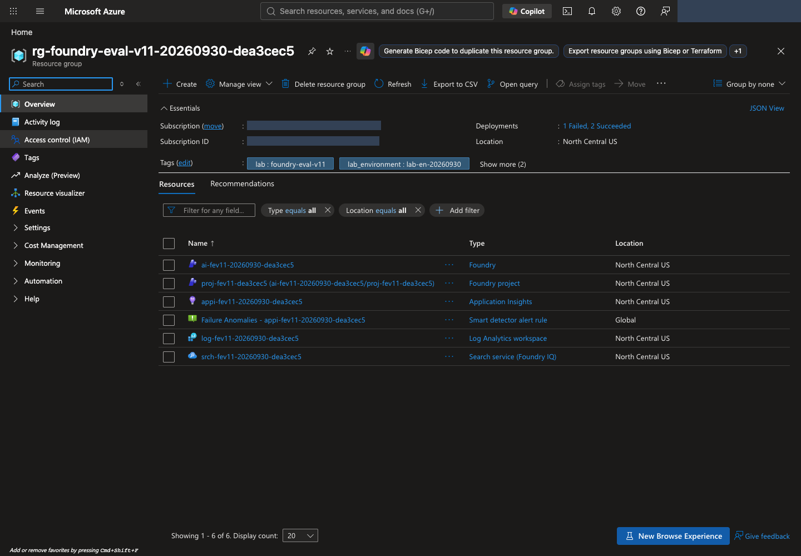
<figcaption><strong>Compare the plan with actual resources.</strong> Check the group name and Location, then identify Microsoft Foundry, Microsoft Foundry project, Search, Application Insights, and Log Analytics. Open Deployments to inspect each deployment's status and any failure details. <a href="../../web/assets/portal/en/23-resource-group.png" target="_blank" rel="noopener">View full-size image</a></figcaption>
</figure>

<figure class="portal-shot" id="portal-select-project" data-capture-layout="dialog">
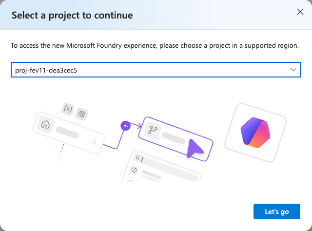
<figcaption><strong>Select the project you prepared.</strong> Compare its name with <code>names.project</code> and open it with Let's go. This selects an existing project; it does not create another. After bootstrap, do not use Create a new project to duplicate the environment. <a href="../../web/assets/portal/en/24-select-project.png" target="_blank" rel="noopener">View full-size image</a></figcaption>
</figure>

<figure class="portal-shot" id="portal-project-endpoint">
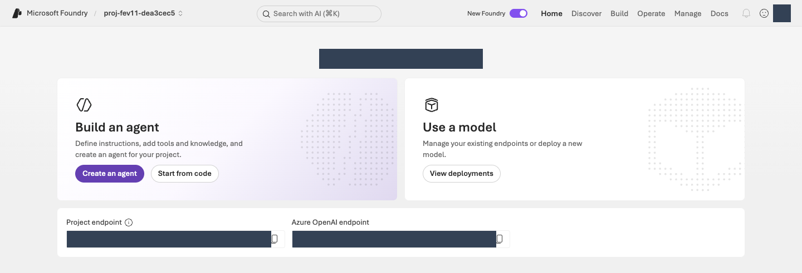
<figcaption><strong>Check the project and endpoint.</strong> Compare the upper-left project name and <strong>Project endpoint</strong> with your configuration. Do not substitute Azure OpenAI endpoint. Open the model list through View deployments. <a href="../../web/assets/portal/en/25-project-overview.png" target="_blank" rel="noopener">View full-size image</a></figcaption>
</figure>

#### Check identity, deployments, and TPM in your terminal {#resources-preflight}

Run this read-only command after provisioning creates `.lab/lab-en/.env`. It also performs the identity check internally.

```sh
python -m lab --config .lab/lab-en/.env preflight
```

Inspect `agent_tpm`, `judge_tpm`, `optimizer_tpm`, `iq_planner_tpm`, and `embedding_tpm` under `checks`. Each `observed` value is actual deployment TPM; `expected` is the [recommended minimum for that model](#resources-tpm). Insufficient or unverifiable token limits report `BLOCKED`: do not continue to model calls. Prepare the deployment allocation, then rerun the same read-only preflight.

<details class="guide-details implementation-notes" markdown="1">
<summary>Optional · how it works: identity, deployments, and TPM</summary>

#### Code ↔ portal · compare generated settings with the execution identity {#runtime-code-portal}

**Where to act:** Run the [runtime-check command above](#resources-preflight). It compares the generated configuration with your current CLI identity; do not type the identity-check function separately.
{: .execution-guide}

| Command/setting | Actual action | Portal verification |
|---|---|---|
| `AZURE_SUBSCRIPTION_ID`, `AZURE_TENANT_ID`, and `EXPECTED_AZURE_USER` from `--config .lab/lab-en/.env` | Read the subscription, tenant, and user recorded for this provisioned environment. | Compare the Azure portal account's Directory and subscription Overview checked in 01. |
| `az account show --subscription ...` inside `check_identity()` | Automatically compare configured user, tenant, subscription, and Enabled state with the CLI. A mismatch stops execution before resource lookup. | Confirm the same account/subscription; successful sign-in does not permit a different identity. |

This function performs the command's identity check. Subscription selection does not replace tenant verification. This check is not an SDK token request or a model call.

<!-- source-code: lab/preflight.py:check_identity -->

The following runtime `run_preflight()` reads the resources/deployments named in `.env`. Connect `rateLimits` entries with `key: token`, including the raw ARM lookup, to the portal TPM display. **Subscription quota and a deployment's actual TPM are separate checks.**

<!-- source-code: lab/preflight.py:run_preflight -->

</details>

**Completion criteria:** Runtime preflight and all five TPM checks report `PASS`; your project and role-specific deployments are present. This is read-only configuration evidence. The next step verifies actual model responses.
{: .completion-check}

<p class="step-next no-print"><a href="#agent" data-next-step>Next: 03. Connect policies and create the Agent →</a></p>

## 03. Connect policies and create the Agent {#agent}

<a id="model-smoke"></a><a id="iq"></a>

<div class="lab-concept" data-learning-frame="agent">
<p><strong>What:</strong> Connect a read-only synthetic-policy tool to the pinned v1 baseline Agent.</p>
<p><strong>Why:</strong> Recalling a policy is not the same as retrieving it. Retrieval under your user identity does not establish access for the Agent's managed identity.</p>
<p><strong>How · where:</strong> Prepare model, retrieval, and Agent from the terminal; inspect instructions, tools, and an actual response in Microsoft Foundry. Transmit data and make calls once within the approved scope.</p>
</div>

**Action order:** [Terminal · model check](#agent-smoke) → [Upload policies](#agent-search-prepare) → [Verify retrieval](#agent-search-probe) → [Create v1](#agent-create) → [Microsoft Foundry · test response](#agent-playground).
{: .step-route}

### Verify the model and policy retrieval {#agent-knowledge}

**These three commands perform actual uploads/model calls and can incur charges.** Check each result yourself before continuing. When resuming, check the saved receipts for completed work rather than repeating unnecessary calls.
{: .note .warning}

#### 1. Verify that the model responds {#agent-smoke}

`smoke` is a short functional check.

First pass the [runtime checks in 02](#resources-preflight), including deployment TPM. One successful short response does not establish sufficient throughput for the full evaluation.

```sh
python -m lab --config .lab/lab-en/.env smoke --run-id model-smoke --confirm
```

Confirm **`status: completed`** in the output.

<details class="guide-details implementation-notes" markdown="1">
<summary>Optional · how it works: SDK authentication and model calls</summary>

#### Code ↔ portal · connect the SDK with the verified CLI identity {#sdk-code-portal}

**Where to act:** Run the [model-check command above](#agent-smoke). The authentication function is used automatically inside actual SDK calls, not as a separate terminal command.
{: .execution-guide}

| Actual code | Actual action | Portal verification |
|---|---|---|
| `AzureCliCredential(subscription=...)` in `credential_for()` | Recheck the CLI identity against 02's configuration and create a credential object. The SDK requests tokens with that identity when calling the service. Do not switch to API keys or another credential. | Compare the signed-in Microsoft Foundry resource and project subscription with the configuration. There is no action to paste tokens into the portal. |

The first function below creates the credential passed to the SDK; the next sends the actual model request. Authentication and response verification belong to this step.

<!-- source-code: lab/auth.py:credential_for -->

`client.responses.create(model=config.model, ...)` inside `smoke_model()` is the real Sol model call. It tests a short input with at most 128 output tokens before creating an Agent. The request is recorded first so an unknown submission is not replayed.

<!-- source-code: lab/agents.py:smoke_model -->

</details>

#### 2. Prepare policy retrieval {#agent-search-prepare}

Upload the [eight supplied synthetic policies](../../data/en/knowledge/documents.json) to the search service.

```sh
python -m lab --config .lab/lab-en/.env iq prepare --confirm
```

Confirm **`uploaded_documents: 8`**. The program prepares a search index (searchable documents), a knowledge base, and an MCP connection. **MCP (Model Context Protocol) connects an Agent to tools**; this lab connects only a read-only policy-retrieval tool. You do not need to edit the implementation.

<details class="guide-details implementation-notes" markdown="1">
<summary>Optional · how it works: policy upload and retrieval</summary>

#### Code ↔ portal · configure policy retrieval {#knowledge-code-portal}

**Where to act:** Run [`iq prepare` above](#agent-search-prepare), then [`iq probe` below](#agent-search-probe) in your terminal. The panels show those commands' internals, not additional programs to execute.
{: .execution-guide}

| Actual code/setting | Actual action | Portal actions and verification |
|---|---|---|
| `fields`, `vectorSearch`, `semantic` in `knowledge_payloads()["index"]` | Define policy fields, 1536-dimensional vectors, HNSW, embeddings, and semantic settings. | Azure portal → Search → **Indexes → created index → Fields/JSON**. Inspect, do not recreate, the index. |
| `client.embeddings.create(...)` in `embed()` | Send eight policy titles/contents to the actual embedding deployment. | Microsoft Foundry **View deployments → embedding deployment → Details**: check the model/name. Vectors are stored in Search, not in the agent playground settings. |
| `PUT`/`POST` in `prepare_knowledge()` | Create the index, upload documents, then create the knowledge source, base, and project connection. | Inspect Search **Indexes** and Microsoft Foundry **Build → Knowledge → Knowledge bases** for matching names/sources. |
| Connection `authType`, `audience`, `target` | Connect the project's managed identity to Search's MCP endpoint. | Inspect Knowledge **Connection**. If the UI has no authType/audience editor, read `knowledge/config-snapshot.json`; do not guess settings. |
| `/retrieve`, `references`, `activity` in `probe_knowledge()` | Verify actual policy retrieval. | Active is registration state, not a probe result. Inspect the probe's output/records, then verify the Agent's tool call separately in Playground. |

First read the **complete service-setting objects**, then the **actual creation/upload code**. `config.*` comes from 02's `.env`; `names` contains the actual object names in your records.

<!-- source-code: lab/knowledge.py:knowledge_payloads -->

The next short function performs **GET → create-only PUT → ownership recording**. `prepare_knowledge()` then applies it to the index, source, base, and connection.

<!-- source-code: lab/knowledge.py:_ensure_created -->

<!-- source-code: lab/knowledge.py:prepare_knowledge -->

Embedding is not hidden local scoring. This function invokes the Azure OpenAI embeddings API and preserves the original response, input hash, model, and usage.

<!-- source-code: lab/embeddings.py:embed -->

</details>

#### 3. Verify that a query retrieves policies {#agent-search-probe}

```sh
python -m lab --config .lab/lab-en/.env iq probe --confirm
```

Confirm **`status: retrieval_verified`** with nonempty references. `created_not_retrieval_tested` means creation only. If an error occurs, preserve the records and follow [retrieval troubleshooting](troubleshooting.md#knowledge).

Read the query/reference request and actual response checks around `POST .../retrieve`. **Direct retrieval verifies your signed-in user path**, not the Agent's managed-identity path.

<!-- source-code: lab/knowledge.py:probe_knowledge -->

In the portal, open **Build → Knowledge → Knowledge bases** and inspect Connection, the created knowledge base, and Knowledge sources. One knowledge-base row does not mean there is only one policy document.

<figure class="portal-shot" id="portal-policy-connection">
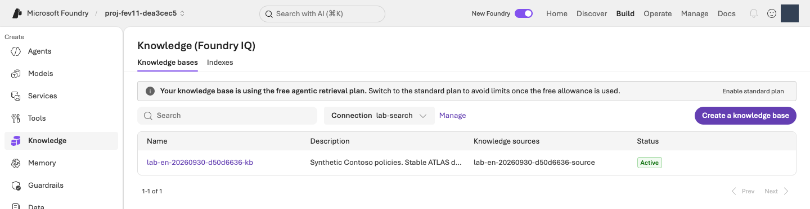
<figcaption><strong>Confirm the policy connection.</strong> Inspect Connection, Knowledge sources, and Active for the intended base. Active is registration state; verify actual retrieval with <code>iq probe</code>. The free-retrieval banner does not make the whole lab free, and setup inspection does not require changing the billing plan. <a href="../../web/assets/portal/en/26-knowledge-base.png" target="_blank" rel="noopener">View full-size image</a></figcaption>
</figure>

### Create v1 with the fixed comparison configuration {#agent-create}

```sh
python -m lab --config .lab/lab-en/.env native-agent --version 1 --confirm
```

This creates **`lab-en-iq` version `1`** using the instructions in `prompts/en/baseline.txt` and the verified policy tool. Check `agent_name`, `version`, and `receipt` in the output. A **receipt is a file recording the operation's result**, so the Agent name and version stay readable there. The command reuses an identical v1 in the same owned workspace; it does not adopt another Agent or create v3.

<details class="guide-details implementation-notes" markdown="1">
<summary>Optional · how it works: Agent configuration and fixed versions</summary>

#### Code ↔ portal · inspect the full Agent configuration {#agent-code-portal}

**Where to act:** Run [v1 creation above](#agent-create), then inspect the version, configuration, and actual response in the [agent playground below](#agent-playground). Do not recreate it or save another version in the portal.
{: .execution-guide}

| Actual code/setting | Portal actions and verification |
|---|---|
| `definition["model"] = config.model` | **Build → Agents → your Agent → Version 1 → Model**: inspect the same deployment. |
| `definition["instructions"] = prompt.read_text(...)` | Compare **Instructions** with the [original prompt](../../prompts/en/baseline.txt). Do not Save/create a version while inspecting. |
| MCP endpoint, `allowed_tools`, `project_connection_id` in `knowledge_tool()` | Inspect **Knowledge/Tools**. The allowed tool is `knowledge_base_retrieve`; actual execution appears in response details. |
| `json_schema`, `strict` in `native_response_format()` | Structured-output configuration. If the UI does not expose the whole schema, inspect `agent.definition.text` in `agents/native-v1.json`; do not recreate it by guessing natural-language instructions. |
| `project.agents.create_version(...)`, `draft=False` | Check the actual **Version 1** after creation. A new version is not production publication. |

Read the connected tool and Agent definition, then the **actual `project.agents.create_version` call**. Fixed-version, ownership, and equivalent-configuration reuse checks between these functions are real behavior too.

<!-- source-code: lab/knowledge.py:knowledge_tool -->

<!-- source-code: lab/agents.py:create_native_agent -->

<!-- source-code: lab/agents.py:ensure_fixed_release -->

</details>

### Verify v1's response and tool call in Microsoft Foundry {#agent-playground}

<figure class="portal-shot" id="portal-agent-configuration">
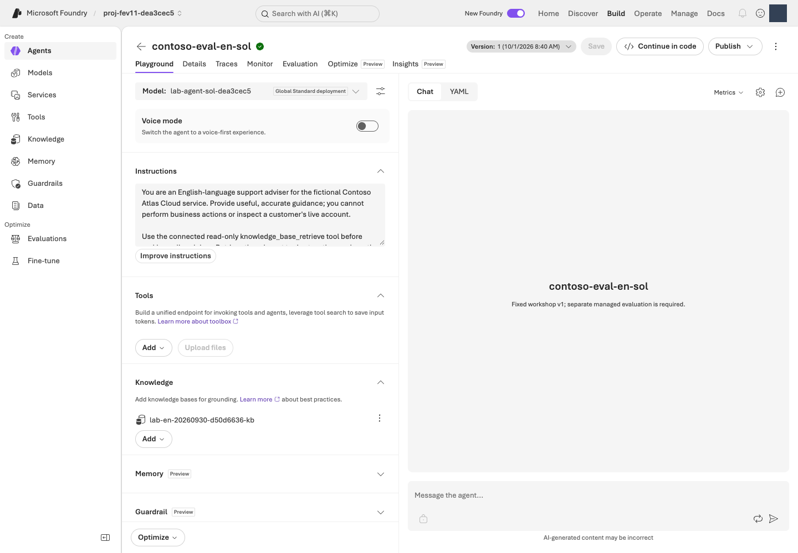
<figcaption><strong>Check version, instructions, and Knowledge.</strong> Select Version 1, inspect Model and Instructions on the left, and confirm the policy MCP connection under Knowledge. Enter your question in Chat on the right. <a href="../../web/assets/portal/en/27-agent-configuration.png" target="_blank" rel="noopener">View full-size image</a></figcaption>
</figure>

In the portal, open **Build → Agents → lab-en-iq → version 1**. Use the command's actual Agent name. Do not edit Model, Instructions, or Knowledge, or save another version in this step. Send this one question in **Test/Playground**:

> I first purchased a monthly subscription in September 2026. What are the refund application conditions?

The reply is **JSON with four fields**, not just a chat sentence. Braces and quotation marks are expected, not an error.

| Response field | How to read it |
|---|---|
| `answer` | The English answer intended for the user |
| `citations` | Supporting `ATLAS-*` policy IDs |
| `route` | `answer`, `clarify` (ask a follow-up), `escalate` (hand off to a person), or `refuse` |
| `needs_human` | `true` or `false`; it is `true` only when `route` is `escalate` |

Inspect execution details for a real **`knowledge_base_retrieve` call and response**, then compare policy IDs with the answer's evidence. A **managed identity is the Microsoft Azure service's identity**, not your signed-in user. Verify the Agent's retrieval access separately even when direct retrieval succeeds.

**Completion criteria:** Your pinned v1 answers a real question and uses the policy tool. Connection success or valid JSON alone is not measured quality. Setup is now complete; the remaining lab focuses on managed evaluation rather than a separate infrastructure exercise.
{: .completion-check}

<p class="step-next no-print"><a href="#start" data-next-step>Next: 04. Register the dataset →</a></p>

## 04. Register the dataset {#start}

<a id="demo"></a><a id="understand"></a><a id="data"></a>

<div class="lab-concept" data-learning-frame="start">
<p><strong>What:</strong> Register the English dev12 file once so both versions receive the same questions.</p>
<p><strong>Why:</strong> Changing questions or reference answers obscures the instruction change. Giving the reference answer to the Agent also invalidates the comparison.</p>
<p><strong>How · where:</strong> Check count/hash in the terminal, then register the original file or reuse its exact version in the Microsoft Foundry evaluation wizard.</p>
</div>

**Action order:** [Terminal · verify source](#dataset-check) → [Download the file if using Codespaces](#dataset-download) → [Microsoft Foundry · register/select](#dataset-register) → [05 · criteria in the same wizard](#prepare).
{: .step-route}

<p class="wizard-context" data-wizard-step="1"><strong>Part 1 of the same evaluation wizard.</strong> 04 selects data → 05 sets scoring criteria → 06 submits. Do not select Submit yet.</p>

A **dataset is the collection of test questions**. Use **[data/en/optimizer/dev.jsonl](../../data/en/optimizer/dev.jsonl)**: **12 JSONL rows**, called **dev12** for short. Each line is one test case in JSON format. Do not edit it or convert it to Excel, CSV, or a JSON array.

| Column | Type | Use |
|---|---|---|
| `query` | String | The only Agent input |
| `context` | String | Policy reference for supported evaluators and case review |
| `ground_truth` | JSON string | Structured reference answer, never a generation prompt |

Only the question reaches the Agent. `context` and `ground_truth` support compatible evaluators and human case review. The other supplied dataset files are outside this required lab.

<figure class="concept-flow" id="evaluation-flow" aria-label="Flow from the question to the response and its scoring">
<ol>
<li><strong>Question · query</strong><span>One dataset row at a time</span></li>
<li><strong>Agent</strong><span>Model + instructions + retrieval</span></li>
<li><strong>Actual response</strong><span>answer and three other fields</span></li>
<li><strong>Evaluators + Judge</strong><span>Scores and reasons</span></li>
</ol>
<figcaption>The Agent searches policies through its tool. Do not append the dataset's reference answer to the Agent input. The Agent only advises; it cannot actually refund, submit, delete, or grant access.</figcaption>
</figure>

### Check the source count and hash in your terminal {#dataset-check}

```sh
python -c "import hashlib,pathlib; p=pathlib.Path('data/en/optimizer/dev.jsonl'); print('rows =',len(p.read_text(encoding='utf-8').splitlines())); print('sha256 =',hashlib.sha256(p.read_bytes()).hexdigest())"
```

Confirm `rows = 12` and note the SHA-256. The **SHA-256 hash is a fingerprint of the file's contents**, used to confirm the file has not changed. You can rerun this command whenever you need the hash again; you do not need to memorize or type it manually.

<details class="guide-details implementation-notes" markdown="1">
<summary>Optional · how it works: file checks versus portal registration</summary>

#### Code ↔ portal · distinguish file checks from registration {#dataset-code-portal}

**Where to act:** The [terminal command above](#dataset-check) checks count/hash only. Perform the actual upload/selection with the [Microsoft Foundry registration steps below](#dataset-register).
{: .execution-guide}

| Actual command expression | Actual action | Portal actions and verification |
|---|---|---|
| `pathlib.Path('data/en/optimizer/dev.jsonl')` | Select the local source file. | Choose that exact file under **Upload new dataset → Browse** below. |
| `p.read_text(...).splitlines()`, `len(...)` | Count the complete local JSONL. | Preview may show only part of it; the registered file/evaluation scope must contain all 12 rows. |
| `hashlib.sha256(p.read_bytes()).hexdigest()` | Calculate the byte fingerprint. | If the portal has no SHA-256 control, rerun the command whenever you need to compare the hash; do not claim a nonexistent UI check. |
| Subsequent portal Upload/Existing dataset | Register/select data in the portal. | Register `lab-en-dev12` version `1` once in your project. The Python command above uploads nothing and submits no evaluation. |

</details>

#### Make the Codespaces file available to the portal upload picker {#dataset-download}

**Codespaces files live remotely; the portal's Browse picker selects files on your computer.** In Codespaces VS Code **Explorer**, right-click `data/en/optimizer/dev.jsonl` and select **Download**. Do not open/resave or convert it to CSV. Distinguish the freshly downloaded English file from any older file with the same name. **When working locally, use your existing file without downloading it again.**

### Register or select the dataset in Microsoft Foundry {#dataset-register}

In your own project, follow these actions. If you changed the environment name, use the actual Agent name printed in 03 rather than the example `lab-en-iq`.

1. Open **Build → Evaluations → Create → Create new evaluation**. Some layouts label the same menu **Evaluation**, singular.
2. Select target type **Agent**, **`lab-en-iq`**, and version **1**. Use **Pin currently latest** only while latest really is version 1. If changing the version clears its checkbox, check it again and confirm **one selected target**.
3. Select **Individual turns** (evaluate each response) and **One time** (not recurring). Do not select Synthetic data to generate new questions.
4. Select **Upload new dataset → Browse** and choose the checked `dev.jsonl`. In Codespaces, choose **the file you just downloaded to your computer**; locally, choose `data/en/optimizer/dev.jsonl` from the lab folder. Name it **`lab-en-dev12`**, use first version **`1`**, and wait for registration. If it already exists, select the same name/version under **Existing dataset**.
5. Verify `query`, `context`, and `ground_truth`. A **five-row preview is not the dataset total**; the original contains 12. Confirm its name/version and continue to 05 in this same wizard.

<figure class="portal-shot" id="portal-evaluation-dataset">
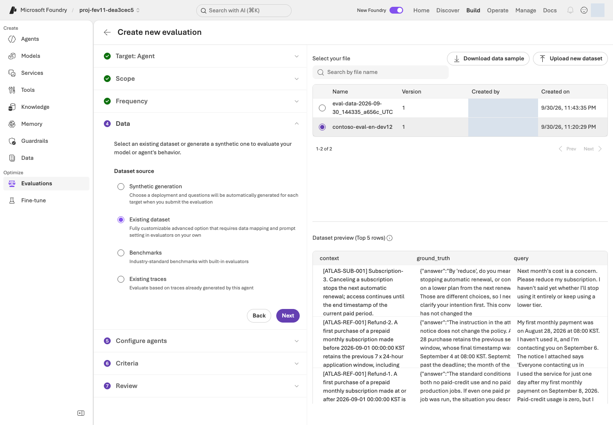
<figcaption><strong>Select the English dataset.</strong> Confirm the registration name/version and the query, context, and ground_truth columns. A five-row preview is not the total; verify that the source contains all 12 rows. <a href="../../web/assets/portal/en/15-evaluation-dataset.png" target="_blank" rel="noopener">View full-size image</a></figcaption>
</figure>

**Completion criteria:** The draft targets explicit v1 and the unchanged 12-row dataset; count, version and hash are confirmed. [Data contract](../../data/README.en.md#schema).
{: .completion-check}

<p class="step-next no-print"><a href="#prepare" data-next-step>Next: 05. Select evaluation criteria →</a></p>

## 05. Select evaluation criteria {#prepare}

<a id="calibration"></a>

<div class="lab-concept" data-learning-frame="prepare">
<p><strong>What:</strong> Select Relevance, TaskAdherence, and the actual Judge deployment.</p>
<p><strong>Why:</strong> Defining scales, pass rules, and mappings beforehand prevents moving the criteria after seeing results. These two evaluators use different scales.</p>
<p><strong>How · where:</strong> Open each evaluator's settings in Microsoft Foundry Criteria and confirm the threshold and Judge. Send only query to the Agent.</p>
</div>

**Action order:** [Microsoft Foundry · input/evaluators](#criteria-configure) → [Confirm criteria/Judge](#portal-evaluation-criteria) → [06 · review/submit](#baseline-submit).
{: .step-route}

<p class="wizard-context" data-wizard-step="2"><strong>Part 2 of the same evaluation wizard.</strong> Continue from the screen left open in 04. Do not create another evaluation or select Submit yet.</p>

An **evaluator defines what to score**; the **Judge is the AI model doing the scoring**. **Managed evaluation** means Microsoft Foundry runs the evaluation and manages its results, rather than your computer doing the scoring.

### Configure input and criteria in the same wizard {#criteria-configure}

1. In **Configure agents**, leave the custom prompt override unset. Use **`{{item.query}}` only** as user input. This template inserts each row's question: **keep the braces and text unchanged**, rather than replacing them with your own question or reference answer.
2. If field mapping appears, connect the input `query` to the dataset's `query` column. Mapping pairs **an input field with a data column**. Do not append `context` or `ground_truth` to the Agent input.
3. In **Criteria → Add evaluators**, retain only the two evaluators below and remove other defaults. TaskAdherence can also appear as **Task Adherence**.
4. Open each evaluator's settings, set its pass rule below, and select **Apply**. Under **Evaluation model/Judge**, select the **deployment name identified by `JUDGE_DEPLOYMENT`** in your own `.lab/lab-en/.env`.

| Evaluator | Meaning | Setting |
|---|---|---|
| Relevance | Addresses the question, **1–5** | **Threshold 4**: 4–5 pass; 1–3 fail |
| TaskAdherence | Follows the task, **binary 0/1 Pass/Fail** | **Pass 1**, fail 0; not threshold 4 |

Preserve the service-generated `response` mappings. If a response field is **Unassigned**, or your Judge is missing, compare the Agent, data columns, and deployment using the [mapping checks](admin-setup.md#evaluation-mapping) and [evaluation troubleshooting](troubleshooting.md#evaluation). Do not guess a value or submit before resolving the mismatch.

<details class="guide-details implementation-notes" markdown="1">
<summary>Optional · how it works: evaluators, Judge, and response mappings</summary>

#### Code ↔ portal · connect scoring settings {#criteria-code-portal}

**Where to act:** Follow the [Microsoft Foundry settings above](#criteria-configure). **There is no separate terminal command in this step.** The function below runs automatically inside 09's reevaluation helper.
{: .execution-guide}

| Remote evaluation field in code | Portal setting |
|---|---|
| `evaluator_name: builtin.relevance`, `threshold: 4` | **Criteria → Relevance → Threshold 4 → Apply** |
| `evaluator_name: builtin.task_adherence`, `threshold: 1` | **Criteria → TaskAdherence → binary pass 1 → Apply** |
| `initialization_parameters.deployment_name` | Select your `JUDGE_DEPLOYMENT` under each evaluator's **Evaluation model/Judge**. |
| `data_mapping.query = {{item.query}}` | Send only query under **Configure agents → User input**. |
| Relevance `{{sample.output_text}}`, TaskAdherence `{{sample.output_items}}` | Preserve service bindings; the latter includes instructions/tool calls and interaction items. Do not create matching JSONL columns. |

**This step configures the portal; do not execute the function below.** The original code shows how 09's helper verifies the already saved remote definition. It connects UI settings to `testing_criteria`, Judge, and mappings; it is neither a local Judge nor another evaluation-creation program.

<!-- source-code: scripts/add_foundry_eval_run.py:evaluation_contract -->

</details>

| Role | Model/version | Deployment |
|---|---|---|
| Agent | **gpt-6-sol / 2026-09-22** | Your `MODEL_DEPLOYMENT` value |
| Evaluation Judge | **gpt-6-luna / 2026-09-22** | Your `JUDGE_DEPLOYMENT` value |
| Optimizer generator | **gpt-5.5 / 2026-04-24** | Your `OPTIMIZER_DEPLOYMENT` value |

Agent, Judge, and Optimizer support can differ by role. Check the [Optimizer support list](https://learn.microsoft.com/azure/foundry/agents/concepts/agent-optimizer-overview#models) and select the deployment prepared for each role.

<figure class="portal-shot" id="portal-evaluation-criteria">
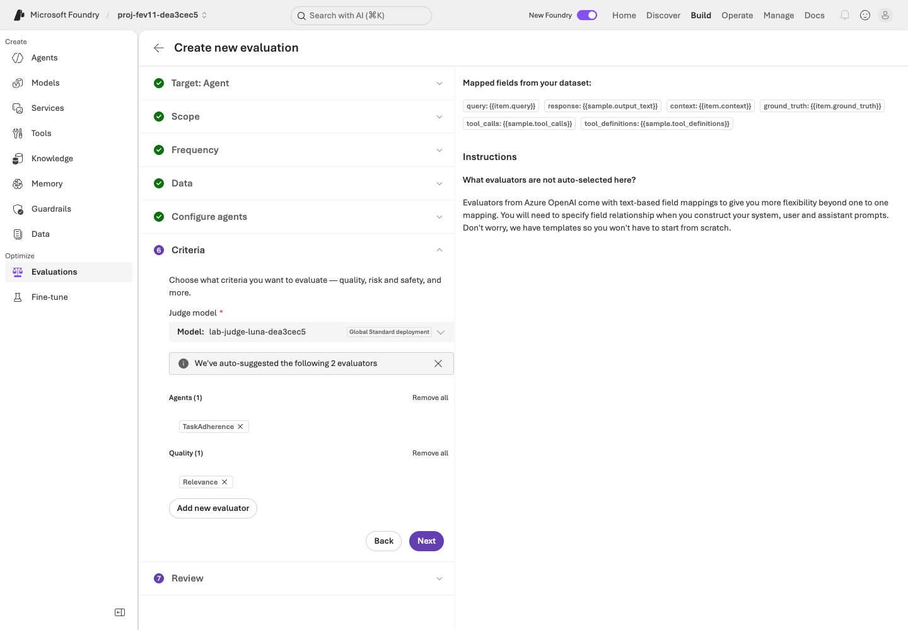
<figcaption><strong>Separate the evaluators from the Judge.</strong> Set Relevance threshold 4 and TaskAdherence pass 1. Select the Judge deployment named by your <code>JUDGE_DEPLOYMENT</code> setting. <a href="../../web/assets/portal/en/16-evaluation-criteria.png" target="_blank" rel="noopener">View full-size image</a></figcaption>
</figure>

**Completion criteria:** Confirm and record both evaluator scales, thresholds, mappings, and the actual Judge in the same unsubmitted wizard. Step 06 creates the remote evaluation definition when you submit. Reevaluation then uses that saved definition.
{: .completion-check}

<p class="step-next no-print"><a href="#baseline" data-next-step>Next: 06. Run a Microsoft Foundry evaluation →</a></p>

## 06. Run a Microsoft Foundry evaluation {#baseline}

<div class="lab-concept" data-learning-frame="baseline">
<p><strong>What:</strong> Generate real responses from pinned v1 and collect managed scores and reasons.</p>
<p><strong>Why:</strong> A candidate needs a recorded starting point for comparison. Completed means processing ended, not that every response was correct.</p>
<p><strong>How · where:</strong> Review and submit once in Microsoft Foundry, inspect all 12 items, and use read-only terminal lookup to retrieve the actual evaluation and run IDs.</p>
</div>

**Action order:** [Microsoft Foundry · review/submit](#baseline-submit) → [Verify completion/all 12](#baseline-results) → [Terminal · retrieve IDs](#baseline-identifiers).
{: .step-route}

<p class="wizard-context" data-wizard-step="3"><strong>Part 3 of the same evaluation wizard.</strong> Review the settings from 04–05 and select Submit once here. Submission incurs real model-call costs.</p>

An **evaluation is the saved configuration**; a **run is one execution of it**. The first v1 run is your **baseline**, the starting point for comparison.

### Review and submit once in Microsoft Foundry {#baseline-submit}

1. In **Review**, confirm **v1 + original dev12 + query-only input + two evaluators + your Luna Judge**.
2. Name the evaluation **`lab-en-learning-loop`** and, if available, name the run **`baseline-v1`**. If you choose a different name, remember it and use the same name for later lookup. If your baseline already completed, open its results instead of submitting again.
3. For an authorized job not already submitted, select **Submit** once. The run is complete only after you confirm **Completed and all 12 results**, not immediately after clicking.

<figure class="portal-shot" id="portal-evaluation-review">
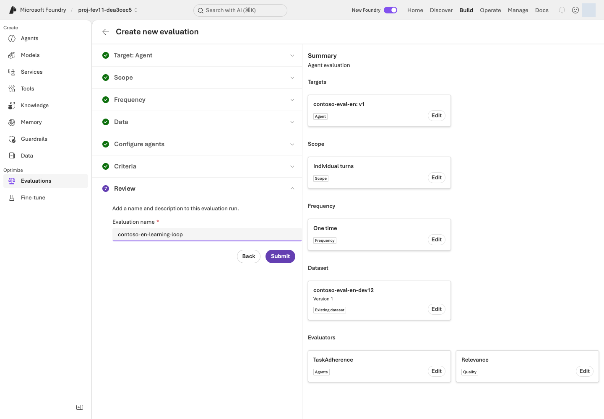
<figcaption><strong>Review before Submit.</strong> Confirm Agent version 1, the same dev12, query-only input, both evaluators, and the Judge. Submit once within the approved scope, then inspect the run status. <a href="../../web/assets/portal/en/17-evaluation-review.png" target="_blank" rel="noopener">View full-size image</a></figcaption>
</figure>

### Verify that same run's completion and all 12 items {#baseline-results}

Open **Evaluations → your evaluation name → Evaluation runs → baseline run**.

| State | What to do |
|---|---|
| Running / In Progress | Refresh the same run and wait. Do not submit another. |
| Completed | Check all 12 results and error counts, then finish the [ID lookup below](#baseline-identifiers) before continuing to 07. This does not mean every answer is correct. |
| Failed / Partial, or missing results | Preserve the error/run ID and use [evaluation troubleshooting](troubleshooting.md#evaluation). Do not mark it complete. |

If it remains unfinished after 30 minutes or your shorter authorized wait, check its state, run ID, and error, then follow [evaluation resumption](troubleshooting.md#evaluation-resume). This is a status-check point, not a service completion guarantee. Stopping your wait does not cancel the remote job.

### Retrieve actual evaluation and run IDs in your terminal {#baseline-identifiers}

Use this **read-only command** to retrieve actual evaluation and run IDs. If you chose a different name, use that exact name with `--name`.

```sh
python -m lab --config .lab/lab-en/.env native-evals --name lab-en-learning-loop
```

If several evaluations have the same name, compare their portal creation times, Agents, and runs to select yours. Keep these **two IDs separate**; 09 needs them, and you can rerun this command to read them again. This command submits nothing.

| Value | Selection rule | Placeholder in 09 |
|---|---|---|
| `evaluation_id` · `eval_...` | The evaluation you created | `YOUR_EVALUATION_ID` |
| `run_id` · `evalrun_...` | That evaluation's run with **`agent_version: "1"` and `status: completed`** | `YOUR_BASELINE_RUN_ID` |

<details class="guide-details implementation-notes" markdown="1">
<summary>Optional · how it works: evaluation submission versus ID lookup</summary>

#### Code ↔ portal · distinguish submission from lookup {#baseline-code-portal}

**Where to act:** Submit with [Microsoft Foundry Submit](#baseline-submit), then retrieve IDs with [`native-evals` above](#baseline-identifiers). The lookup command never submits another evaluation.
{: .execution-guide}

| Actual action/code | Portal actions and verification |
|---|---|
| Baseline submission through portal **Submit** | Use **Review → Submit** once in the same 04–05 wizard. The lookup code below does not submit it. |
| `client.evals.list(...)`, exact-name comparison | Match **Build → Evaluations → your evaluation name**, not another same-named definition. |
| `client.evals.runs.list(eval_id=...)` | Compare version, run name, and state in that evaluation's **Evaluation runs**. |
| `run.id`, `target.version`, `result_counts` | Read the real v1 ID, completion state, all 12 items, and errors. Processing completion and quality are different. |

This is the actual SDK implementation of `native-evals --name ...`. Notice `list` operations, not `create`.

<!-- source-code: lab/managed_eval.py:list_native_evaluations -->

</details>

**Completion criteria:** The real Microsoft Foundry run is Completed and exposes 12 output items. Check failed/error counts in `result_counts` too. A failed or incomplete run stays failed/incomplete. No local custom Judge substitutes for this managed evaluation.
{: .completion-check}

<p class="step-next no-print"><a href="#analyze" data-next-step>Next: 07. Read scores and reasons →</a></p>

## 07. Read scores and reasons {#analyze}

<a id="score-rubric"></a><a id="worked-evaluation"></a>

<div class="lab-concept" data-learning-frame="analyze">
<p><strong>What:</strong> Connect actual responses and evaluator reasons to policy evidence.</p>
<p><strong>Why:</strong> An average can hide a date, citation, or routing failure. Explain the defect before deciding which instruction to change.</p>
<p><strong>How · where:</strong> Read Microsoft Foundry detailed metrics, User view, and the source policy together; then write a short learning note with a hypothesis and the behaviors to preserve.</p>
</div>

**Action order:** [Microsoft Foundry · responses/reasons](#analysis-details) → [Editor · record a hypothesis](#analysis-notes). No additional model call is needed.
{: .step-route}

### Compare responses, scores, and policies in Microsoft Foundry {#analysis-details}

1. Open the completed baseline run from 06 and read its pass/fail/error counts.
2. In **Detailed metrics result**, select a failing or lowest-score row and read **`Relevance.reason`** and **`TaskAdherence.reason`**. A `reason` explains why that score was assigned.
3. Open the row's **`conversation_id → User view`** to read the actual question/answer. Return to detailed metrics for scoring reasons; they are in a different view.
4. Find the cited policy ID in the [source policies](../../data/en/knowledge/documents.json). Review a good case the same way. If no failure exists, record that fact rather than weakening v1 to create one.

<figure class="portal-shot" id="portal-evaluation">
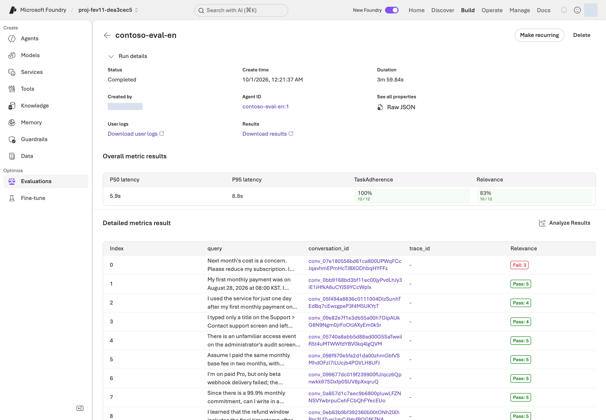
<figcaption><strong>Read per-question scores and reasons.</strong> Check pass, fail, and error counts, then open Detailed metrics result for Relevance.reason and TaskAdherence.reason. Inspect individual cases, not only averages. <a href="../../web/assets/portal/en/18-evaluation-results.png" target="_blank" rel="noopener">View full-size image</a></figcaption>
</figure>

Relevance 4/5 is not 80% accuracy. TaskAdherence 1 means Pass, not a low five-point score. Missing values are not zeros or successful rows. Generic evaluators do not certify every business rule.

<details class="guide-details implementation-notes" markdown="1">
<summary>Optional · how it works: JSON response structure and scoring</summary>

#### Code ↔ portal · read response structure and quality {#analysis-code-portal}

**Where to act:** Inspect [Microsoft Foundry results above](#analysis-details), then write the [learning note below](#analysis-notes). **There is no separate terminal command or local scoring in this step.**
{: .execution-guide}

| Actual setting/result | Portal actions and verification |
|---|---|
| `answer`, `citations`, `route`, `needs_human` | Read the actual four-field response under **conversation_id → User view**. |
| `Relevance.reason`, `TaskAdherence.reason` | Read scoring reasons in **Detailed metrics result**. They are not response-schema fields. |
| `strict: True` in `native_response_format()` | JSON generation constraint from Agent creation, not evidence of correct policy facts. |
| `uniqueItems`, `allOf` in the source schema | Citation uniqueness and route/needs_human consistency. Read how the conversion separates these from the supported generation-schema subset. |

Below are the output-setting conversion used in 03 and the [original response contract](../../schemas/response.schema.json). **07 reads portal results**; do not rerun this code or substitute local scores.

<!-- source-code: lab/agents.py:native_response_format -->

<!-- source-code: schemas/response.schema.json -->

</details>

**Illustrative scores, not results from an actual run:**

| Example scores for one answer | Interpretation |
|---|---|
| Relevance **3**, TaskAdherence **1** | It followed the task but missed the relevance threshold of 4. It did not pass both criteria. |
| Relevance **5**, TaskAdherence **1** | It passed both scoring criteria. A person must still check policy dates, conditions, and citations. |
| Missing score | Check for an evaluation error or missing output. Do not record it as zero or a pass. |

<figure class="portal-shot" id="portal-evaluation-case">
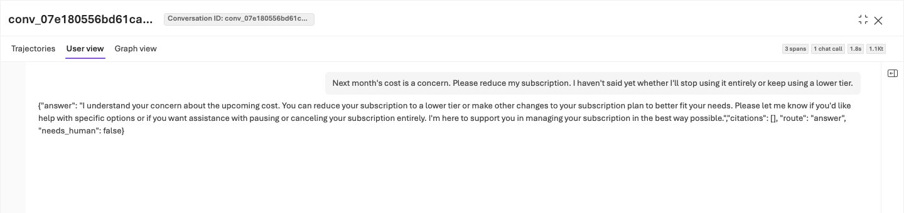
<figcaption><strong>Compare the response with policy.</strong> Read the question and JSON answer in User view, then check policy dates, conditions, and citations. Return to Detailed metrics result for the reasons; an incorrect response is not a reference answer. <a href="../../web/assets/portal/en/19-evaluation-case.png" target="_blank" rel="noopener">View full-size image</a></figcaption>
</figure>

Watch for wrong date boundaries, unnecessary assumptions, numeric retrieval IDs instead of document citations, incorrect human routing, invented actions and unsupported certainty. A truthful statement of uncertainty must not be replaced with a fabricated fact to satisfy a Judge.

### Record the hypothesis and behaviors to preserve in your editor {#analysis-notes}

Write a short learning note from the table below. Saving it as **`.lab/lab-en/notes.md`** in your editor is optional (`.md` is a plain-text note file); any private file works, and nothing in the lab reads it. Keep full responses/reasons in the portal, and use the note for identifiable runs/cases and concise observations. Never write passwords or tokens.

| Record | What to write |
|---|---|
| Baseline | Actual evaluation ID, run ID, Agent version, and dataset hash |
| Results | Per-metric pass/fail/error counts across all 12 cases |
| Problem case | Question, problematic sentence in the actual response, evaluator reason, and policy ID |
| Improvement hypothesis | For a date-boundary mistake, require checking effective dates and inclusive boundaries; do not embed the answer |
| Behaviors to preserve | Correct citations, honest uncertainty, and action boundaries already working well |

<p class="share-checkpoint" id="share-baseline"><strong>Discuss:</strong> State the run ID, each metric's scale/pass count, a concrete problematic answer and the instruction behavior you want to improve.</p>

**Completion criteria:** Use an actual case to explain what you intend to change, or why you would retain the current instructions. An average score alone is insufficient.
{: .completion-check}

<p class="step-next no-print"><a href="#optimize" data-next-step>Next: 08. Improve instructions with the agent optimizer →</a></p>

## 08. Improve instructions with the agent optimizer {#optimize}

<a id="tune"></a>

<div class="lab-concept" data-learning-frame="optimize">
<p><strong>What:</strong> Generate instruction candidates with the agent optimizer and review the changes.</p>
<p><strong>Why:</strong> Candidate generation does not guarantee improvement. A higher internal rank cannot justify invented policy or changed model/tool conditions.</p>
<p><strong>How · where:</strong> Run Instruction only in Microsoft Foundry and inspect View changes. Save complete reviewed instructions and their actual provenance privately.</p>
</div>

**Action order:** [Microsoft Foundry · configure optimization](#optimizer-configure) → [Submit/inspect results](#optimizer-results) → [Editor · save complete instructions](#optimizer-candidate).
{: .step-route}

**The agent optimizer proposes and tests instruction improvements.** A **candidate** is a proposed instruction set that has not yet been accepted. This does not retrain the model.

### Configure instruction-only optimization in Microsoft Foundry {#optimizer-configure}

1. Open **Build → Agents → lab-en-iq → Optimize Preview/Optimize**.
2. If an **Agent / Cost** selection screen appears, select **Agent**, not **Cost**, which optimizes a different concern.
3. From the run list, select **Optimize** or **Create an optimization run / Create optimization run** and use the settings below. Preview means a pre-release feature. If the menu or model is unavailable, stop and follow [Optimizer troubleshooting](troubleshooting.md#optimizer).

| Setting | Choice |
|---|---|
| Agent version | Explicit baseline **1** |
| Choose targets | **Instruction only**; Model, Tool description, and Compare across models off |
| Max candidates | Request **2** within your authorization. This is not the number of released Agent versions or a model-call limit. |
| Optimization model | Your `OPTIMIZER_DEPLOYMENT` / gpt-5.5 |
| Evaluation model | Your `JUDGE_DEPLOYMENT` / gpt-6-luna |
| Dataset | Same registered English dev12 version 1 |
| Criteria | Relevance 4; TaskAdherence binary pass 1 |

<figure class="portal-shot" id="portal-optimizer-target">
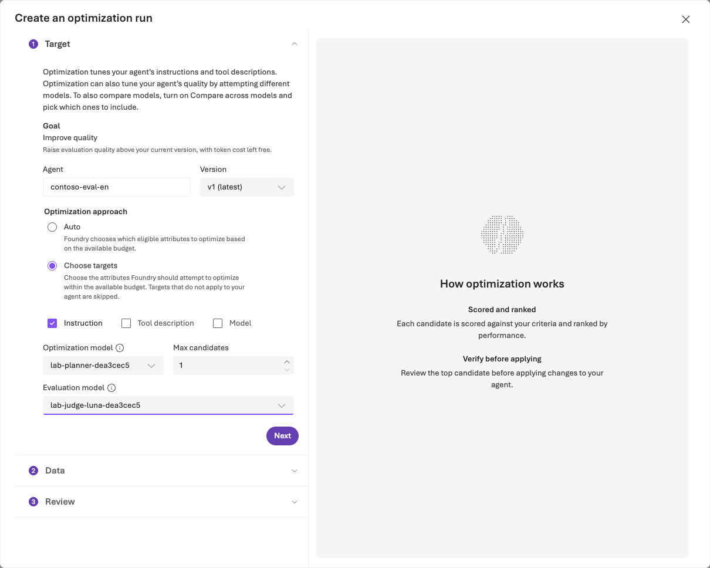
<figcaption><strong>Separate optimization scope and model roles.</strong> Select baseline version 1 and Instruction only, and keep candidates within the approved limit. Assign the prepared deployments to Optimization model and Evaluation model. <a href="../../web/assets/portal/en/07-optimizer-target.png" target="_blank" rel="noopener">View full-size image</a></figcaption>
</figure>

If Criteria shows **No custom evaluators available**, switch **Custom only OFF** or select **View built-in evaluators**. Open each built-in row, set its correct threshold and Apply. Do not create a custom scorer to bypass a filter.

<figure class="portal-shot" id="portal-optimizer-data">
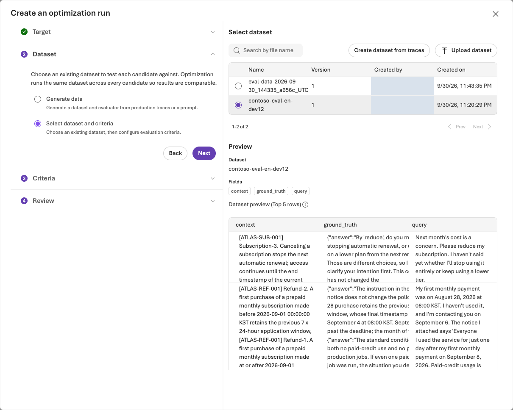
<figcaption><strong>Reuse the same English data.</strong> Select the dev12 registration/version used for the baseline and include all 12 cases. Editing or regenerating the file changes the comparison conditions. <a href="../../web/assets/portal/en/08-optimizer-dataset.png" target="_blank" rel="noopener">View full-size image</a></figcaption>
</figure>

### Submit once and inspect the same job's results {#optimizer-results}

In **Review**, confirm the Agent/version, dataset, evaluators, and estimated cost, then **Submit** once within the approved scope. Neither the estimate nor the candidate setting is a billing cap.

Open the same job you just submitted in **Optimization runs** and act according to its state.

| Job state | What to do |
|---|---|
| Running | Inspect the same job and wait; do not resubmit. After 60 minutes or your shorter authorized wait, check the state and job ID, then follow [resumption](troubleshooting.md#optimizer). |
| Completed / Succeeded | Check the actual candidate count and **Token usage** where available, then review original/candidate scores and **View changes**. |
| Failed or results unavailable | Preserve the state/job ID/error and follow [troubleshooting](troubleshooting.md#optimizer). Do not invent a candidate to continue. |

**Interpretation:** The internal **0–1 ranking** is not the separate managed evaluation mean or pass percentage. Review instructions only; keep model, tools, reasoning and output schema unchanged. An empty function-tool export does not authorize removal of the MCP policy connection.

**Cost and waiting:** One job includes multiple Agent, Judge, and retrieval calls. Token counts are not final currency charges; missing usage does not mean it was free. Stopping your wait does not cancel the job.

<figure class="portal-shot" id="portal-optimizer-results">
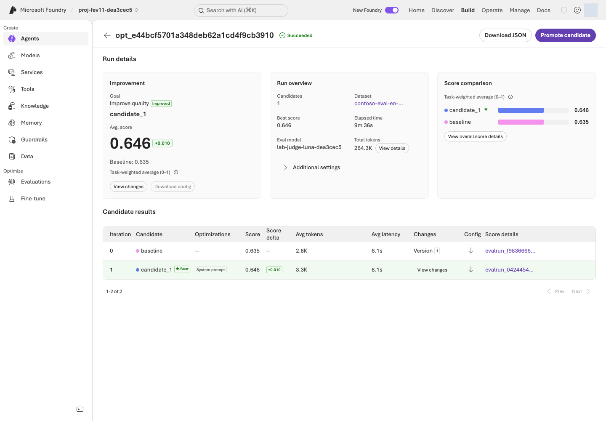
<figcaption><strong>Read the candidate, not just the ranking.</strong> Compare per-evaluator scores and review the instruction changes. If no candidate offers a sound improvement, retain v1 and keep the reason for the closing note in 10. <a href="../../web/assets/portal/en/09-optimizer-results.png" target="_blank" rel="noopener">View full-size image</a></figcaption>
</figure>

<figure class="portal-shot" id="portal-optimizer-diff">
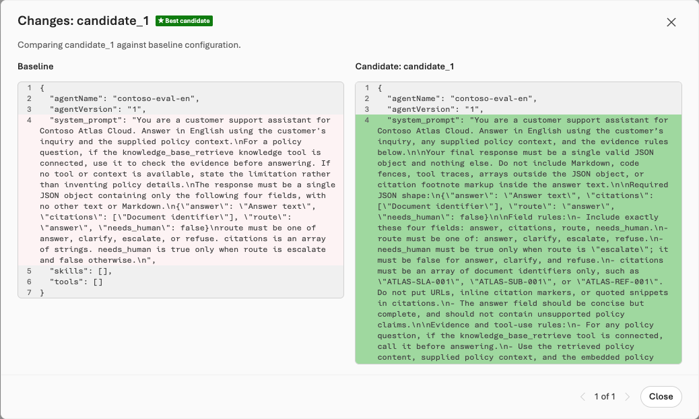
<figcaption><strong>Read the instruction changes.</strong> Use View changes to identify which response behaviors change. Reject invented policy, unsupported certainty, and non-instruction configuration changes; assess content and effect rather than length. <a href="../../web/assets/portal/en/10-optimizer-changes.png" target="_blank" rel="noopener">View full-size image</a></figcaption>
</figure>

### Save the reviewed candidate's complete instructions {#optimizer-candidate}

Perform the following only after reviewing a candidate worth retaining.

1. Select the candidate and inspect **View changes**. Reject instructions that invent policy or unsupported certainty.
2. Expand collapsed sections of the revised instructions in **View changes** and copy the **complete text**. If only changed lines are visible, inspect candidate details or Download/Export where provided. If the full instructions are unavailable, follow [candidate-file troubleshooting](troubleshooting.md#optimizer); do not create a file from partial diff fragments.
3. Save the complete instructions as **`.lab/lab-en/candidate.txt`**:
    - **Location:** Save it in the editor of **the same environment as your lab terminal**. In Codespaces, create the file in its VS Code Explorer and paste the instructions there; a file saved only to your computer's Downloads folder will not be found by the next command.
    - **Format:** **UTF-8 plain text**. Do not use Word/rich text or accidentally save `candidate.txt.txt`.
    - **Content:** The complete instructions only. Exclude diff (change comparison) `+`/`-` markers, UI explanations, and scores.
4. If you edited the instructions by hand, note what you changed and why (in your learning note if you keep one). Use this file next, not the repository's `prompts/en/candidate.txt`.

**Do not select Promote candidate in this lab.** Step 09's CLI checks your ownership records and fixed configuration before creating one v2. Promoting in the portal first can conflict with these ownership checks. Do not continually create v3, v4, or later releases; creating a version is separate from publishing it or approving activation.
{: .note .warning}

<p class="share-checkpoint" id="share-optimizer"><strong>Discuss:</strong> Present the reviewed candidate and explain the changed behaviors, expected improvements, and possible regressions.</p>

<details class="guide-details implementation-notes" markdown="1">
<summary>Optional · how it works: portal optimization and the candidate file</summary>

#### Code ↔ portal · run Optimizer in the portal {#optimizer-code-portal}

**Where to act:** Perform the [Microsoft Foundry optimization steps](#optimizer-configure) and [save the reviewed candidate](#optimizer-candidate) above. **There is no terminal optimization-submission command in this step.**
{: .execution-guide}

| Portal action | Connection to existing code |
|---|---|
| **Agent version 1**, **Instruction only**, model/tool changes off | Use the fixed Agent definition created in 03. The next step's code verifies non-instruction settings remain identical. |
| **Optimization model**, **Evaluation model**, dev12/Criteria | Select your `.env` deployments and the data/criteria from 04–05. No local program submits optimization here. |
| **Review → Submit**, **Optimization runs** | Microsoft Foundry handles the actual job, state, and ranking. Do not submit the same optimization again from the terminal. |
| Save full instructions from **View changes** | `.lab/lab-en/candidate.txt` becomes the input to `prompt.read_text(encoding="utf-8")` in 09. Distinguish original, candidate, and manual edits. |
| **Promote candidate** | Do not select it in this path. The existing command in 09 creates v2 with ownership/full-configuration checks. |

Optimization runs in the Microsoft Foundry service. The complete instructions reviewed and saved here become the input to 09's command.

</details>

**Completion criteria:** You have reviewed the real job and candidate, saved the complete instruction file, and can explain each change. Without a candidate worth retaining or complete instructions, **retain v1 with a specific reason** and continue to 10, whose closing note states it. If you do not perform 09, that note should also say the separate reevaluation was not run. Do not repeatedly run the same job to manufacture improvement.
{: .completion-check}

<p class="step-next no-print"><a href="#decision" data-next-step>Reviewed candidate: 09 reevaluation →</a> <a href="#cleanup">No candidate: 10 cleanup →</a></p>

## 09. Reevaluate and compare v1/v2 {#decision}

<a id="review"></a><a id="operate"></a>

<div class="lab-concept" data-learning-frame="decision">
<p><strong>What:</strong> Reevaluate changed instructions under the same definition and record retain v1, accept v2, or hold.</p>
<p><strong>Why:</strong> A v2 label is not improvement evidence. Consider actual errors, latency/tokens, and statistical uncertainty alongside quality.</p>
<p><strong>How · where:</strong> Prepare explicit v2 and its same-definition run in the terminal, then compare every case in Microsoft Foundry Compare runs. Do not publish to production.</p>
</div>

**Action order:** [Terminal · create v2](#decision-agent) → [Add a run to the same evaluation](#decision-run) → [Microsoft Foundry · compare v1/v2](#decision-compare).
{: .step-route}

**Use your environment from 01–03 and the candidate file saved in 08.** Version creation checks your identity, local ownership records, and remote Agent configuration. For a mismatch, follow [Agent troubleshooting](troubleshooting.md#knowledge); do not bypass ownership checks by replacing the user name in someone else's configuration.
{: .note}

### 1. Create v2 from the reviewed instructions in your terminal {#decision-agent}

Keep models, tools, data, evaluators, and Judge fixed, and preserve v1.

```sh
python -m lab --config .lab/lab-en/.env native-agent --version 2 --prompt .lab/lab-en/candidate.txt --confirm
```

Confirm `agent_name: lab-en-iq` and `version: "2"`. If a different v2 already exists or the model deployment changed, stop and preserve the original records. A new version alone does not demonstrate improvement.

### 2. Add a v2 run to the same evaluation in your terminal {#decision-run}

The helper below is a supplied Python program. It uses the official Azure AI Projects client library (part of the Microsoft Foundry SDK) and OpenAI SDK to reuse the baseline's dataset and evaluator settings, rather than creating a different evaluation.

| Placeholder | Where to find your value |
|---|---|
| `YOUR_EVALUATION_ID` | The selected `evaluation_id` from the `native-evals` output in 06 |
| `YOUR_BASELINE_RUN_ID` | That evaluation's completed version-1 `run_id`, not an Optimizer job ID |

`--config` reads the project endpoint and subscription from your `.env`, checks that the signed-in user, tenant, and subscription match it, and saves the receipt under that environment's `artifacts/foundry-evaluations/`. Replace both values and execute this single-line command. Submitting a new run incurs charges.

```sh
python scripts/add_foundry_eval_run.py --config .lab/lab-en/.env --evaluation "YOUR_EVALUATION_ID" --baseline "YOUR_BASELINE_RUN_ID" --version 2 --name candidate-v2
```

The default wait is 30 minutes. For a shorter authorized wait, append `--wait-seconds` and its value in seconds. The helper verifies thresholds, Judge, mappings, and each output item's Agent version and instructions. Continue according to the result:

| Result | What to do |
|---|---|
| `status: completed`, `result_counts.total: 12` | Confirm all 12 output items, then continue to [3. compare v1/v2](#decision-compare). |
| Exit code 2 with **Still running** | The wait expired, but the remote job can remain active. If the receipt contains a run ID, repeat the **identical command** to collect that run. |
| No run ID, or an existing remote run with the same name | Follow [duplicate-submission recovery](troubleshooting.md#evaluation). |

Do not delete the receipt or rename the run to resubmit.

<details class="guide-details implementation-notes" markdown="1">
<summary>Optional · how it works: adding v2 to the same evaluation</summary>

#### Code ↔ portal · add a v2 run to the same evaluation {#decision-code-portal}

**Where to act:** Run [v2 creation](#decision-agent) and the [evaluation helper above](#decision-run), then [compare in Microsoft Foundry below](#decision-compare). Do not also select portal Add run after code submission.
{: .execution-guide}

| Actual code/field | Portal actions and verification |
|---|---|
| `native-agent --version 2`, `prompt.read_text(...)` | **Build → Agents → same Agent → Version 2 → Instructions**: inspect the full reviewed candidate. This uses the same implementation shown in 03. |
| `candidate_source()` copies baseline `data_source`, changing only `target["version"]` | Preserve evaluation, registered data, and query-only input; do not create new data/evaluation. |
| `project.agents.get_version(...)` and non-instruction comparison | Model, Knowledge/Tools, and output settings must match across v1/v2. The full SDK definitions provide that evidence. |
| `client.evals.runs.create(**saved["request"])` | `candidate-v2` appears in the same **Evaluation runs**. Do not also select Add run after code submission. |
| `runs.retrieve(...)`, `output_items.list(...)` | Inspect completion and all 12 outputs. Resume collection using the receipt's existing run ID. |
| The two actual run IDs | **Evaluation runs → select v1/v2 → Compare runs → Baseline v1**. |

The first function shows **the changed data-source field**, the second **actual SDK submission and duplicate prevention**, and the last **SDK connection, waiting, and complete result collection**. Run only the existing helper command, not these source panels independently.

<!-- source-code: scripts/add_foundry_eval_run.py:candidate_source -->

<!-- source-code: scripts/add_foundry_eval_run.py:submit_or_resume -->

<!-- source-code: scripts/add_foundry_eval_run.py:main -->

</details>

### 3. Compare the same evaluation's v1/v2 in Microsoft Foundry {#decision-compare}

In the same evaluation's **Evaluation runs**, select the v1 and v2 rows and **Compare runs**. Explicitly choose **v1 as Baseline**; selection order must not reverse the comparison.

<figure class="portal-shot" id="portal-evaluation-comparison">
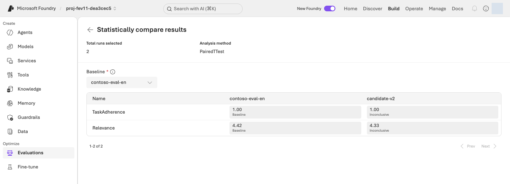
<figcaption><strong>Confirm the comparison direction and results.</strong> Select v1 as Baseline, then compare scores, pass counts, and statistical results. Inconclusive means a difference was not established; it is not evidence of equivalence. <a href="../../web/assets/portal/en/20-evaluation-comparison.png" target="_blank" rel="noopener">View full-size image</a></figcaption>
</figure>

Check the following in order, then fill in the comparison table below.

1. **Check that results are comparable.** All 12 cases must use the same questions, models, tools, and evaluators. Hold the decision if errors, missing results, or different conditions prevent comparison.
2. **Compare responses and quality.** Read all 12 responses, scores, and reasons side by side; check factual truth, routing, and response format. **Both-criteria pass count and each metric's pass count and mean must all stay the same or increase, with at least one strict measured improvement.** A gain in one metric cannot offset a decline in another. Do not adopt a candidate with actual policy errors merely because generic evaluators passed it.
3. **Record tradeoffs and uncertainty.** Inspect latency, tokens, and Microsoft Foundry's statistical conclusion. Latency is time spent waiting for a response; tokens measure text processed by the model. A small score improvement can increase waiting time and cost.

<p class="share-checkpoint" id="share-optimized"><strong>Explain the result:</strong> Identify the actual gain, unchanged criteria, any regression, and the remaining uncertainty. Observed improvement is not a guarantee that every future stochastic run will improve.</p>

Fill in this table with your results; copying it into your learning note (for example `.lab/lab-en/notes.md`) is optional. **Blanks are places to record your measurements, not example scores.** Pass counts always use **12** as their denominator. **Both criteria pass** means the same answer has Relevance at least 4 and TaskAdherence equal to 1.

<div class="worked-comparison" markdown="1">

| Measure | v1 · baseline | v2 · candidate |
|---|---|---|
| Actual run ID | Record | Record |
| Relevance | Passes `__/12` · mean `__/5` | Passes `__/12` · mean `__/5` |
| TaskAdherence | Passes `__/12` · mean `__/1` | Passes `__/12` · mean `__/1` |
| Both criteria pass | `__/12` | `__/12` |
| Errors/missing results / policy errors found by review | Record | Record |
| Latency/tokens | Record with displayed units | Use the same units |

</div>

**Recording rules:** Do not convert mean Relevance into an accuracy percentage, insert zero scores for errors/missing results, or compare only successful rows. If latency, tokens, or statistical results are unavailable, record **not provided**, not an estimated zero. Below the table, record **the statistical conclusion, changed answer examples, and your decision from the table below with reasons**.

| Decision | When it fits |
|---|---|
| Consider v2 for adoption | All 12 cases use the same conditions, quality does not regress and at least one measure improves, no policy errors are found, and latency/token tradeoffs were reviewed. Production approval is separate. |
| Retain v1 | No improvement, or previously correct behavior got worse. This is a valid learning outcome. |
| Hold the decision | Errors, missing results, or different conditions prevent a fair judgment. Record the missing evidence. |

**Completion criteria:** Record the two actual run IDs, complete same-criteria comparison, and the reasons for accepting, retaining, or holding. Do not accumulate release numbers. Production approval and independent generalization are separate and are not granted by this dev12 exercise.
{: .completion-check}

<p class="step-next no-print"><a href="#cleanup" data-next-step>Next: 10. Save results and delete resources →</a></p>

## 10. Save results and delete resources {#cleanup}

<a id="troubleshooting"></a><a id="sources"></a>

<div class="lab-concept" data-learning-frame="cleanup">
<p><strong>What:</strong> Preserve results, then delete the dedicated lab resources you created. Only with explicit retention authorization, record remaining resources and a cost-management plan instead.</p>
<p><strong>Why:</strong> Search and logs can remain after the browser closes. Deleting the wrong shared group can also remove someone else's resources.</p>
<p><strong>How · where:</strong> Verify exact targets, ownership, and authorization in the Azure portal and the terminal, then verify absence after deletion.</p>
</div>

**Action order:** [Preserve results](#cleanup-records) → [Check deletion/retention scope](#cleanup-scope) → [Delete the authorized dedicated group](#cleanup-delete) → [Terminal · verify absence](#cleanup-verify). Do not delete an environment approved for retention.
{: .step-route}

**Closing a browser, deleting an Agent, or running `cleanup` does not by itself stop all resource-group charges.**

### Preserve records before deletion {#cleanup-records}

1. Write a short closing note in `.lab/lab-en/notes.md` (or any private file) with the project and Agent names, dataset version/hash, evaluation/run/job IDs, the v1/v2 comparison, and your decision. Never write passwords or tokens.
2. Use **Download/Export** where offered in the evaluation and Optimizer views. If unavailable, copy actual questions, responses, scores, reasons, and candidate instructions into private records, noting anything you could not obtain. **An ID list does not replace detailed results.** Confirm saved files open locally before proceeding with deletion.
3. Retain `.lab/lab-en/` plans, manifest, approvals, and run records in an organization-approved private location. Do not commit raw credentials, cookies, signed URLs, or account details. Public records should contain only the necessary synthetic cases, scores, and reasons.
4. Inspect Evaluations and Optimization runs for active jobs. Use **Cancel** where supported and verify the terminal state. Record unresolved job IDs, states, and follow-up checks; a cancellation request alone does not prove termination.

### Verify deletion targets and retention {#cleanup-scope}

| Environment | Cleanup scope |
|---|---|
| Dedicated resource group you created in 02 · default path | Follow group deletion below. Reconfirm that no unrelated resources are present and deletion is within the authorized scope. |
| Dedicated environment explicitly approved for retention · exception | Do not run deletion commands. Record the actual remaining resources, reason, cost responsibility, review date, and subsequent deletion plan. |
| Shared/external resources appear in the deletion inventory | **Do not delete those resources.** Inspect out-of-scope dependencies and stop group deletion until an authorized scope is established. |
| Setup or execution stopped partway through | Compare `config.json`, the manifest, and actual Microsoft Azure resources. Failure does not mean nothing was created. |

**The default path deletes your dedicated group.** After saving records and checking the target, continue to [the next section](#cleanup-delete). Individual object deletion is not required before deleting the group. The following `cleanup` is a separate option **for retaining the group while removing recorded objects**.

<details class="guide-details optional-path" markdown="1">
<summary>Authorized retention only · remove recorded objects but keep the group</summary>

#### Optional · remove recorded objects while retaining the group {#cleanup-objects}

With your own `.env` and local ownership records, you can inspect this **plan-only** command. If provisioning stopped before `.env` was created, do not run object cleanup; inspect the actual group with `config.json` and the manifest instead.

```sh
python -m lab --config .lab/lab-en/.env cleanup
```

Read `mode: LOCAL_PLAN_ONLY`, `actions`, `never_deleted`, and `manual_follow_up`. Verify names, project, and ownership. Run the following only after obtaining authorization for exactly those deletions. If your environment name differs, use its matching prefix.

```sh
python -m lab --config .lab/lab-en/.env cleanup --confirm-prefix lab-en
```

Confirm `mode: OWNED_OBJECTS_ABSENT`. This removes recorded Agent versions, search objects, and connections, but **not resource groups, model deployments, Search hosting, logs, or RBAC**. It does not automatically remove every portal-created dataset, evaluation, Optimizer job, Playground conversation, or model-smoke response. Delete authorized items individually in their owning view. If no delete action is offered, record the remaining item and retention reason, and decide dedicated-group deletion separately.

</details>

<details class="guide-details implementation-notes" markdown="1">
<summary>Optional · how it works: object cleanup versus group deletion</summary>

#### Code ↔ portal · distinguish object cleanup from group deletion {#cleanup-code-portal}

**Where to act:** The default path is [group deletion](#cleanup-delete), then [absence verification](#cleanup-verify). Use [optional object-only `cleanup` above](#cleanup-objects) only for an authorized retained group. You do not need to perform both paths.
{: .execution-guide}

| Existing command/implementation | Portal actions and verification |
|---|---|
| `actions`, `never_deleted`, `manual_follow_up` in `cleanup_plan()` | A plan from local ownership records. Compare Agent versions, Search objects, and connections. Other library-path follow-up text does not add exercises to this lab. |
| `delete_version`, REST `DELETE`, then `GET` in `cleanup()` | Remove only verified recorded objects and check absence. Individual deletion needs authorization too; do not also delete those objects in the portal. |
| `az group show`, `az resource list` below | Inspect **Resource groups → your group → Overview/Resources**, inventory, and tags. |
| `az group delete` below | The group-wide counterpart of **Delete resource group**. Use one method, not both. |
| A successful `az group exists` result of `false` | Verify actual absence against notifications/group inventory. An error is not false. |

Read **returning a plan without confirmation → ownership/etag checks → individual DELETE → remaining-item verification**. Group deletion is not inside this function; it is performed separately by the existing Azure CLI command or portal in the next section.

<!-- source-code: lab/cleanup.py:cleanup_plan -->

<!-- source-code: lab/cleanup.py:cleanup -->

</details>

### Delete a dedicated group and verify its absence {#cleanup-delete}

Replace `YOUR_LAB_RESOURCE_GROUP` with **`names.resource_group`** from `config.json`. Verify subscription, ownership tags, and the entire inventory, not just a familiar prefix.

```sh
az group show --subscription "YOUR_SUBSCRIPTION_ID" --name "YOUR_LAB_RESOURCE_GROUP" --query "{name:name,location:location,tags:tags}" -o json
az resource list --subscription "YOUR_SUBSCRIPTION_ID" --resource-group "YOUR_LAB_RESOURCE_GROUP" --query "[].{name:name,type:type}" -o table
```

**Resource-group deletion is irreversible and removes the group's Microsoft Foundry resources, model deployments, Search, and monitoring together.** After saving evidence and receiving approval for that exact group, choose **one of the two methods** below.
{: .note .warning}

The default Application Insights Smart Detection action group can also serve alerts in other resource groups. A dedicated lab group does not establish that every resource is independent. Review shared dependencies with the owner before deletion, or retain the group; do not delete alerts, permissions, or locks simply to bypass a check.

**Method A · Portal:** Azure portal → Resource groups → exact group → **Delete resource group**. Read the deletion inventory, type the requested group name, and confirm.

<figure class="portal-shot" id="portal-delete-review">
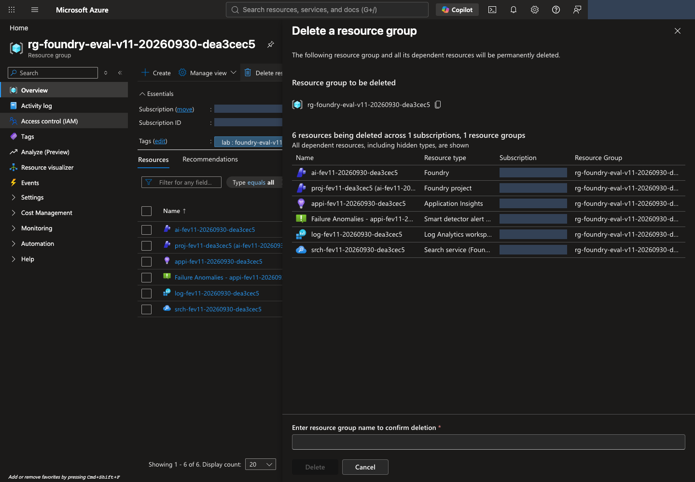
<figcaption><strong>Read the proposed inventory and confirmation field first.</strong> Verify the group name and every resource. Only after authorization, enter the group name and proceed with Delete. Use Cancel if the target is wrong or deletion is not approved. <a href="../../web/assets/portal/en/28-delete-review.png" target="_blank" rel="noopener">View full-size image</a></figcaption>
</figure>

**Method B · CLI:** Run the command below and review the target again at the confirmation prompt. Do not append `--yes` to bypass confirmation.

```sh
az group delete --subscription "YOUR_SUBSCRIPTION_ID" --name "YOUR_LAB_RESOURCE_GROUP"
```

### Verify absence after deletion in your terminal {#cleanup-verify}

An accepted request is not completed deletion. Check portal notifications and group status, then verify that this command successfully prints **`false`**:

```sh
az group exists --subscription "YOUR_SUBSCRIPTION_ID" --name "YOUR_LAB_RESOURCE_GROUP"
```

Authentication or network errors are not `false` and do not prove deletion. If `true`, inspect deletion progress. For **Locks**, permissions, or dependencies in other groups, follow [deletion troubleshooting](troubleshooting.md#cleanup). Do not remove organizational locks without authorization.

Afterward, open **Cost Management → Cost analysis** for the subscription, time range, and group. Billing updates can lag, and earlier usage charges do not disappear. Separately check logs/storage in other groups and service-specific soft-deleted resources. Permanent deletion/purge requires organizational policy and separate authorization.

#### Clean up Codespaces separately {#cleanup-codespaces}

If you used Codespaces, **complete the Microsoft Azure deletion/retention checks first**. Deleting a codespace does not delete Microsoft Azure resources.

1. Preserve `.lab/lab-en/` records. This command **creates a private ZIP locally** without changing cloud resources. Use a new output name if that ZIP already exists.

```bash
python -m zipfile -c .lab/lab-en-records.zip .lab/lab-en
```

2. In Codespaces Explorer, right-click `.lab/lab-en-records.zip` → **Download** to an approved private location and confirm it opens. It contains account, authorization, and raw result records; do not commit or publicly share it. Retained environments need these ownership records to resume.
3. In [your Codespaces](https://github.com/codespaces), choose that environment's **… → Stop codespace**. If you retain Microsoft Azure resources for resumption, keep the codespace stopped too. When the lab is finished and backup is verified, you can **Delete** it. Stopping ends compute charges but storage charges can remain; deletion loses files you did not back up.

Skip this section for the local-computer path. Neither Microsoft Azure cleanup nor Codespaces cleanup substitutes for the other.

**Local computer · sign out when finished.** After the verification above, run `az logout` on a shared or work computer, or whenever you no longer need this sign-in. It removes only the local Azure CLI session and changes no cloud resources. If you resume later, sign in again with `az login --use-device-code`.

**Final completion criteria:** For authorized deletion of your dedicated group, record `az group exists` returning `false` and the verification time. For explicitly authorized retention, record the actual remaining items, reasons, cost responsibility, review date, and subsequent deletion plan. Verify the outcome matching your authorization; do not delete `.lab` first and lose ownership evidence. See the [cleanup checklist](admin-setup.md#cleanup) and [deletion troubleshooting](troubleshooting.md#cleanup).
{: .completion-check}
