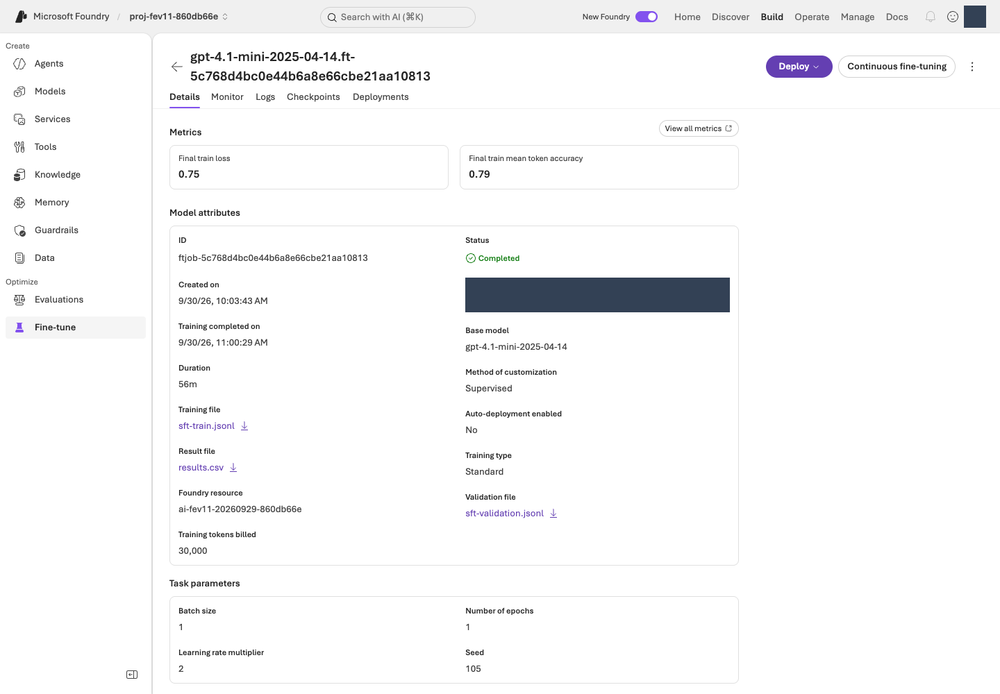

# Optional appendix · Foundry SFT and checking Frontier access {#선택-부록-foundry-sft와-frontier-접근-확인}

[Back to the six participant steps](handbook.md#start) · [Operator setup](admin-setup.md) · [Actual verification status](verification.md)

**This is an optional, separately paid path. You do not need it to complete the core loop.**

The participant lab ends at step 06. Follow this appendix only with a separate objective and authorization—not to bypass errors or HOLD in the main path. Preserve existing tools and run evidence.

- **Foundry SFT** is supervised training. Claim training or improvement only when backed by actual service jobs, weight artifacts, deployments, and evaluations.
- A directly matching official **Frontier** API/support route remains **`NOT_VERIFIED`** in the recorded research. Not finding one does not establish that the product/API does not exist.
- Do not relabel an ordinary SFT job as Frontier success. In the dedicated new environment, the recorded sequence reached **SFT `succeeded` → actual model deployment `Succeeded` → paired dev evaluation against the same base model**. Quality and human operational approval remain separate.

**What you will explore:** Supervised Fine-Tuning (SFT) updates **model weights** using example inputs and desired responses. This lab targets stable behaviors such as JSON formatting, clarification, and action routing, while maintaining changing policy facts separately.

| Approach | What changes | When to consider it |
|---|---|---|
| Foundry IQ / RAG | Evidence retrieved at answer time | Policy freshness, relevant documents, or source evidence is the issue |
| Agent Optimizer | Selected agent configuration, such as instructions | The agent has evidence but still mishandles conditions or action rules |
| SFT | Trained weights starting from a base model | Reviewed examples exist, and stable behavior problems persist after retrieval/instruction improvements |

**Why learn this separately?** SFT has a lifecycle beyond training: file processing, deployment, comparison, and ongoing hosting. Verify each stage: **training files → remote job → `fine_tuned_model` → model deployment → actual answer evaluation**. Unlike the main Agent+IQ path, this appendix compares model calls supplied with static policy context. A more involved technique does not guarantee better results.

## S0. Decide whether training can start {#gate}

**Purpose:** Distinguish a catalog's training capability marker from actual region/model/type/permission support.

**Your task:** Check whether stable behavior problems remain after retrieval and instruction improvements on the same Contoso data. Memorizing changing policy facts in weights is not the objective.

**Run · inspect the current adapter only:**

```bash
python -m lab.sft --help
```

**Command explained:** `--help` prints the installed repository adapter's subcommands/options locally. It does not query available Azure models or your account's training permissions. `lab.sft` is this repository's educational CLI, not an official Microsoft command.

| Check | Current contract in this appendix |
|---|---|
| Candidate base model | **gpt-4.1-mini / 2025-04-14**. Catalog `Legacy` and fineTune markers were observed; actual training support needs separate verification |
| Region | Only the dedicated new NCUS environment. No automatic region switch |
| Current code | The default `lab.sft` adapter validates **Standard training and Standard deployment** |
| Approved processing scope | Permission for Global/Developer processing of synthetic data does not mean the code supports those types |
| Work size | One SFT job, 56 train / 12 validation cases, one epoch, at most 60 minutes waiting per job |
| Costs | Observe training, base/tuned inference, continuous tuned-model hosting, and Judge costs separately |
| Inputs | Exclude original test20 and fresh12 from training/validation files |

**Important compatibility gate:** Do not pass bootstrap's GlobalStandard base deployment into this Standard-only comparison adapter. Bootstrap supports an [explicit Standard-agent plan](admin-setup.md#sft-base). Existing GlobalStandard plans remain unchanged. If needed, prepare a new local plan, scope-bound approval, and binding to the original receipt for the same still-empty group, then apply **one plan only**.

The previous gpt-4o-mini / 2024-07-18 was rejected during actual creation validation with `ServiceModelDeprecated`. The failure was preserved, and both the primary agent and SFT base were explicitly changed to gpt-4.1-mini / 2025-04-14 **before model responses were generated**. Do not compare nonexistent responses/training scores from the rejected model.

**Stop here** if the actually approved/supported training and deployment types differ from the adapter. Exact quota names are `OpenAI.Standard.gpt4.1-mini` for the base and **`OpenAI.Standard.gpt4.1-mini-finetune`** for tuned deployment. Observed headroom—5000 base and 500 tuned—does not prove deployment/training completion or free usage. Do not substitute old-model/GlobalStandard capacity or import an earlier deployment.

**Completion signal:** Actual model/version, training/deployment type, NCUS support, lifecycle conditions, permissions, and remaining call scope are verified. Names/capability markers alone are insufficient.

**Errors/recovery:** If support or capacity is unavailable, record `BLOCKED` or `NOT_VERIFIED` and return to [the core retention record](handbook.md#cleanup).

**Resume:** Recheck current support under the same original plan. Metadata-query success is not training success.

**Next:** S1 only if prerequisites pass.

## S1. Prepare training files locally {#prepare}

**Purpose:** Prepare only train/validation data in a traceable format.

**Your task:** Reuse the main guide's `.venv`, `LAB_LANGUAGE=en`, `LAB_ENV_FILE`, and `LAB_ARTIFACTS_DIR`. If the preparation directory already exists, read its manifest instead of generating it again.

**Run:**

```bash
python -m lab tune-prepare --kind sft
python -m json.tool "$LAB_ARTIFACTS_DIR/tuning/sft/manifest.json"
```

**Commands explained:**

| Command | What it does and what to check |
|---|---|
| `tune-prepare --kind sft` | Validates source exports and prepares train/validation locally in `tuning/sft/`. `--kind` chooses the preparation format, not a remote training submission type. |
| `json.tool .../manifest.json` | Reads row counts, bytes, and SHA-256 per file. Verify before upload because changed data changes comparison conditions. No model call/upload occurs. |

| File | Meaning |
|---|---|
| `sft-train.jsonl` | Only the 56 English training cases from `data/en/` |
| `sft-validation.jsonl` | Only the 12 English validation cases from `data/en/` |
| `manifest.json` | Row counts, bytes, hashes, and `PREPARED_NOT_SUBMITTED` |
| `sft-state.json` | Actual preparation/file/job/model state, created or updated as service operations proceed |

The adapter currently prepares UTF-8 files with a BOM. Do not change encoding/message columns without checking generator and service contracts. SFT user messages contain English query/context; assistant messages contain English training answers from the same selected corpus. Never append evaluator-only labels to user input.

**Completion signal:** Counts are 56/12, hashes agree, and test/fresh-holdout data is absent. **Prepared does not mean trained.**

**Errors/recovery:** Do not delete the existing preparation directory or mix validation/test data to make counts match.

**Resume:** Read the existing manifest/ledger. Do not manually turn `PREPARED_NOT_SUBMITTED` into a later successful job state.

**Next:** S2.

## S2. Establish a pretraining baseline on the same base model {#baseline}

**Purpose:** Avoid reporting a comparison between different model families as a tuning effect.

**Your task:** After the operator prepares the **new base deployment compatible with the current adapter**, in the same new group verified in S0, enter its actual name. If it is not ready, record this step as not run.

If the Standard-agent plan above was actually applied, the verified `MODEL_DEPLOYMENT` in its private `.env` is the base candidate. Check the actual model, version, and Standard SKU—not just the copied value. Do not substitute a different untuned family or an old GlobalStandard deployment name.

**Run · paid baseline, 12 dev cases:**

```bash
export SFT_BASE_DEPLOYMENT="YOUR_VERIFIED_NEW_SFT_BASE_DEPLOYMENT"
python -m lab.sft --config "$LAB_ENV_FILE" baseline --base-deployment "$SFT_BASE_DEPLOYMENT" --run-id sft-pre-dev --interval-seconds 15 --confirm
python -m lab score --run-id sft-pre-dev
cat "$LAB_ARTIFACTS_DIR/runs/sft-pre-dev/report.md"
```

**Commands explained:**

| Command | What it does and its cost boundary |
|---|---|
| `export SFT_BASE_DEPLOYMENT=...` | Stores the verified **untuned deployment name**, not a model family or training job ID. |
| `baseline --base-deployment ... --run-id sft-pre-dev --interval-seconds 15 --confirm` | Runs 12 paid dev cases on the base deployment and saves responses/settings in `runs/sft-pre-dev/`. The 15 seconds spaces cases. No training is submitted. |
| `score --run-id sft-pre-dev` | Aggregates saved responses with local rules. No Judge has run yet; do not invent missing semantic scores. |
| `cat .../report.md` | Displays the aggregate report without model calls or report edits. |

**Completion signal:** You have the same base model's pretraining settings, prompt, complete dev responses, and ledger linkage. A high score is not the condition for submitting training; explain which stable behavior needs improvement.

**Errors/recovery:** Do not submit if authentication, SKU, or model checks fail. Preserve failed rows; do not import scores from another model family as the baseline.

**Resume:** Preserve baseline/ledger. A changed model configuration requires a separate plan, not continuation as the same experiment.

**Next:** S3.

## S3. Upload the files and submit training once {#submit}

**Purpose:** Verify upload, file processing, and training submission separately, and prevent duplicate jobs.

**Your task:** Recheck valid approval, actual supported types, and remaining calls/jobs. Do not submit the same job once through the portal and again through the CLI.

**Run · upload, then check state:**

```bash
python -m lab.sft --config "$LAB_ENV_FILE" upload --confirm
python -m lab.sft --config "$LAB_ENV_FILE" status
```

**Commands explained:** `upload --confirm` **transfers the two prepared files to the selected Foundry environment** and records remote file IDs in `tuning/sft/sft-state.json`. It does not start training. `status` queries their remote processing state and updates the ledger. Local file existence and service `processed` are different states.

**First completion signal:** Two actual file IDs are saved, and both are `processed`. Sending an upload request alone does not establish readiness.

Only then, submit once.

```bash
python -m lab.sft --config "$LAB_ENV_FILE" submit --confirm
python -m lab.sft --config "$LAB_ENV_FILE" status
```

**Commands explained:** `submit --confirm` requests **one paid SFT job** using processed file IDs, the base model, and approval conditions. The default one epoch means one pass through the training set. The following `status` queries that job; it does not create another. Once a job ID is recorded, do not submit again even if it is queued.

Current defaults are `supervised`, one epoch, seed 105, and the training type validated by the adapter. Do not predict and fill in model/job IDs.

**Completion signal:** The ledger's actual job ID agrees with service state. Submission complete is not training complete.

**Errors/recovery:** `SUBMITTING`/`SUBMISSION_UNKNOWN` does not mean no job exists. Before resubmission, compare request time, base model, and file IDs against portal/remote listings. Do not erase the ledger to create another job.

**Resume:** Do not re-upload recorded file IDs. Query the same job's `status`. Resolve unknown outcomes remotely first.

**Next:** S4.

## S4. Verify training completion and artifacts {#result}

**Purpose:** Distinguish preparation, submission, waiting, failure, and successful training.

**Run · query once at a time:**

```bash
python -m lab.sft --config "$LAB_ENV_FILE" status
```

**Command explained:** Queries actual files, job, model, and deployment recorded in the ledger and saves observations. Unlike local `score`, it needs Azure connectivity, but starts no training/inference. Check failure reasons, actual model ID, and completion time separately.

**Your task:** Check status within the agreed maximum 60-minute wait. Both `succeeded` and an actual `fine_tuned_model` are required. Training/validation loss helps diagnose overfitting; it is not support accuracy or a safety score.

You may also wait on the same job with an explicit limit. A timeout neither resubmits nor automatically cancels it.

```bash
python -m lab.sft --config "$LAB_ENV_FILE" wait --timeout-seconds 3000 --interval-seconds 60
```

**Command explained:** Queries the same job every 60 seconds for **up to 3,000 seconds (50 minutes)**. Here, `--interval-seconds` is a **polling interval**, not inference pacing. The local wait limit does not cancel server training or cap costs.

The recorded job returned **30,722 trained tokens** for 56 train / 12 validation cases and one epoch, with an actual tuned-model ID. Raw responses from each status query were preserved in `job-observations/`. Service `trainingType: standard` is a casing difference for the same Standard type—not an automatic switch to Global/Developer.

<figure class="portal-shot" id="portal-sft">

<figcaption><strong>Screen 14 · Build → Fine-tune → the job → Details.</strong> This existing job was inspected with headless Playwright on 2026-09-30. Match its job ID to local sft-state and read Completed, Supervised, Standard, files, and epoch. Creator/profile details are masked. No new training or deployment was started for the screenshot. <a href="../../web/assets/portal/14-sft-job.png" target="_blank" rel="noopener">View full-size image</a></figcaption>
</figure>

**How to read training metrics:** Loss measures next-token prediction error on training examples; inspect its trend. Train mean token accuracy of 0.79 is **not 79% customer-support accuracy**. The model may fit only the training set, so dev comparison is needed. Preserve the portal's `Training tokens billed` of 30,000 and the raw API's `trained_tokens` of 30,722 as different fields/sources. Do not force them to match or turn them into an actual bill. Monitor and Checkpoints support training diagnosis; Deployments shows callable deployments.

**Completion signal:** Actual job/model IDs, result files/observed tokens, and a supported deployment contract are available.

**Errors/recovery:** Do not relabel failed, canceled, or waiting states as success. Do not automatically resubmit after 60 minutes. Ending a local wait does not cancel the server job.

**Resume:** Read the original job ID's state. Cancellation requires separate approval for that job and is different from deleting resources.

**Next:** S5.

## S5. Deploy the tuned model and compare it {#compare}

**Purpose:** Compare the same base and tuned models under matched conditions, separately from Agent Service+IQ.

**Your task:** Check actual tuned-model deployment support, quota, continuous hosting cost, and the adapter's SKU. The capacity below is an ARM-unit example; review it against your approved plan.

The current `deploy` command uses only the artifact from your own actually `succeeded` SFT job and verifies completed new-bootstrap ownership via `BOOTSTRAP_CONFIG`. An empty group or plan alone does not pass. Current cost/processing/task scope and fine-tuned quota are required in addition to ownership. Do not assume manual portal deployment is the only option.

**Run · only for a successfully trained actual model:**

```bash
export SFT_TUNED_DEPLOYMENT="YOUR_NEW_SFT_TUNED_DEPLOYMENT"
python -m lab.sft --config "$LAB_ENV_FILE" deploy --deployment "$SFT_TUNED_DEPLOYMENT" --capacity 20 --confirm
python -m lab.sft --config "$LAB_ENV_FILE" status
```

**Commands explained:** The export selects a new tuned-model **deployment name**. `deploy` remotely deploys your successful job's actual model under that name and records ownership. `--capacity 20` is an ARM capacity value to validate, not a universal TPM conversion. **Ongoing hosting charges** may begin. Confirm actual readiness with `status`; assigning a name does not mean deployment happened.

After deployment is actually ready, compare dev results.

```bash
python -m lab.sft --config "$LAB_ENV_FILE" run-pair --base-deployment "$SFT_BASE_DEPLOYMENT" --tuned-deployment "$SFT_TUNED_DEPLOYMENT" --split dev --run-prefix sft-dev --interval-seconds 10 --confirm
python -m lab score --run-id sft-dev-base
python -m lab score --run-id sft-dev-tuned
```

**Commands explained:** `run-pair` selects two actual same-family deployments with `--base-deployment`/`--tuned-deployment`. Each receives all 12 dev cases: normally **12×2 model responses**. `--run-prefix sft-dev` creates `sft-dev-base` and `sft-dev-tuned` records. Ten seconds spaces cases. The two `score` commands aggregate saved responses locally without additional model/Judge calls.

Both arms use the same system prompt, query/context, and generation settings. This is a **model comparison with static reference policies**, not a comparison of actual IQ retrieval, MCP, or versioned-agent execution.

### Recorded paired results {#이번-실제-paired-결과}

| Local check | Base gpt-4.1-mini | Model tuned from that base |
|---|---:|---:|
| Dev rows | 12 | 12 |
| JSON contract passed | 12/12 | 12/12 |
| Route matched | 10/12 | 11/12 |
| Required citations passed | 9/12 | 11/12 |
| Critical rule failures | 2 | 1 |
| API errors | 0 | 0 |
| Observed total tokens | 7,385 | 7,226 |

Model/version family, static policy context, system prompt, temperature 0, seed 105, Standard SKU, and capacity 20 were matched. This is one small synthetic dev comparison, **not a production pass: a critical failure remains**. Neither test20 nor fresh12 was used for training. Do not relabel dev changes as independent real-world improvement.

Standard tuned-model hosting can incur charges while idle. The recorded reference price was **USD 1.70/hour**, not an actual bill. Do not automatically clean up without deletion approval.

**Completion signal:** Same-base/version original base/tuned responses, errors, latency, and observed tokens are preserved. If you also change data or prompts, do not attribute the difference solely to SFT.

**Errors/recovery:** Do not compare if either arm lacks execution or scores. Never reuse old scores as new-model results. Stop extra evaluation if it would exceed the remaining 300-call authorized scope.

**Resume:** Do not overwrite an existing pair. Inspect saved state; the operator separately decides on a new experiment requiring additional calls.

**Next:** S6.

## S6. Evaluate, hold, and preserve {#decision}

**Purpose:** Separate training completion from unseen-data performance and operational approval.

**Your task:** Select candidates using only dev/validation and evaluate under an actually supported, consistent Judge contract. For optional managed diagnostics, submit only the two runs that have not already received another Judge.

**Run · only after checking separate evaluation costs and support:**

```bash
python -m lab --config "$LAB_ENV_FILE" evaluate submit --run-id sft-dev-base --confirm
python -m lab --config "$LAB_ENV_FILE" evaluate submit --run-id sft-dev-tuned --confirm
python -m lab --config "$LAB_ENV_FILE" evaluate collect --run-id sft-dev-base
python -m lab --config "$LAB_ENV_FILE" evaluate collect --run-id sft-dev-tuned
python -m lab score --run-id sft-dev-base
python -m lab score --run-id sft-dev-tuned
```

**Commands explained:**

| Command pair | What it does and what to check |
|---|---|
| Two `evaluate submit --run-id ... --confirm` commands | Submit the **already saved answers** from base and tuned runs to separate paid managed evaluations. No answer regeneration; eval/run IDs are saved in each run's `managed-eval.json`. |
| Two `evaluate collect --run-id ...` commands | Query/collect the recorded remote evaluations. While processing, continue only collect for the same IDs; do not replace incomplete state with zero scores or PASS. |
| Two `score --run-id ...` commands | Reaggregate collected Judge scores and original responses locally. Check coverage before/after collection and missing values in both arms. |

Built-in metrics diagnose those saved inputs/definitions; they do not replace business-specific calibration or operational approval. Static context is not evidence of actual retrieval. Do not attach another Judge to rescore the same run.

Consider the following separate paired test only if original test20 is still unseen, the SFT experiment's candidate/criteria are frozen, and sufficient authorized work remains.

```bash
python -m lab.sft --config "$LAB_ENV_FILE" run-pair --base-deployment "$SFT_BASE_DEPLOYMENT" --tuned-deployment "$SFT_TUNED_DEPLOYMENT" --split test --run-prefix sft-test --confirm
```

**Command explained:** This is a separate paid comparison with **20 original test cases per model, 40 responses total**. `--run-prefix sft-test` creates two saved run IDs separate from dev. It does not use the main path's fresh12. A person must first verify freeze, unseen-data, and authorization conditions.

This is **a different contract** from the main fresh12 agent attempt. Do not claim a pass through `compare` before execution, Judge, and local scoring are complete for both arms. A small test20 does not guarantee broad generalization or a tuning benefit.

**Completion signal:** Record SFT job success, deployment, comparison, quality, and human judgment separately. Unperformed steps remain not run. Hold operational adoption without separate human approval.

**Errors/recovery:** Missing values, execution errors, critical failures, or Judge disagreement mean HOLD. If you tune after inspecting a test, its questions are no longer unseen.

**Resume:** Preserve job, deployment, response, and evaluation ledgers. **Do not automatically delete the new group, base/tuned models, or files. Deletion is not authorized.** Training/terminal completion does not stop hosting charges; agree with the operator on the next cost check.

**Next:** [The main path's retention record](handbook.md#cleanup).

## Check Frontier access separately {#frontier}

**Purpose:** Prepare what can be prepared without inventing unverified product menus or APIs.

**Your task:** Verify current official support, actual participation, models, regions, data/processing conditions, and execution route through the appropriate support channel. An ordinary SFT screen or fineTune metadata marker is not a substitute.

**Run · neutral local preparation only:**

```bash
python -m lab tune-prepare --kind frontier
```

**Command explained:** Locally prepares original train/validation data, a neutral experiment description, and a manifest in `tuning/frontier/`. It neither converts to an unverified Frontier upload schema nor submits remote training. **Frontier is not ordinary SFT under a different name**; stop here until an actual supported route is verified.

**Completion signal:** `PREPARED_NOT_SUBMITTED`, with 56 train / 12 validation cases, an experiment objective, and an evaluation plan. This does not mean a service-specific upload schema or actual Frontier training job was implemented.

**Errors/recovery:** If no directly matching official API/support route has been verified, record `NOT_VERIFIED`. Do not infer nonexistence or a permanent tenant denial.

**Resume:** Follow that route only after verifying its current official contract and actual participation/data-use conditions. If it needs another harness/endpoint, do not claim it integrates automatically through `agent --stage tuned`.

**Next:** Record unverified status in retention/handoff notes. Do not substitute SFT success for Frontier success.

## Official references {#공식-참고}

- [Foundry fine-tuning: supported models, training types, inputs, and status](https://learn.microsoft.com/azure/foundry/openai/how-to/fine-tuning)
- [Deploy a fine-tuned model](https://learn.microsoft.com/azure/foundry/openai/how-to/fine-tuning-deploy)
- [Azure OpenAI pricing](https://azure.microsoft.com/pricing/details/cognitive-services/openai-service/)

Recheck support, pricing, and lifecycle before execution. Writing a guide or passing mock tests does not verify actual training, improvement, or safety.
