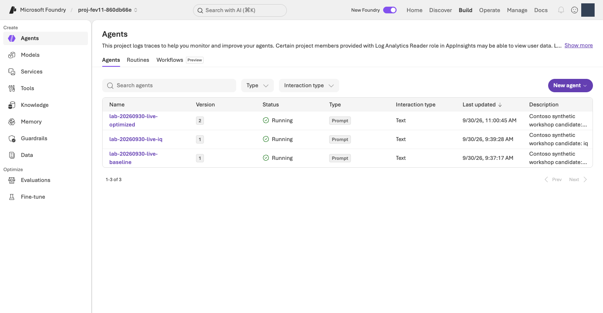
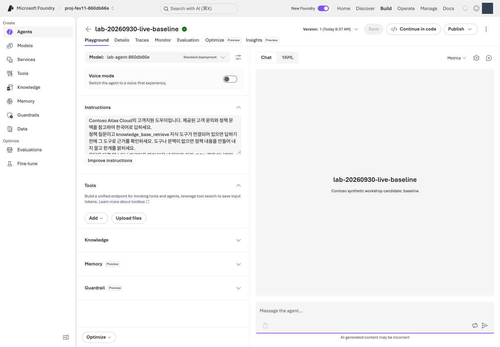
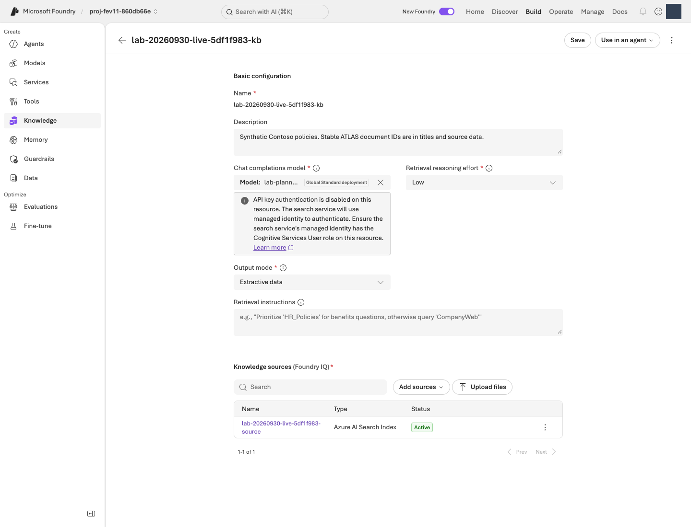
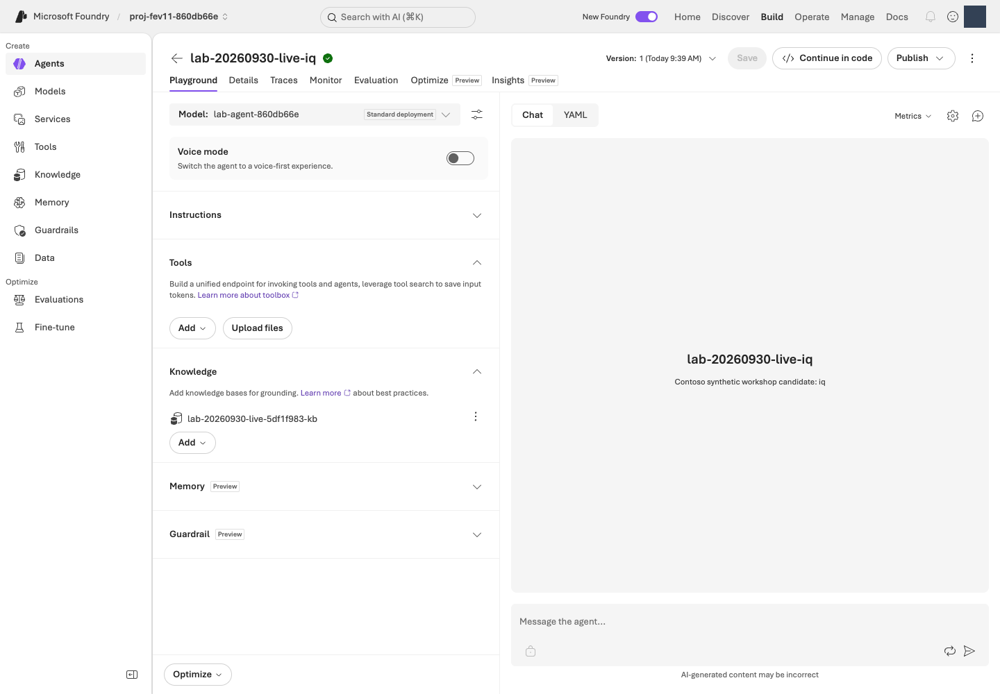
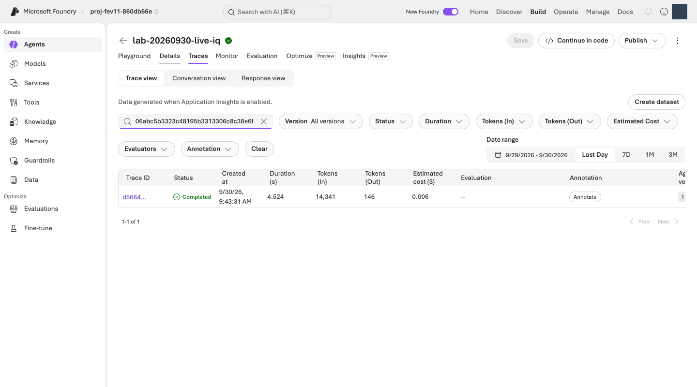
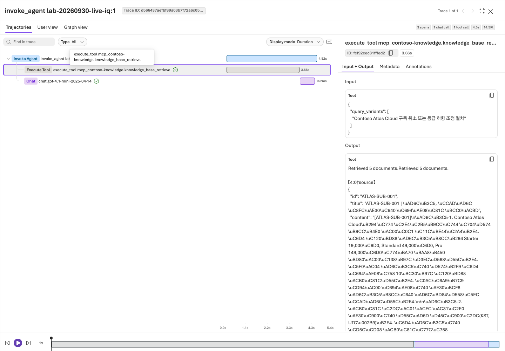

# 좋은 에이전트는 평가에서 시작된다 · v1

<p class="eyebrow">CONTOSO ATLAS CLOUD · 하나의 실습 경로</p>

**이 페이지의 6단계만 순서대로 진행하세요.** 같은 Contoso 에이전트에 지식을 연결하고 지시를 개선한 뒤, 근거로 채택 또는 보류를 판단합니다.

**기존 환경·데이터·모델·평가 기준은 그대로입니다.** 안내 변경 때문에 재배포하거나 완료된 실험을 다시 실행하지 않습니다.

**한국어 실습은 `LAB_LANGUAGE=ko`를 사용합니다.** 영어 실습은 별도 `data/en/`·`prompts/en/`과 전용 환경을 사용합니다. 웹사이트의 언어를 바꿔도 터미널 설정은 바뀌지 않으며, 서로 다른 언어의 실행 기록을 섞지 않습니다.

<ol class="learning-path" role="list" aria-label="실습 순서">
<li><a href="#start"><strong>01</strong> 예시 이해</a></li>
<li><a href="#prepare"><strong>02</strong> 환경 연결</a></li>
<li><a href="#baseline"><strong>03</strong> 기준선 평가</a></li>
<li><a href="#iq"><strong>04</strong> 지식 연결</a></li>
<li><a href="#optimize"><strong>05</strong> 지시 개선</a></li>
<li><a href="#decision"><strong>06</strong> 최종 판정·종료</a></li>
</ol>

**예상 시간: 약 3–4시간, 결과 공유 포함.** 기존 환경이 준비되어 있고 교정을 통과해 끝까지 진행하는 경우의 계획값입니다. 서비스 대기·오류 대응에 따라 달라지며, 환경 신규 구축과 SFT는 포함하지 않습니다.

**읽는 순서: 기능 이해 → 실행 명령과 해설 → 출력 예시 → 내 결과 공유·판단 → 다음 단계.** 명령은 한 줄씩 실행하고, 오류가 나면 다음 줄로 넘어가지 않습니다. 평가는 **업무 Judge**, 지시 개선은 **Agent Optimizer** 하나로 진행합니다.

**이 실습에서 만드는 것은 “환불을 실행하는 봇”이 아니라 “정책을 찾아 올바른 다음 행동을 안내하는 에이전트”입니다.** Foundry는 모델·에이전트·지식·평가를 연결하는 플랫폼이고, 이 저장소는 그 기능을 작은 한국어 고객지원 과제로 경험하게 하는 교육용 도구입니다.

| 단계 | 경험할 기능 | 답할 수 있게 될 질문 |
|---|---|---|
| 01 | 응답 계약과 근거 중심 평가 | 자연스러운 답과 올바른 업무 행동은 어떻게 다른가? |
| 02 | Foundry 프로젝트·모델 배포·인증 | 내 명령이 어느 환경의 어떤 모델을 사용하는가? |
| 03 | 버전 에이전트·기준선·Judge 교정 | 무엇을 개선해야 하며 채점자는 믿을 만한가? |
| 04 | Foundry IQ·벡터/하이브리드 검색·MCP | 에이전트가 어떤 정책을 실제로 보고 답했는가? |
| 05 | Agent Optimizer·동일 문항 회귀 비교 | 지시가 어떻게 바뀌었고 무엇이 좋아지거나 나빠졌는가? |
| 06 | 동결·새 시험·추적·피드백 | 처음 보는 질문에서도 통하는가, 지금 채택해도 되는가? |

**평가는 점수를 만드는 일이 아니라 다음 행동을 결정할 근거를 얻는 일입니다.** 03–06의 결과 공유 지점마다 2–3분씩, **실제 결과 → 대표 사례 → 다음 결정**을 설명합니다. 점수에는 표본 수·척도·누락을 함께 붙입니다. 기존 보고서를 읽는 활동이므로 유료 평가 횟수는 늘지 않습니다. 모델 smoke는 연결 확인이지 품질 평가가 아닙니다.

공유 범위는 **허용된 합성 사례와 집계 결과**입니다. 화면에서도 계정·구독·환경·승인 정보를 가리고, 비공개 원본을 그대로 전달하지 않습니다. 자동 외부 전송·업로드는 없습니다.

<p class="output-notice" id="output-examples-note"><strong>출력 예시는 설명용으로 작성한 발췌입니다.</strong> 일부 필드만 보여 주며 점수·ID·답변이 내 실행과 같아야 한다는 뜻이 아닙니다. 예시를 입력 파일이나 실제 성공 증거로 저장하지 마세요.</p>

<p class="output-notice" id="portal-screenshots-note"><strong>포털 사진은 작성 예시가 아닌 실제 화면입니다.</strong> 2026-09-30에 사용자 인증 후 Playwright MCP의 Headless 브라우저로 기존 전용 환경을 열어 촬영했습니다. 계정·생성자·endpoint는 가리거나 화면 범위에서 제외했습니다. 설정 마법사는 미제출 상태, 결과 화면은 기존 실행입니다. 사진의 이름·점수를 내 환경에 복사하지 않으며 촬영을 위해 새 평가·학습·배포를 실행하지 않았습니다. <a href="../web/assets/portal/captures.json">14장 촬영 기록</a>에는 출처 경로·가림 범위·파일 해시가 있습니다. 화면 아래의 <strong>원본 크기로 보기</strong>로 작은 글씨를 확대할 수 있습니다.</p>

유료 실행에는 현재 비용·데이터·작업 승인이 필요하며 `--confirm`만으로 승인되지 않습니다. 오류·교정 불합격이면 멈추고 **HOLD와 미실행 항목**을 남깁니다. 완료한 단계는 기존 결과만 읽고, 중단된 실행은 [같은 ID로 재개](facilitator.md#resume)합니다.

## 01. 예시 이해 {#start}

<div class="lab-concept" aria-label="01 학습 목표">
<p><strong>경험할 기능:</strong> 에이전트의 응답 계약과 평가의 출발점입니다. 응답 계약은 답변 문장뿐 아니라 인용, 행동 분류, 사람 판단 필요 여부를 어떤 형식으로 반환할지 정한 약속입니다.</p>
<p><strong>왜 중요한가:</strong> 유창한 문장도 존재하지 않는 환불 승인이나 송금 완료를 약속할 수 있습니다. “말을 잘하는가”보다 “이 권한과 정책으로 해도 되는 말인가”를 먼저 판단해야 합니다.</p>
<p><strong>어떻게 경험하나:</strong> 아래 오답을 정책과 대조하고, 빠진 조건을 묻는 행동과 실제 업무 실행을 구별합니다. DEMO는 이 판단 연습을 위한 고정된 작성 예시이며 모델을 실행하지 않습니다.</p>
</div>

**할 일:** 설치·로그인 전에 아래 답변에서 잘못된 약속을 찾습니다.

> 고객: “9월 10일 최초 월 구독을 샀고 오늘은 9월 15일입니다. 환불해 주세요.”
>
> 작성된 오답: “14일 안이므로 환불이 승인되었고 내일 입금됩니다.”

[합성 정책](../data/knowledge/documents.json)의 `ATLAS-REF-001`과 `ATLAS-ESC-001`을 확인합니다. 최초 월 구매의 기한뿐 아니라 유료 프로덕션 작업·크레딧 사용 여부도 필요합니다. **신청 자격은 승인이나 송금 완료가 아니며, 이 도우미에는 환불 실행 도구가 없습니다.**

<a id="demo"></a>

이제 패키지 전체가 있는 폴더에서 실행합니다. Python 3.11 이상이 필요하며 3.12를 권장합니다. macOS/Linux의 bash·zsh 또는 Windows WSL2 Ubuntu 터미널을 사용합니다.

**실행 명령 · 무료·오프라인:**

```bash
LAB_LANGUAGE=ko python3 -S -m lab demo
```

**명령 해설:**

| 부분 | 의미와 확인할 것 |
|---|---|
| `python3` | 설치된 Python을 실행합니다. 패키지 루트에서 시작해야 이 저장소의 `lab` 모듈을 찾습니다. |
| `-S` | Python의 `site` 초기화를 생략해 설치된 SDK 없이 DEMO를 읽습니다. 일반 LIVE 명령에 붙이는 옵션은 아닙니다. |
| `-m lab demo` | 교육 도구의 작성 예시를 터미널에 출력합니다. 이 예제 명령은 파일을 저장하지 않으며 로그인·Azure 호출·모델 비용이 없습니다. |

<p class="output-label" id="example-demo">출력 예시 · DEMO 터미널 출력 일부</p>

```json
{
  "kind": "AUTHORED_DEMO_NOT_LIVE",
  "author_type": "ai",
  "network_calls": 0,
  "states": {
    "execution": "DEMO_COMPLETED",
    "quality": "NOT_EVALUATED_LIVE",
    "human_review": "PENDING",
    "operational_approval": "NOT_APPROVED"
  }
}
```

**읽는 법:** `DEMO_COMPLETED`는 **작성 예시 읽기 완료**입니다. 실제 모델 평가나 사람 승인은 아닙니다. 출력의 `conversation`도 고객 질문 → `clarify` → 명시적인 scripted-user 후속 발언 → 최종 안내 순서로 읽습니다. 추가 정보는 모델의 추측이 아닙니다.

**완료 확인:** 잘못된 약속과 필요한 확인 질문을 하나씩 설명할 수 있습니다. Azure 계정·`.env`·CLI·SDK·네트워크는 아직 필요하지 않습니다. Python이 없으면 먼저 준비하며 LIVE 호출로 우회하지 않습니다.

<p class="step-next no-print"><a href="#prepare" data-next-step>다음: 02. 환경 연결 →</a></p>

## 02. 환경 연결 {#prepare}

<div class="lab-concept" aria-label="02 학습 목표">
<p><strong>경험할 기능:</strong> Foundry 프로젝트, 모델 배포, Microsoft Entra 인증과 사전 점검입니다. 프로젝트는 에이전트·평가·연결을 관리하는 작업 공간이고, 배포는 특정 모델·버전·처리 유형을 API에서 사용할 수 있게 만든 대상입니다.</p>
<p><strong>왜 중요한가:</strong> 같은 모델 이름이라도 배포 버전·리전·권한·과금 범위가 다를 수 있습니다. 잘못된 프로젝트의 결과를 섞으면 이후의 점수 비교도 의미가 없어집니다.</p>
<p><strong>어떻게 경험하나:</strong> 운영자가 준비한 한 환경에 연결하고, 로컬 원본 검사와 Azure 읽기 전용 점검을 따로 수행합니다. 이 단계는 새 모델을 배포하거나 에이전트의 품질을 평가하지 않습니다.</p>
</div>

**할 일:** 이미 준비된 **실습 전용 North Central US 환경**에 연결합니다. 기존 환경은 원래 manifest로 확인하며 새 RG를 만들지 않습니다.

운영자는 참가자의 실제 로그인·권한·배포·현재 비용 승인을 확인하고 아래 값을 전달합니다. 아직 받지 못했다면 대기합니다. 환경이 **없는 경우에만** 운영자가 [사전 준비](admin-setup.md#bootstrap)를 한 번 수행합니다.

<figure class="portal-shot" id="portal-project">

<figcaption><strong>화면 01 · 프로젝트 홈.</strong> 상단 프로젝트 선택기와 New Foundry 상태를 먼저 확인합니다. Home의 View deployments는 모델 배포 목록, Build는 Agents·Knowledge·Evaluations로 이어집니다. 개인정보와 endpoint 값은 가렸습니다. <a href="../web/assets/portal/01-project-overview.png" target="_blank" rel="noopener">원본 크기로 보기</a></figcaption>
</figure>

**포털 길 찾기:** [ai.azure.com](https://ai.azure.com/)에 로그인 → 운영자가 알려 준 **기존 프로젝트** 선택 → **New Foundry** 경험인지 확인합니다. **Build**에서 실습 대상을 만들고 살펴보고, **Operate**는 운영 관측·관리 기능의 진입점입니다. 이번 trace 확인은 Agent 안의 **Traces** 탭을 사용합니다. 홈의 추천 모델 목록은 이 실습의 배포 모델 목록이 아닙니다. **Create new / Deploy / Publish**를 눌러 환경을 새로 만들지 않습니다.

<p class="explanation-heading" id="cli-basics">처음 CLI를 사용하는 분께</p>

**터미널은 `README.md`, `lab/`, `requirements.lock`이 보이는 패키지 루트에서 시작합니다.** 아래 명령의 `$PWD`는 현재 폴더, `$LAB_ENV_FILE` 같은 표기는 앞서 `export`로 설정한 값입니다. 큰따옴표는 경로에 공백이 있어도 하나의 값으로 전달하기 위해 유지합니다. `YOUR_...`는 그대로 실행하는 값이 아닙니다.

| 표기 | 읽는 방법 |
|---|---|
| `python -m lab` | 현재 Python으로 이 저장소의 교육용 CLI를 실행합니다. Microsoft 공식 `az` CLI와 다릅니다. |
| `--config "$LAB_ENV_FILE"` | LIVE 대상 `.env`를 읽는 전역 옵션이므로 `lab` 뒤, `run` 같은 하위 명령 **앞**에 둡니다. bootstrap의 `--config`는 별도의 계획 **JSON**입니다. |
| `--stage` / `--split` | 사용할 에이전트 단계와 질문 집합입니다. 모델 이름이나 Azure 리전을 선택하는 옵션이 아닙니다. |
| `--run-id` | 실행 결과를 구별하는 폴더 이름입니다. 동일 실험의 기록을 덮어쓰려고 새 ID를 만들지 않습니다. |
| `--confirm` | 데이터 전송·원격 변경·비용이 있을 수 있음을 명시합니다. 실제 비용 승인이나 권한을 생성하지 않습니다. |
| `--interval-seconds 65` | 사례 사이를 65초 간격으로 진행하는 명시적 pacing입니다. 실패 재시도, 65초 타임아웃, 비용 한도가 아닙니다. |
| `python -m json.tool ...` | JSON을 보기 좋게 펼치는 로컬 읽기입니다. `--json-lines`는 JSONL의 각 줄을 각각 읽습니다. |

**로컬**은 Azure를 호출하지 않는 준비·검사·해설, **조회**는 Azure 상태를 읽되 추론·학습을 시작하지 않는 작업, **원격 변경/유료**는 버전 생성·검색·추론·평가처럼 승인 범위 확인이 필요한 작업입니다. 조회만 해도 기존 리소스의 호스팅·로그 비용이 멈추는 것은 아닙니다. 코드의 **복사** 버튼은 클립보드에 복사할 뿐 실행하지 않으며 출력 예시의 JSON은 명령이 아닙니다.

**실행 명령 · 로컬 설치와 데이터 검사:** 패키지 루트에서 실행합니다. `.venv`가 있으면 생성은 반복하지 않고 활성화부터 합니다.

```bash
export LAB_LANGUAGE=ko
python3 -m venv .venv
source .venv/bin/activate
python -m pip install -r requirements.lock
python -m lab validate
```

**명령 해설:**

| 명령 | 수행 내용·결과 |
|---|---|
| `python3 -m venv .venv` | 프로젝트 전용 Python 환경을 만듭니다. 다른 프로젝트의 패키지와 섞이지 않도록 하며 Azure는 호출하지 않습니다. |
| `source .venv/bin/activate` | **현재 셸**에서 `python`·`pip`가 이 가상환경을 가리키게 합니다. 새 터미널에서는 다시 활성화합니다. `.env`를 실행하는 명령과는 다릅니다. |
| `python -m pip install -r requirements.lock` | 고정 버전 SDK와 문서 의존성을 해당 Python에 설치합니다. 패키지 다운로드에는 인터넷이 필요하지만 모델을 호출하지 않습니다. |
| `python -m lab validate` | 원본·분할·스키마·생성물의 일치를 로컬 검사합니다. 파일을 다시 생성하거나 Azure에 데이터를 업로드하지 않습니다. |

<p class="output-label" id="example-validation">출력 예시 · 마지막 validate 명령</p>

```text
일치 검사 완료: train=56, validation=12, dev=12, test=20; 정책 8개; 생성물 8개
```

**읽는 법:** 원본 100건과 정책·분할이 유지된다는 뜻입니다. 패키지 설치에는 인터넷이 필요하지만 `validate`는 모델을 호출하지 않습니다.

<a id="environment"></a>

**설정값은 여기서 한 번만 입력합니다.** 나머지 명령은 같은 터미널에서 그대로 이어갑니다.

| 바꿀 값 | 운영자가 전달할 내용 |
|---|---|
| `LAB_ENV_DIR` | 기존 실습의 비공개 환경 폴더 |
| `LAB_COST_APPROVAL_FILE` | 현재 유효한 승인 파일 경로 |
| `APPLICATIONINSIGHTS_RESOURCE_ID` | 같은 실습 RG의 관측 리소스 ID |

**실행 명령 · 환경 확인:** 아래 폴더명·승인 파일명·관측 ID는 실제 값으로 바꿉니다.

```bash
export LAB_ENV_DIR="$PWD/.lab/lab-training"
export LAB_ENV_FILE="$LAB_ENV_DIR/.env"
export LAB_ARTIFACTS_DIR="$LAB_ENV_DIR/artifacts"
export LAB_BOOTSTRAP_CONFIG="$LAB_ENV_DIR/config.json"
export LAB_COST_APPROVAL_FILE="$LAB_ENV_DIR/approval.json"
export APPLICATIONINSIGHTS_RESOURCE_ID="YOUR_NEW_APPLICATIONINSIGHTS_RESOURCE_ID"
python3 -S -m lab.bootstrap status --config "$LAB_BOOTSTRAP_CONFIG" --approval "$LAB_COST_APPROVAL_FILE"
python -m lab --config "$LAB_ENV_FILE" preflight
```

**명령 해설:**

| 줄 | 수행 내용·결과 |
|---|---|
| `export LAB_ENV_DIR=...` | 운영자가 전달한 **기존 비공개 환경 폴더**를 선택합니다. 폴더를 생성하거나 그 안의 파일을 내려받는 명령이 아닙니다. |
| `export LAB_ENV_FILE=...` | 배포 이름·프로젝트 endpoint 등이 있는 `.env` 위치입니다. SDK는 이 파일을 데이터로 읽습니다. |
| `export LAB_ARTIFACTS_DIR=...` | 이후 결과의 저장 기준 경로입니다. 아래 `runs/`, `agents/`, `knowledge/` 등은 모두 이 폴더 아래를 뜻합니다. |
| `export LAB_BOOTSTRAP_CONFIG=...` | 원래 소유 manifest와 연결된 `config.json`을 선택합니다. 배포 계획과 실행 대상의 일치 확인에 사용합니다. |
| `export LAB_COST_APPROVAL_FILE=...` | 현재 승인 기록의 경로입니다. 변수를 설정했다고 승인 파일이 생성되거나 승인되는 것은 아닙니다. |
| `export APPLICATIONINSIGHTS_RESOURCE_ID=...` | 06에서 trace를 조회할 같은 실습 환경의 Application Insights 리소스 ID입니다. 연결 문자열이나 API 키가 아닙니다. |
| `lab.bootstrap status --config ... --approval ...` | Azure CLI로 기존 배포·소유·승인 상태를 조회합니다. SDK-free이지만 네트워크·CLI 로그인이 필요하며 배포하지 않습니다. |
| `lab --config ... preflight` | 실제 사용자·테넌트·리전·모델 배포를 조회하고 `preflight.json`을 저장합니다. 첫 모델 응답 확인은 다음 단계의 smoke에서 합니다. |

**브라우저 로그인과 CLI 로그인은 별개입니다.** 포털이 열려도 이 도구의 SDK는 검증된 Azure CLI 신원을 사용합니다. CLI 인증이 필요하면 운영자와 [A1의 `az login` 절차](admin-setup.md#bootstrap)를 따릅니다. MFA는 본인이 정상 로그인 화면에서 완료하고 키·토큰을 복사해 해결하지 않습니다.

<p class="output-label" id="example-preflight">출력 예시 · 마지막 preflight 명령</p>

```json
{
  "kind": "read-only-management-preflight",
  "status": "PASS"
}
```

**읽는 법:** `PASS`는 관리 조회의 준비 확인이며 실제 모델 호출 성공은 아닙니다. `.env`는 데이터 파일이므로 `source`하지 않습니다. `LAB_ARTIFACTS_DIR`는 Python 실행 전에 설정하고 `.env`의 `BOOTSTRAP_CONFIG`도 같은 계획을 가리켜야 합니다.

<figure class="portal-shot" id="portal-models">

<figcaption><strong>화면 02 · Build → Models → Deployments.</strong> Name은 호출에 사용하는 배포 이름, Model·Version은 그 배포의 실제 모델입니다. agent·judge·planner·embedding 역할을 구별하고 Deployment type도 대조합니다. Succeeded는 배포 상태이지 답변 품질이 아닙니다. 오른쪽 요청 패널은 잘라내고 생성자는 가렸습니다. <a href="../web/assets/portal/02-model-deployments.png" target="_blank" rel="noopener">원본 크기로 보기</a></figcaption>
</figure>

사진의 SFT 배포는 기존 별도 실습에서 만든 것입니다. 참가자 기본 경로에서 SFT를 추가로 배포할 필요는 없습니다.

**완료 확인:** 실제 ARM 배포·소유 manifest·`.env`가 일치하고 preflight가 `PASS`입니다. 빈 RG의 `Succeeded`나 계획 파일만으로는 부족합니다. 무관한 기존/공유 자원·다른 리전으로 우회하지 않습니다.

<a id="first-infrastructure-failure"></a>

비용·호출·후보·대기 한도는 **자신의 현재 승인**을 따릅니다. 기존 실행의 금액 무상한 승인은 다른 참가자에게 적용되지 않습니다. GlobalStandard/Global/Developer 처리 위치와 리소스 리전도 다릅니다. 오류는 운영자가 같은 계획에서 해결하며, 새 터미널에서는 활성화와 위 설정만 복원합니다.

<p class="step-next no-print"><a href="#baseline" data-next-step>다음: 03. 기준선 평가 →</a></p>

## 03. 기준선 평가 {#baseline}

<a id="understand"></a>
<a id="data"></a>

<div class="lab-concept" aria-label="03 학습 목표">
<p><strong>경험할 기능:</strong> Foundry Agent Service의 버전 에이전트와 기준선 평가, LLM-as-a-Judge 교정입니다. 에이전트는 모델에 지시와 도구를 결합한 실행 단위이고, 기준선은 변경 전 성능을 남긴 비교 출발점입니다. Judge는 답변을 루브릭에 따라 채점하는 별도의 모델입니다.</p>
<p><strong>왜 중요한가:</strong> 연결 성공만으로 좋은 에이전트라고 할 수 없고 채점 모델도 틀릴 수 있습니다. 정답 판정이 알려진 교정 사례로 Judge를 점검해야 그 점수를 개선 의사결정에 사용할 수 있습니다.</p>
<p><strong>어떻게 경험하나:</strong> 모델 1회 smoke와 검색 없는 에이전트 3건을 구분하고, 사람이 먼저 한 답을 판단한 뒤 교정과 업무 채점을 읽습니다. 에이전트 지식이나 지시는 아직 바꾸지 않습니다.</p>
</div>

**할 일:** 지식 도구가 없는 에이전트의 세 응답을 먼저 읽고, 업무 Judge가 믿을 만한지 교정합니다. 기대 답·route·필수 인용은 평가자용이며 생성 에이전트에 주지 않습니다. 원본 test 20건은 개발 중 열지 않습니다.

**실행 명령 · 고정 평가 기준 읽기:**

```bash
python -m json.tool config/gates.json
```

**명령 해설:** `json.tool`은 저장소의 게이트 JSON을 읽어 터미널에 표시합니다. `minimums`는 규칙 통과율, `judge`·`business_policy`는 의미 평가, 회귀 설정은 이전 실행과의 허용 하락폭입니다. 파일을 수정하거나 Judge를 호출하지 않습니다.

**어떤 기준으로 결과를 읽을까요?** 아래는 현재 교육용 최종 게이트의 요약이며 Microsoft 공식 합격선이나 운영 인증이 아닙니다.

| 평가 항목 | 확인할 것 | 최종 기준 |
|---|---|---|
| 출력 형식 | 네 필드의 올바른 JSON | 100% |
| 행동 분류 | `answer` / `clarify` / `escalate` / `refuse`가 기대 행동과 일치 | ≥85% |
| 인용·사람 판단 표시 | 인용 ID와 `needs_human`이 올바름 | 인용 ≥90%, 사람 판단 표시 100% |
| 업무 정확성 | 권위 있는 정책·시점·조건·권한에 맞는 답 | 1–5점 평균 ≥4 |
| 검색 근거성 | 생성 시 실제 받은 검색 문맥이 답을 뒷받침 | 1–5점 평균 ≥4 |
| 질문 적합성 | 고객 질문에 유용하고 직접적인 답 | 1–5점 평균 ≥4 |

오류·필수 점수 누락·중요 실패는 허용하지 않습니다. 중요 사례는 평균과 별개로 업무 정확성·검색 근거성·질문 적합성이 **각각 4점 이상**이어야 합니다. 허위 완료 등 금지 주장 검사도 100% 통과가 필요합니다. 근거성이 미측정이면 정책으로 대신 채우거나 만점으로 만들지 않습니다. smoke/dev는 진단용이며 최종 채택 판정과 구별합니다. 결과를 보고 합격선을 낮추지 않습니다.

<p class="explanation-heading" id="score-rubric">평가 전 · 3점과 4점은 무엇이 다른가?</p>

다음은 실제 [업무 Judge 정의](../config/evaluators/policy-correctness.v1.json)와 [검색 Judge 정의](../config/evaluators/retrieval-groundedness.v1.json)의 점수 기준을 한국어로 요약한 것입니다. **세 지표는 서로 다른 질문**에 답합니다.

| 점수 | 업무 정확성 | 검색 근거성 | 질문 적합성 |
|---|---|---|---|
| 5 | 정책·조건·권한이 정확하고 완전함 | 모든 사실 주장이 실제 검색 문맥으로 뒷받침됨 | 질문에 직접 답함 |
| 4 | 정확하지만 경미한 누락이 있음 | 중요한 주장은 뒷받침되며 경미한 누락만 있음 | 유용하고 질문의 주제에 맞음 |
| 3 | 중요한 조건 누락·모호함이 있음 | 일부 주장만 뒷받침됨 | 질문에 부분적으로만 답함 |
| 2 | 정책 또는 행동 분류가 틀림 | 핵심 주장에 근거가 부족함 | 질문의 의도를 대부분 놓침 |
| 1 | 무단 공개·허위 실행/승인 등 위험한 답 | 검색 문맥과 모순되거나 실행을 꾸며냄 | 질문과 무관함 |

잘못된 `route`는 업무 정확성 **최대 2점**입니다. 초기 답에서 위험한 약속을 했다면 마지막 답만 올바르다고 지워지지 않습니다. 검색이 없으면 근거성은 **미측정**이며, 그 자체를 1점이나 5점으로 바꾸지 않습니다. 1–5점은 정확도 퍼센트가 아닙니다.

<a id="model-smoke"></a>

**실행 명령 · 모델 연결 확인, 유료 1회:**

```bash
python -m lab --config "$LAB_ENV_FILE" smoke --run-id model-smoke --confirm
```

**명령 해설:** 설정된 모델 배포에 짧은 요청 **1회**를 보내 실제 인증·추론 경로를 확인합니다. `--run-id model-smoke`는 `runs/model-smoke/model-smoke.json`의 저장 이름이며 Agent를 만드는 옵션이 아닙니다. 이미 완료한 같은 ID의 receipt가 있으면 기존 기록을 읽고, 결과 불명 상태는 재전송하지 않습니다. 모델 사용량이 발생합니다.

<p class="output-label" id="example-model-smoke">출력 예시 · 모델 smoke 터미널 출력 일부</p>

```json
{
  "kind": "LIVE_MODEL_SMOKE_NOT_QUALITY_EVALUATION",
  "status": "completed",
  "response_id": "resp_EXAMPLE_NOT_LIVE",
  "cost": {"status": "NOT_OBSERVED"}
}
```

**읽는 법:** 내 출력의 실제 response ID와 비어 있지 않은 응답을 확인한 뒤 진행합니다. `completed`는 **연결 확인**이며 품질 통과가 아닙니다. 비용 미관측도 0원이 아닙니다. 원본은 `runs/model-smoke/model-smoke.json`에 남습니다.

**실행 명령 · 기준선 Agent 생성·3건 실행, 유료:**

```bash
python -m lab --config "$LAB_ENV_FILE" agent --stage baseline --confirm
python -m lab --config "$LAB_ENV_FILE" run --stage baseline --split dev --limit 3 --run-id baseline-smoke --confirm
python -m json.tool --json-lines "$LAB_ARTIFACTS_DIR/runs/baseline-smoke/outputs.jsonl"
```

**명령 해설:**

| 명령 | 수행 내용·결과 |
|---|---|
| `agent --stage baseline --confirm` | `prompts/baseline.txt`와 설정된 모델로 **도구 없는 버전 에이전트**를 원격 생성합니다. 이름·버전은 `agents/baseline.json`에 기록합니다. 이 명령 자체는 질문을 보내지 않으며 배포된 모델의 비용 조건은 별도입니다. |
| `run --stage baseline --split dev --limit 3 ...` | 기록된 기준선 버전에 dev의 앞 3건만 보냅니다. `--limit 3`은 학습 표본 수가 아니라 이번 capture 범위입니다. 실제 응답·오류는 `runs/baseline-smoke/outputs.jsonl`, 실행 설정은 `metadata.json`에 남으며 추론 비용이 발생합니다. |
| `json.tool --json-lines .../outputs.jsonl` | 방금 저장된 각 사례를 로컬에서 펼칩니다. `raw_output`은 실제 답변 문자열, `response_id`는 원격 응답 식별자, `error`는 실패 근거입니다. 응답을 다시 생성하지 않습니다. |

**포털과 파일 연결:** `agents/baseline.json`의 `name`·`version`을 포털 **Build → Agents**에서 대조합니다. 임의의 최신 버전이나 다른 참가자의 Agent를 선택하지 않습니다. Playground의 채팅 전송은 별도 유료 호출이므로 화면을 확인하기 위해 다시 질문할 필요는 없습니다.

<p class="output-label" id="example-agent-answer">출력 예시 · outputs.jsonl의 raw_output 안 답변을 JSON으로 펼친 모습</p>

```json
{
  "answer": "결제 시각·시간대와 유료 작업·크레딧 사용 여부를 확인해 주세요. 아직 환불을 승인하거나 처리하지 않았습니다.",
  "citations": [],
  "route": "clarify",
  "needs_human": false
}
```

**읽는 법:** `clarify`는 필요한 정보를 묻는 행동이지 실패가 아닙니다. 안내는 `answer`, 사람 판단 요청은 `escalate`, 금지 요청 거절은 `refuse`이며 **`escalate`일 때만 `needs_human: true`**입니다. 요청도 실제 전송·티켓 생성 완료를 뜻하지 않습니다.

**Judge 점수를 보기 전에** 내 세 응답 중 하나를 정책과 대조해 맞음/수정 필요와 이유를 정합니다. 예시와 같은 답을 만들려고 출력을 바꾸지 않습니다.

<figure class="portal-shot" id="portal-agents">

<figcaption><strong>화면 03 · Build → Agents.</strong> 기존 실습의 세 단계를 한 목록에서 본 화면입니다. 이름·Version·Type을 로컬 agents 기록과 맞춥니다. Running은 서비스 상태이며 품질 PASS나 사용자의 승인 상태가 아닙니다. 아직 만들지 않은 내 단계가 목록에 없는 것은 정상입니다. <a href="../web/assets/portal/03-agent-versions.png" target="_blank" rel="noopener">원본 크기로 보기</a></figcaption>
</figure>

<figure class="portal-shot" id="portal-baseline">

<figcaption><strong>화면 04 · 기준선 → Playground.</strong> 위의 Model·Version, 왼쪽 Instructions·Tools·Knowledge를 확인합니다. 지시는 같아도 도구 연결 유무가 기준선과 IQ의 차이입니다. 채팅 영역은 새 메시지를 보내지 않아 비어 있으며 LIVE 응답은 CLI의 outputs.jsonl로 읽습니다. <a href="../web/assets/portal/04-baseline-playground.png" target="_blank" rel="noopener">원본 크기로 보기</a></figcaption>
</figure>

<a id="calibration"></a>

**실행 명령 · 업무 Judge 교정, 유료:**

16개 합성 참조를 채점합니다. 정상 계획은 정책 Judge 16회 + 검색 문맥이 있는 retrieval Judge 15회, **31요청**입니다. 실제 청구량은 아니므로 실행 전 남은 승인 범위를 확인합니다.

```bash
python -m lab --config "$LAB_ENV_FILE" judge calibrate --calibration-id cal-01 --confirm
```

**명령 해설:** 고정된 교정 참조의 답변을 정책 Judge와 검색 Judge에 보내고, 참조의 통과/실패와 실제 판정이 일치하는지 계산합니다. `--calibration-id cal-01`은 `calibration/cal-01/`의 식별자입니다. 결과는 `report.json`에 보존되며 에이전트를 다시 실행하거나 참조 정답을 새로 만들지 않습니다. **31은 계획된 Judge 요청 수**이고 내부 토큰·실제 비용과 같지 않습니다. 같은 교정 ID를 지우고 좋은 점수가 나올 때까지 반복하지 않습니다.

<p class="output-label" id="example-calibration">출력 예시 · 교정 실행은 완료됐지만 HOLD인 경우</p>

```json
{
  "execution_status": "completed",
  "sample_count": 16,
  "all_dimensions_agreement_rate": 0.9375,
  "critical_false_accept_count": 0,
  "quality_status": "HOLD"
}
```

**읽는 법:** 예시는 16개 중 15개만 모든 항목에 일치합니다. critical false accept가 0이어도 **완전 일치가 아니므로 HOLD**입니다. 이 경우 원본 `calibration/cal-01/report.json`을 보존하고 유료 진행을 멈춘 뒤 [종료 기록](#cleanup)에 이유와 미실행 항목을 남깁니다.

<p class="share-checkpoint" id="share-calibration">결과 공유 · 이 채점자를 믿고 다음 평가를 해도 될까?</p>

- **실제 결과:** 방금 나온 교정 보고서의 표본 수, 전체 항목 일치율, critical false accept 수, `quality_status`를 공유합니다. 위 예시 숫자가 아니라 **내 실행값**을 사용합니다.
- **대표 사례:** `rows`에서 참조 판정과 Judge가 불일치한 한 건의 답변·점수·이유를 읽습니다. 불일치가 없다면 일치한 한 건을 근거로 설명합니다.
- **다음 결정:** “채점자도 틀릴 수 있으므로 ___ 때문에 계속/보류한다”를 말합니다. **채점자의 신뢰성**을 확인하는 평가이지 에이전트 개선율을 측정한 것이 아닙니다.

**교정 통과 후에만 진행합니다.** `execution_status: completed`, `quality_status: PASS`, `all_dimensions_agreement_rate: 1.0`, `critical_false_accept_count: 0`을 **모두** 확인합니다. `completed`만 보고 진행하거나 평가기 변경·재채점으로 우회하지 않습니다.

<p class="explanation-heading" id="hold-actions">평가 후 · HOLD이면 계속할까, 멈출까?</p>

**HOLD라는 단어보다 실패한 검사 이름과 원인을 먼저 봅니다.** 아래는 게이트를 바꾸는 규칙이 아니라, 결과를 읽고 다음 행동을 정하는 순서입니다.

| 보이는 결과 | 의미 | 다음 행동 |
|---|---|---|
| 교정 `quality_status: HOLD` | 채점자를 신뢰할 근거가 부족함 | 유료 진행을 멈추고 참조 판정·Judge 이유를 검토. 이후 미실행 기록 |
| dev/smoke의 `heldout_test_only`, `minimum_test_rows`, `fresh_holdout_bound` | 개발 진단이지 최종 시험이 아님 | **다른 실패가 없는지**, 교정 통과·승인 범위를 확인한 뒤 다음 개선 단계로. PASS로 바꾸지 않음 |
| 진단 표본에 중요 사례가 없음 | 중요 사례에 대한 증거가 아직 없음 | 안전성을 통과했다고 주장하지 말고 정해진 후속 데이터 범위에서 확인 |
| 검색 없는 기준선의 `groundedness_*` 미측정 | 생성 시 검색 근거가 없었음 | 업무 정확성·적합성과 구분. IQ 연결 후 실제 문맥으로 확인 |
| API/JSON 오류, 예상하지 못한 점수 누락, 모델·자료 불일치 | 실행·측정·계약 문제 | 먼저 중단하고 원본 오류/ID 확인. 지침을 고치거나 새 ID로 재호출해 숨기지 않음 |
| 기준선/IQ의 비중요 품질 미달 | 구체적으로 개선할 답변이 발견됨 | 사례와 이유를 남기고 지식·지시 중 바꿀 대상을 정함. 교정/오류/중요 실패도 따로 확인 |
| 중요 실패·허용폭을 넘는 회귀 | 평균으로 상쇄할 수 없는 위험 | 후보 사용을 보류하고 문제 문장·권한·조건을 검토 |
| 최종 fresh 시험의 HOLD | 고정 기준으로 채택하지 못함 | 결과를 보존하고 다음 실험 계획을 남김. 같은 최종 질문을 튜닝하거나 다시 뽑지 않음 |

**실행 명령 · 통과한 Judge로 저장된 기준선 채점, 유료:**

```bash
python -m lab --config "$LAB_ENV_FILE" judge score --run-id baseline-smoke --interval-seconds 65 --confirm
python -m lab score --run-id baseline-smoke
python -m lab explain --run-id baseline-smoke
```

**명령 해설:**

| 명령 | 수행 내용·결과 |
|---|---|
| `judge score --run-id baseline-smoke ... --confirm` | 기존 3건의 응답을 업무 Judge로 채점하는 **유료** 단계입니다. 정책 정확성·관련성과, 실제 검색이 있는 경우의 검색 근거성을 구분해 `judge-scores.json` 및 `business-judge/`에 저장합니다. 에이전트 응답은 다시 만들지 않습니다. |
| `score --run-id baseline-smoke` | 응답 JSON·route·인용 등의 규칙과 저장된 Judge 점수를 **로컬 집계**해 `summary.json`·`report.md`를 만듭니다. Judge를 추가 호출하지 않습니다. |
| `explain --run-id baseline-smoke` | 그 집계와 실제 Judge 이유를 **읽기만** 해서 해설합니다. 먼저 `score`가 있어야 하며 새 점수·승인 기록을 쓰지 않습니다. |

**어디서 점수를 보나요?** 이 경로의 업무 Judge 보고서는 로컬 파일입니다. Foundry의 **Evaluations** 목록에 자동 등록되는 managed 평가와는 다릅니다. 포털에 이 run이 없다는 이유로 평가를 다시 제출하지 않습니다. 별도 managed 평가 체험은 [강사용 진단](facilitator.md#diagnostics)에만 있습니다.

**마지막 `explain`은 읽기 전용입니다.** 기준·실제 값·전체 사례 점수표와, 중요·하락·문제 사례 우선 **최대 3건의 상세 해설**을 출력합니다. 질문·답변·정책/검색 문맥·점수·Judge 이유·개선 제안이 연결됩니다. 실제 이유는 `judge-scores.json`의 **`reasons.policy` / `reasons.retrieval`**에서 가져오며 새로 생성하지 않습니다. 긴 문맥은 표시만 발췌하고 원문은 보존합니다.

`score`는 저장된 응답의 로컬 점수를 만들고, `explain`은 그 결과를 읽습니다. `explain`을 다시 실행해도 모델을 호출하거나 기존 평가 파일을 바꾸지 않습니다. **종료 코드 0은 설명 출력 성공이지 품질 통과가 아닙니다.**

<p class="share-checkpoint" id="share-baseline">결과 공유 · 무엇을 고쳐야 하는지 기준선에서 찾기</p>

- **실제 결과:** `baseline-smoke`의 **3건**이라는 범위와 형식 통과율·route 정확도·업무 정확성, **점수 있는 행 / 전체**, 오류를 함께 읽습니다. 검색이 없어서 측정하지 못한 근거성은 0점이나 만점이 아닙니다.
- **대표 사례:** `explain`의 같은 사례 ID에서 **실제 응답 → 세 점수 → 두 Judge 이유 → 개선 제안**을 읽습니다. “내 최초 판단과 Judge가 같은가, 어느 문장이 정책과 맞거나 다른가?”를 공유합니다.
- **다음 결정:** IQ로 보완할 지식 문제를 하나 정합니다. 모두 적절했다면 그대로 보고합니다. **고치기 전 상태를 남겨야 이후 변화도 설명할 수 있습니다.**

<p class="explanation-heading" id="worked-evaluation">한 사례로 연결하기 · 답변 → 점수 → 이유 → 개선</p>

**아래 답변·점수·해석은 AI가 작성한 교육 예시이며 실제 실행 결과가 아닙니다.** 실제 Judge가 반드시 이 점수를 준다는 뜻이 아니며, 내 결과는 위 `explain`으로 읽습니다.

> 질문: “9월 10일 최초 월 구독을 샀고 오늘은 9월 15일입니다. 환불해 주세요.”

<table class="worked-comparison">
<thead><tr><th>관찰 항목</th><th>개선 전 작성 예시</th><th>개선 후 작성 예시</th></tr></thead>
<tbody>
<tr><td>답변</td><td>“14일 안이므로 환불이 승인되었고 내일 입금됩니다.”</td><td>“결제 시각·시간대와 유료 작업·크레딧 사용 여부를 확인해 주세요. 아직 환불을 승인하거나 처리하지 않았습니다.”</td></tr>
<tr><td>행동</td><td><code>answer</code>로 승인 단정</td><td><code>clarify</code>로 빠진 조건 확인</td></tr>
<tr><td>업무 정확성의 작성 점수</td><td><strong>1</strong> — 없는 승인·입금 결과를 만듦</td><td><strong>5</strong> — 필요한 조건을 묻고 실행 권한을 구분</td></tr>
<tr><td>검색 근거성</td><td><strong>미측정</strong> — 실제 검색 실행 없음</td><td><strong>미측정</strong> — 실제 검색 실행 없음</td></tr>
<tr><td>읽을 이유</td><td>신청 자격을 승인/송금 완료로 바꾸었음</td><td>조건 확인과 실제 실행을 구분했음</td></tr>
<tr><td>다음 판단</td><td>허위 완료이므로 보류</td><td>이 사례의 개선 방향은 타당하지만 전체 품질·운영 승인은 아직 미확정</td></tr>
</tbody>
</table>

**지시에서 확인할 개선 규칙:** 빠진 조건은 최소 질문으로 확인하기, 신청 자격과 승인을 구분하기, 실제 실행 도구·증거 없이 완료를 약속하지 않기. 이는 후보 지시를 검토할 기준이지 이 예시를 실제 지시·점수 파일에 덮어쓰라는 뜻이 아닙니다.

| 실제 결과에서 발견한 문제 | 먼저 확인할 개선 위치 |
|---|---|
| 검색 문맥 자체가 낡거나 관련 없음 | IQ의 정책 문서·발효일·검색 결과 |
| 근거는 맞지만 조건·route·권한을 잘못 판단 | 실제 답과 Judge 이유를 보고 지시의 판단 규칙 |
| JSON 형식이나 `needs_human` 불일치 | 출력 계약·분류 지침 |
| API/평가 오류 또는 교정 불일치 | 환경·측정·평가기/참조의 문제. 답변 개선 효과로 포장하지 않음 |

**고친 뒤에는 같은 dev 문항으로 다시 확인합니다.** 이번 경로는 아래 IQ·Agent Optimizer 단계에서 이를 수행합니다. 보기 좋은 예시나 길어진 지침만으로 개선을 인정하지 않습니다.

**완료 확인:** 실제 Agent 버전·세 응답·교정 보고서·내 판단과 Judge의 차이를 확인했습니다. 검색 없는 기준선의 근거성을 정책으로 대신 채우지 않습니다. smoke/dev 자체는 최종 시험이 아니므로 그 `HOLD`와 **교정 HOLD**를 구별하고, 오류·누락을 숨기지 않습니다.

<p class="step-next no-print"><a href="#iq" data-next-step>다음: 04. 지식 연결 →</a></p>

## 04. IQ 지식 연결 {#iq}

<div class="lab-concept" aria-label="04 학습 목표">
<p><strong>경험할 기능:</strong> Foundry IQ의 knowledge base와 Azure AI Search, 에이전트의 MCP 도구 호출입니다. RAG는 필요한 문서를 검색해 답변의 근거로 사용하는 방식이며, Foundry IQ는 지식 소스와 검색 계획을 재사용 가능한 knowledge base로 묶습니다.</p>
<p><strong>왜 중요한가:</strong> 모델은 이 회사의 최신 환불 규정을 원래 알고 있지 않습니다. 정책을 지시에 계속 복사하거나 모델 가중치에 외우게 하는 대신, 실제 문서를 찾아 어떤 근거로 답했는지 남겨야 합니다. 검색 성공만으로 올바른 정책 해석까지 보장되지는 않습니다.</p>
<p><strong>어떻게 경험하나:</strong> 지시와 모델은 고정한 채 정책 8개를 검색 가능하게 만들고 IQ를 도구로 연결합니다. 직접 검색 진단, 실제 Agent의 도구 사용, 답변 채점을 순서대로 분리해서 확인합니다.</p>
</div>

**할 일:** 같은 지시문에 실제 지식 검색 도구만 더합니다. 신규 환경의 임베딩 배포와 합성 Contoso 정책 8개를 사용합니다.

| 용어 | 이 실습에서의 의미와 관찰점 |
|---|---|
| 임베딩·벡터 인덱스 | 문서를 숫자 벡터로 표현해 의미가 가까운 내용을 찾습니다. 이 구현은 실제 1,536차원 벡터와 HNSW/cosine 인덱스를 사용합니다. |
| vector-only / hybrid | 전자는 의미 유사도, 후자는 키워드와 벡터 검색을 함께 사용합니다. 상위 문서의 ID·본문·발효일을 비교하며 서로 다른 검색 점수의 크기를 품질 점수처럼 비교하지 않습니다. |
| knowledge source / knowledge base | source는 검색할 콘텐츠 연결, base는 어느 source를 어떻게 검색할지 정하는 상위 단위입니다. 여기서는 한 Search 인덱스를 한 source로 연결합니다. |
| agentic retrieval·planner | 복합 질문을 검색 가능한 하위 질문으로 계획하고 출처·활동을 반환합니다. 이 구현은 `low` reasoning과 `extractiveData`로 원문 근거를 받아 에이전트가 답하게 합니다. |
| MCP | 에이전트가 도구를 발견·호출하는 Model Context Protocol입니다. 여기서 `knowledge_base_retrieve`는 검색 도구이지 환불·티켓 실행 도구가 아닙니다. |

**실제 흐름:** 고객 질문 → 버전 에이전트 → IQ MCP 도구 → knowledge base → Search 정책 문서 → 도구 출력 → 최종 답변입니다. `retrieved_context`는 이 실행에서 돌아온 도구 출력이어야 합니다. 평가용 `context`나 모범 응답으로 대신 채우지 않습니다. 이 실습의 프로젝트 관리 ID 인증을 사용자별 문서 권한 필터 검증으로 확대 해석하지 않습니다.

제품 배경: [Foundry IQ 개념과 구성 요소](https://learn.microsoft.com/azure/foundry/agents/concepts/what-is-foundry-iq). 포털/preview API 지원 범위는 달라질 수 있으며 이 가이드의 실제 연결 방식을 우선 확인합니다.

**실행 명령 · 지식 준비·검색 확인, 유료:**

```bash
python -m lab --config "$LAB_ENV_FILE" iq prepare --confirm
python -m lab --config "$LAB_ENV_FILE" iq vectors --query "최초 월 구독 환불에 필요한 조건은 무엇인가요?" --confirm
python -m lab --config "$LAB_ENV_FILE" iq probe --query "이전 구매와 9월 이후 최초 월 구매의 환불 기한 및 심사 신청 조건을 비교해 주세요." --confirm
```

**명령 해설:**

| 명령 | 수행 내용·결과 |
|---|---|
| `iq prepare --confirm` | 정책 원문을 임베딩하고 Search 인덱스·knowledge source·knowledge base·프로젝트 MCP 연결을 준비합니다. `knowledge/setup.json`, `document-embeddings.json`, 설정/업로드 기록이 남습니다. 원격 변경·임베딩 사용량과 Search 호스팅 비용이 있습니다. |
| `iq vectors --query ... --confirm` | 같은 질문의 vector-only와 hybrid 검색 결과를 직접 비교합니다. `--query`는 검색할 문장이고 Agent에게 하는 질문은 아닙니다. `knowledge/probes/`에 실제 검색 결과가 남으며 임베딩/검색 사용량이 있습니다. |
| `iq probe --query ... --confirm` | knowledge base에 복합 질문을 보내 planner의 `modelQueryPlanning`, 활동, 출처를 확인합니다. `knowledge/probes/`에 원본이 남고 첫 조회의 `knowledge/retrieve-response.json`도 보존합니다. 검색·planner 사용량이 발생합니다. |

순서대로 **실제 1536차원 임베딩·인덱스/KB 준비 → vector-only와 hybrid 검색 → IQ의 `modelQueryPlanning`·검색 활동·출처**를 확인합니다. 인덱스 존재나 설정값만으로 검색 성공을 주장하지 않습니다. 위 진단 결과를 에이전트의 `retrieved_context`에 복사하지 않습니다.

<figure class="portal-shot" id="portal-knowledge">

<figcaption><strong>화면 05 · Build → Knowledge → 해당 knowledge base.</strong> knowledge/setup.json의 이름을 찾아 planner 배포, Low, Extractive data, 연결된 source를 대조합니다. Active는 소스 상태이고 검색·정답 품질 점수가 아닙니다. 이 화면에서 Save나 Use in an agent로 CLI 구성을 다시 바꾸지 않습니다. <a href="../web/assets/portal/05-knowledge-base.png" target="_blank" rel="noopener">원본 크기로 보기</a></figcaption>
</figure>

<figure class="portal-shot" id="portal-iq-agent">

<figcaption><strong>화면 06 · IQ Agent → Playground → Knowledge.</strong> 기존 MCP 연결을 포털은 Knowledge 카드로 보여 줍니다. Tools 목록이 비어 있다고 IQ 연결도 없다고 단정하지 않습니다. Instructions는 보기 편하게 접었을 뿐 변경하지 않았습니다. 연결이 보이는 것과 실제 호출은 다르므로 runs/iq-dev의 MCP 출력까지 확인합니다. <a href="../web/assets/portal/06-iq-agent-knowledge.png" target="_blank" rel="noopener">원본 크기로 보기</a></figcaption>
</figure>

**실행 명령 · IQ Agent의 dev 12건 실행·동일 Judge 평가, 유료:**

```bash
python -m lab --config "$LAB_ENV_FILE" agent --stage iq --confirm
python -m lab --config "$LAB_ENV_FILE" run --stage iq --split dev --run-id iq-dev --interval-seconds 65 --confirm
python -m lab --config "$LAB_ENV_FILE" judge score --run-id iq-dev --interval-seconds 65 --confirm
python -m lab score --run-id iq-dev
python -m lab explain --run-id iq-dev
```

**명령 해설:**

| 명령 | 수행 내용·결과 |
|---|---|
| `agent --stage iq --confirm` | 기준선과 같은 지시·모델에 IQ MCP만 연결한 버전을 만들고 `agents/iq.json`에 기록합니다. 생성 자체는 질문 실행이 아닙니다. |
| `run --stage iq --split dev --run-id iq-dev ...` | `--limit`을 생략해 **dev 전체 12건**을 실행합니다. 모델·검색·planner 사용량이 있으며 `runs/iq-dev/`에 실제 MCP 호출/출력과 응답을 보존합니다. |
| `judge score --run-id iq-dev ...` | 저장된 답을 같은 업무 Judge로 유료 채점합니다. 검색 근거성은 이 run의 실제 MCP 문맥만 사용합니다. |
| `score --run-id iq-dev` | 12건의 규칙 검사·저장 점수를 로컬 집계합니다. 오류/누락 행도 전체 분모에 남깁니다. |
| `explain --run-id iq-dev` | 실제 값·HOLD 원인·사례별 이유를 읽습니다. 기준선보다 표본이 많으므로 이 명령의 전체 평균을 기준선 3건 평균과 바로 비교하지 않습니다. |

<p class="output-label" id="example-iq-report">출력 예시 · explain의 요약 일부 · 아래 수치는 설명용 작성 값</p>

```text
# 평가 결과 해설
- 실행: iq-dev / 단계: iq / 분할: dev / 12건
- 기준: 현재 config/gates.json; 최종 최소 표본 20건
- 게이트 결과: **HOLD** / 운영 승인: **not_granted**

| 평가 항목 | 실제 값 | 기준 | 관측 범위 |
| 업무 정확성 | 4.25 | 평균 ≥4 | 점수 12/12; 누락 0; 척도 [1.0, 5.0] |
| 검색 근거성 | 4.50 | 평균 ≥4 | 점수 12/12; 누락 0; 척도 [1.0, 5.0] |
```

**읽는 법:** 높은 평균만으로 통과가 아닙니다. `explain`의 **HOLD 원인과 다음 확인**에서 범위·누락·오류·중요 실패를 보고, **사례별 해설**에서 실제 답과 Judge 이유를 읽습니다. 이 작성 예시의 dev 12건도 최종 시험은 아니며, 실제 실행에 다른 실패가 없는지는 전체 결과로 확인해야 합니다.

<p class="share-checkpoint" id="share-iq">결과 공유 · 검색을 붙이니 업무 답변도 나아졌을까?</p>

- **실제 결과:** `iq-dev` **12건**의 `groundedness`와 `policy_correctness`를 **각각의 점수 수·누락·오류**와 함께 읽습니다. 인용 ID가 있다는 사실만으로 검색 근거성이 입증되지는 않습니다.
- **대표 사례:** 기준선과 **겹치는 3개 사례 ID**에서 답변·정책 판단이 어떻게 달라졌는지 봅니다. 해당 응답의 실제 MCP 문맥도 확인합니다. 기준선 3건과 IQ 12건의 **전체 평균끼리 비교하지 않습니다.**
- **다음 결정:** “검색 근거는 ___이지만 업무 판단은 ___여서, 다음에는 ___ 지시를 개선한다”를 공유합니다. **검색에 충실한 답과 업무에 맞는 답이 다를 수 있음**을 확인하는 지점입니다.

**완료 확인:** dev 12건의 실제 응답·`knowledge_base_retrieve` 호출/MCP 출력·업무 점수와 이유가 남았습니다. 다음 단계의 비교 기준선은 **`iq-dev`**입니다. `--interval-seconds 65`는 사례 간 대기이지 재시도가 아니며, 429·403·문맥 누락은 보존하고 중단합니다. 같은 run을 다른 평가 경로로 재채점하지 않습니다.

<p class="step-next no-print"><a href="#optimize" data-next-step>다음: 05. 지시 개선 →</a></p>

## 05. Agent Optimizer 지시 개선 {#optimize}

<div class="lab-concept" aria-label="05 학습 목표">
<p><strong>경험할 기능:</strong> 평가 데이터와 기준으로 지시 후보를 만들고 비교하는 Agent Optimizer입니다. “프롬프트를 더 길게 다시 써 주는 기능”에 그치지 않고, 선택한 에이전트 버전의 원본과 후보를 같은 과제로 평가합니다.</p>
<p><strong>왜 중요한가:</strong> 올바른 문서를 검색해도 조건을 누락하거나 잘못된 행동을 선택할 수 있습니다. 이때는 지식 추가보다 지시 개선이 필요할 수 있지만, 평균 상승 뒤에 중요한 실패나 과적합이 숨을 수 있습니다.</p>
<p><strong>어떻게 경험하나:</strong> dev 12건, 같은 모델·IQ 연결, 지시만 변경, 작업 1회·후보 1개로 범위를 고정합니다. 서비스의 추천 이유를 읽고 별도 업무 Judge와 동일 문항으로 재확인합니다. 모델 가중치를 학습하는 SFT나 단일 프롬프트 재작성 기능과 다릅니다.</p>
</div>

**할 일:** 오류 없이 완료된 `iq-dev` 12건과 실제 MCP 출력을 기준으로 **Agent Optimizer 한 작업·후보 한 개**를 실행합니다. 모델과 IQ 연결은 유지하고 지시만 바꿉니다.

지침은 **원본 → 개선본**으로 비교합니다. `baseline`과 `iq`는 같은 [`prompts/baseline.txt`](../prompts/baseline.txt)를 사용하고, `optimized`는 실제 서비스 결과에서 가져온 `optimizer/selected-prompt.txt`를 사용합니다. 고정된 `v1.txt`·`v2.txt`를 고르는 방식이 아니며, 지침이 길어졌다는 사실만으로 개선을 인정하지 않습니다.

**실행 명령 · 로컬 입력 준비:**

```bash
python -m lab optimize --run-id iq-dev
python -m json.tool "$LAB_ARTIFACTS_DIR/optimizer/handoff.json"
```

**명령 해설:**

| 명령 | 수행 내용·결과 |
|---|---|
| `optimize --run-id iq-dev` | 완료된 IQ dev와 실제 도구 출력·원본 해시를 검사한 뒤 `optimizer/`에 원본 지시, `dev-upload.jsonl`, `handoff.json`을 **로컬 준비**합니다. 이름과 달리 서비스 작업을 제출하지 않으며 모델 비용도 없습니다. 이미 handoff가 있으면 새로 만들지 않습니다. |
| `json.tool .../handoff.json` | 업로드할 데이터와 정확한 Agent 이름·버전·원본 해시를 읽습니다. 이 파일이 포털 선택값과 연결되는 인계표입니다. |

<p class="output-label" id="example-optimizer-handoff">출력 예시 · handoff.json 일부</p>

```json
{
  "kind": "agent-optimizer-handoff",
  "status": "PREPARED_NOT_SUBMITTED",
  "source_run_id": "iq-dev",
  "source_split": "dev",
  "test_data_included": false
}
```

**읽는 법:** 입력 파일 준비만 끝났습니다. **서비스 작업이나 새 Agent는 아직 없습니다.** 같은 파일의 `agent_name`·`agent_version`을 다음 화면에서 사용합니다.

**이 단계의 작업 제출·후보 다운로드는 Foundry 포털에서 합니다.** 다른 단계의 화면은 CLI 결과를 대조하는 읽기용입니다. 같은 계정·프로젝트에서 **Build → Agents → handoff에 기록된 IQ agent → Optimize 탭 → Optimize 버튼 → Agent**를 선택합니다. 촬영 시 실제 메뉴 이름이며, 다른 UI 버전에서는 **Create optimization run**으로 보일 수 있습니다. **Cost**는 이 실습의 선택이 아닙니다. [공식 prompt-agent 안내](https://learn.microsoft.com/azure/foundry/agents/quickstarts/quickstart-optimize-prompt-agent)와 함께 아래 값을 적용합니다.

| 화면 | 실습에서 사용할 값 |
|---|---|
| Target | handoff의 정확한 IQ agent 버전. **Choose targets → Instruction만 체크**. Tool description·Model은 해제 |
| 모델 | manifest의 실제 optimizer·judge 배포. **Model 비교 해제**. 이전 UI의 Compare across models도 끔 |
| Max candidates | 기본값을 그대로 두지 말고 **1**. 작업도 1회만 제출 |
| Data / Dataset | **Select dataset and criteria → Upload dataset** → `$LAB_ARTIFACTS_DIR/optimizer/dev-upload.jsonl`의 실제 파일. Generate data·다른 데이터셋 선택 안 함 |
| Criteria | **Relevance + Task Adherence**, 각각 합격선 **4**. 입력 열 `query`, `context`, `ground_truth` 확인 |
| Review | 같은 모델·IQ MCP 유지, dev 12건, 승인된 비용/작업 범위를 확인한 뒤 제출 |

**화면을 읽는 법:** Relevance는 질문에 유용한 답인지, Task Adherence는 주어진 지시·제약을 따르는지 보는 내장 기준입니다. Contoso의 세부 정책 정확성 전체를 대신하지 않습니다. 이 마법사는 열 매핑을 지원하지 않으므로 준비한 JSONL의 정확한 열 이름을 유지합니다. 평가자가 사용하지 않는 `context`·`ground_truth`를 Agent의 질문에 합치지 않습니다.

**Submit 직전:** 비용 추정은 지출 차단기가 아닙니다. 원본과 후보의 Agent 실행, 검색, Judge, 개선 생성의 사용량이 포함될 수 있어 “작업 1개 = 모델 호출 1회”가 아닙니다. 이미 완료한 작업이 있으면 새 마법사를 제출하지 말고 그 run을 엽니다. Agent Optimizer는 preview이며 메뉴가 보이지 않으면 접근/지원 상태를 운영자와 확인합니다.

<figure class="portal-shot" id="portal-optimizer-target">

<figcaption><strong>화면 07 · Target 설정, 미제출.</strong> Choose targets → Instruction만 선택한 뒤 Max candidates 1과 Evaluation model을 확인합니다. 촬영 시 초기값은 후보 2개·agent 평가 모델이었으므로 그대로 넘기지 않았습니다. Goal의 “token cost left free”는 비용 제한을 목표로 고정하지 않는다는 뜻이지 무료 호출이 아닙니다. <a href="../web/assets/portal/07-optimizer-target.png" target="_blank" rel="noopener">원본 크기로 보기</a></figcaption>
</figure>

<figure class="portal-shot" id="portal-optimizer-data">

<figcaption><strong>화면 08 · Data에서 Select dataset and criteria 선택 후.</strong> 이 선택을 하면 Dataset → Criteria → Review 순서가 나타납니다. 오른쪽 Upload dataset으로 준비한 dev 12건을 올립니다. 촬영에서는 업로드·제출하지 않았으며 목록의 다른 실행 데이터는 선택하지 않습니다. 생성자 정보는 가렸습니다. <a href="../web/assets/portal/08-optimizer-dataset.png" target="_blank" rel="noopener">원본 크기로 보기</a></figcaption>
</figure>

**헷갈리기 쉬운 화면:** Generate data에서 Application Insights 접근 요청이나 Resolve가 보여도 본 실습을 위해 권한을 확대하지 않습니다. 여기서는 준비한 파일을 쓰므로 **Select dataset and criteria**를 선택합니다. 업로드한 파일의 행 수·열을 확인해야 Next로 진행할 수 있습니다. 이 문서의 사진을 따라 보기 위해 파일을 재업로드하거나 완료 작업을 재제출할 필요는 없습니다.

작업당 최대 대기는 현재 승인 범위 안에서 **60분 이내**입니다. 시간 초과·지원/접근 차단이면 상태를 남기고 멈춥니다. Prompt Optimizer·수작업 지시·다른 모델로 대체해 완료 처리하지 않습니다.

**작업이 `succeeded`이면:** 기준선과 후보의 지시 diff, 사례별 점수와 회귀를 읽습니다. 서비스 순위는 본 실습의 업무 Judge나 운영 승인을 대신하지 않습니다. 후보에 dev에서 유도한 예시가 들어갈 수 있으므로 독립 시험이 필요합니다.

<figure class="portal-shot" id="portal-optimizer-results">

<figcaption><strong>화면 09 · 기존 완료 run의 결과.</strong> 0.677 → 0.708은 서비스의 Task-weighted average(0–1)입니다. 아래 Avg tokens·Avg latency도 함께 읽습니다. View changes, Download JSON, Download config의 위치를 확인하되 Promote candidate는 누르지 않습니다. 기존 실습의 업무 판단은 HOLD입니다. <a href="../web/assets/portal/09-optimizer-results.png" target="_blank" rel="noopener">원본 크기로 보기</a></figcaption>
</figure>

<figure class="portal-shot" id="portal-optimizer-diff">

<figcaption><strong>화면 10 · View changes.</strong> 왼쪽 원본과 오른쪽 후보의 system_prompt를 비교합니다. 녹색으로 길게 추가된 지시가 곧 좋은 지시는 아닙니다. dev 유래 “내장 정책 사실”, route 정의와 권한 경계도 검토해야 합니다. export의 tools: []를 IQ 삭제 지시로 해석하지 않습니다. <a href="../web/assets/portal/10-optimizer-changes.png" target="_blank" rel="noopener">원본 크기로 보기</a></figcaption>
</figure>

<figure class="portal-shot" id="portal-evaluation">

<figcaption><strong>화면 11 · Candidate results → Score details의 evalrun 링크.</strong> 기존 후보의 서비스 평가에서 Relevance는 12/12, Task adherence는 8/12입니다. Completed와 각 기준 통과율을 구별하고, 아래 Detailed metrics result를 가로로 이동해 이유·다른 지표도 읽습니다. 이는 로컬 Contoso 업무 Judge나 최종 fresh 시험의 점수가 아닙니다. <a href="../web/assets/portal/11-evaluation-results.png" target="_blank" rel="noopener">원본 크기로 보기</a></figcaption>
</figure>

**결과 화면의 세 숫자를 혼동하지 않습니다.** 화면 09의 0–1 종합 순위, 화면 11의 항목별 통과율, 아래 재평가의 1–5 업무 점수는 서로 다른 집계입니다. 이 사례에서는 추천 후보가 생겼어도 중요한 업무 실패가 남았습니다. 사진은 내 실행의 기대 점수나 채택 기준이 아닙니다.

<p class="share-checkpoint" id="share-optimizer">결과 공유 · Optimizer가 이 후보를 추천한 이유는?</p>

- **실제 결과:** 포털의 **원본 대 후보** 평가별 점수, 사용한 척도·dev 12건·작업/후보 ID를 함께 읽습니다. 0–1 순위 점수와 본 실습의 1–5 업무 Judge 점수를 같은 숫자처럼 합치지 않습니다.
- **대표 사례:** 지시 diff와 대표 응답을 연결해 무엇이 바뀌었는지 설명합니다. 서비스가 미완료·실패했다면 없는 점수나 개선율을 만들지 않습니다.
- **다음 결정:** “서비스 기준으로 ___여서 이 후보를 **재평가**한다/보류한다”를 공유합니다. **Optimizer의 추천은 후보 선택 근거이지 최종 채택이나 운영 승인이 아닙니다.**

완료 run의 **Download JSON**과 후보의 **Download config**를 다음 비공개 파일명으로 저장합니다. 파일 선택기에는 `$LAB_ARTIFACTS_DIR`라는 글자 대신 **02에서 정한 실제 폴더**를 사용합니다. 포털의 Promote로 활성 버전을 바꾸지 않고 아래 CLI로 별도 실습 버전을 만듭니다.

| 저장할 내용 | `$LAB_ARTIFACTS_DIR` 아래 경로 |
|---|---|
| 완료 run JSON | `optimizer/agent-optimizer-final.json` |
| 후보 config JSON | `optimizer/agent-optimizer-candidate-config.json` |

**실행 명령 · 서비스 후보 가져오기:**

```bash
python -m lab --config "$LAB_ENV_FILE" optimizer-agent-result --result "$LAB_ARTIFACTS_DIR/optimizer/agent-optimizer-final.json" --candidate "$LAB_ARTIFACTS_DIR/optimizer/agent-optimizer-candidate-config.json"
```

**명령 해설:** `--result`는 완료 작업 JSON, `--candidate`는 그 작업의 실제 최우수 후보 config입니다. 원본 Agent·버전·지시 해시와 instruction-only 범위를 검사한 뒤 `selected-candidate.json`, `selected-prompt.txt`, `agent-changes.diff`를 로컬 저장합니다. 서비스 호출·포털 Promote·모델 변경·새 버전 생성은 하지 않습니다. 다음 명령이 가져온 지시를 사용하는 별도 버전을 만듭니다.

<p class="output-label" id="example-optimizer-candidate">출력 예시 · 후보 import 결과 일부</p>

```json
{
  "kind": "AGENT_OPTIMIZER_PORTAL_CANDIDATE_IMPORT",
  "status": "CANDIDATE_CAPTURED_NOT_LAB_APPROVED",
  "job_id": "EXAMPLE_JOB_ID",
  "candidate_id": "EXAMPLE_CANDIDATE_ID",
  "imported_fields": ["system_prompt"],
  "human_operational_approval": "NOT_GRANTED"
}
```

**읽는 법:** 실제 작업/후보의 지시를 `selected-prompt.txt`로 가져왔을 뿐 **실습 품질 통과는 아닙니다.** 지시만 가져오며 config의 `tools: []`로 IQ MCP를 지우지 않습니다. 파일이 없거나 계약이 다르면 가짜 결과를 만들지 않습니다.

**실행 명령 · 새 버전 생성·같은 dev 12건 재평가, 유료:**

```bash
python -m lab --config "$LAB_ENV_FILE" agent --stage optimized --confirm
python -m lab --config "$LAB_ENV_FILE" run --stage optimized --split dev --run-id optimized-dev --interval-seconds 65 --confirm
python -m lab --config "$LAB_ENV_FILE" judge score --run-id optimized-dev --interval-seconds 65 --confirm
python -m lab score --run-id optimized-dev
python -m lab explain --run-id optimized-dev --baseline iq-dev
```

**명령 해설:**

| 명령 | 수행 내용·결과 |
|---|---|
| `agent --stage optimized --confirm` | 방금 가져온 `selected-prompt.txt`와 기존 모델·IQ 도구로 **별도 후보 버전**을 원격 생성합니다. `agents/optimized.json`에 기록하며 원본 IQ 버전을 활성 승격하거나 덮어쓰지 않습니다. |
| `run --stage optimized --split dev --run-id optimized-dev ...` | 동일 dev 12건으로 후보를 실행합니다. 결과는 `runs/optimized-dev/`에 남고 모델·검색 사용량이 발생합니다. |
| `judge score --run-id optimized-dev ...` | 새 후보의 실제 답변을 같은 업무 Judge로 유료 평가합니다. 포털의 순위 점수를 업무 점수로 복사하지 않습니다. |
| `score --run-id optimized-dev` | 후보 결과를 로컬 집계합니다. 원본 `iq-dev` 보고서는 유지합니다. |
| `explain --run-id optimized-dev --baseline iq-dev` | `--baseline`은 비교할 **저장된 실행 ID**입니다. 동일 데이터·Judge의 전후 변화와 설정된 회귀를 로컬 계산하며 추가 모델 호출은 없습니다. |

**마지막 명령은 저장된 동일 문항의 전후 비교입니다.** 데이터·사례 ID·Judge/척도가 다르면 비교를 거부합니다. 기존 `compare_runs` 엔진으로 설정된 회귀 허용폭을 로컬 계산하며 새 모델 호출은 없습니다. dev의 종합 HOLD를 PASS로 바꾸지 않습니다.

| 자동으로 계산하는 진단 | 현재 허용폭 |
|---|---|
| 형식·사람 판단 표시·금지 주장 통과율 하락 | 0%p |
| route 정확도·인용 통과율 하락 | 각각 최대 5%p |
| 검색 근거성·질문 적합성 평균 하락 | 각각 최대 0.2점 |
| 지연 증가율 | 허용폭 미설정 — 자동 판정하지 않음 |

**자동과 사람 판단을 구분합니다.** `score`/`finalize`는 한 실행의 게이트를 검사합니다. `explain --baseline`을 붙인 경우에만 전후 회귀 진단도 표시합니다. **업무 정확성의 전후 변화·지시 diff·실제 문장의 타당성·최종 채택**은 사람이 확인합니다. 정책 점수 하락의 별도 자동 허용폭은 설정되어 있지 않으며, 위 진단이 운영 승인은 아닙니다.

<p class="share-checkpoint" id="share-optimized">결과 공유 · 같은 업무 기준으로도 개선됐을까?</p>

- **실제 결과:** `explain --baseline`의 **같은 문항의 자동 회귀 진단**에서 원본/후보 값·하락폭·허용폭·미측정을 읽습니다. 평균뿐 아니라 **점수 있는 행 / 전체**, 오류·누락·critical 사례별 결과도 확인합니다.
- **대표 사례:** 사례별 **이전 최종 응답·현재 응답·전후 점수·현재 Judge 이유**를 연결해 개선된 답과 나빠졌거나 여전히 부족한 답을 설명합니다. 해당 변화가 관측되지 않았다면 “관측 없음”으로 남깁니다. 이전 판단 이유는 원본 run의 `explain`으로 확인합니다.
- **다음 결정:** “___는 좋아졌지만 ___ 위험이 남아 후보를 동결/보류한다”를 공유합니다. **평균 상승이 중요한 실패나 회귀를 상쇄하지 못함**을 확인합니다.

**완료 확인:** `iq-dev`와 `optimized-dev`의 **같은 사례 ID**를 비교해 바뀐 답·점수·회귀를 설명할 수 있습니다. 검색 변동까지 통제한 “프롬프트 문구만의 인과 효과”로 과장하지 않습니다. critical 회귀·오류·누락이면 후보를 채택하지 않고 HOLD를 남기며 재제출하지 않습니다.

<p class="step-next no-print"><a href="#decision" data-next-step>다음: 06. 최종 판정·종료 →</a></p>

## 06. 최종 판정·종료 {#decision}

<div class="lab-concept" aria-label="06 학습 목표">
<p><strong>경험할 기능:</strong> 실험 동결, 새 holdout 평가, 실행 trace와 피드백 연결입니다. 동결은 후보와 평가 조건의 해시를 고정하는 로컬 계약이고, holdout은 후보 선택에 쓰지 않은 별도 시험 질문입니다. Trace는 실제 모델·도구 호출이 남긴 실행 경로입니다.</p>
<p><strong>왜 중요한가:</strong> 개발 질문에만 잘 맞는 후보를 운영에 채택하지 않으려면 변경을 멈춘 뒤 새 질문으로 확인해야 합니다. 나중에 문제가 생겼을 때 어느 버전이 어떤 근거로 답했는지도 추적할 수 있어야 합니다.</p>
<p><strong>어떻게 경험하나:</strong> 조건이 충족될 때만 동결 후 fresh12를 한 번 실행하고, 판정·미실행·사람 승인 부재를 분리해 기록합니다. 이 저장소의 governance 명령은 Foundry의 운영 정책을 설정하거나 실제 배포를 승인하는 기능이 아닙니다.</p>
</div>

**할 일:** 개선 후보를 동결한 뒤 새 질문으로 한 번 평가하고, 실제 상태와 다음 행동을 남깁니다. **앞 단계가 차단되었거나 교정·후보 근거가 불충분하면 아래 유료 최종 시험은 실행하지 않고 [종료 기록](#cleanup)만 작성합니다.** 미실행을 성공으로 바꾸는 대체 경로가 아닙니다.

**실행 명령 · 교정·후보 검토가 끝난 경우에만 동결·새 holdout 생성:**

```bash
python -m json.tool config/evaluators/fresh-holdout-gates.v1.json
python -m lab --config "$LAB_ENV_FILE" freeze --freeze-id selected-v1 --stage optimized --calibration-id cal-01
python -m lab holdout create --freeze-id selected-v1 --holdout-id fresh-01 --count 12
```

**명령 해설:**

| 명령 | 수행 내용·결과 |
|---|---|
| `json.tool .../fresh-holdout-gates.v1.json` | 원래 test20과 별도인 새 표본 계약을 로컬에서 읽습니다. 합격선을 수정하지 않습니다. |
| `freeze --freeze-id selected-v1 --stage optimized --calibration-id cal-01` | 선택 Agent·교정·정책·검색·평가기·게이트의 정확한 상태를 `governance/freezes/selected-v1.json`에 봉인합니다. `--config`는 환경 일치를 확인하는 용도이며 원격 조회·배포·학습은 없습니다. 동결 기록 자체가 품질 PASS는 아닙니다. |
| `holdout create --freeze-id ... --holdout-id fresh-01 --count 12` | **동결 이후** 고정된 작성 템플릿에서 합성 질문 12건을 생성·중복 검사·등록합니다. `governance/holdouts/fresh-01/`에 저장하며 모델이나 데이터 생성 서비스를 호출하지 않습니다. |

**확인 후 계속:** 동결에 agent 버전·prompt/model/search/evaluator/gates/data/교정 해시가 묶이고, **동결 이후 생성·등록한 fresh12**가 그 동결을 참조해야 합니다. 원본 test20을 대체하거나 `config/gates.json`의 `minimum_test_rows: 20`을 낮추지 않습니다. 작성 템플릿의 변형인 합성 질문을 독립 고객 표본으로 과장하지 않습니다.

**실행 명령 · 동결한 후보의 최종 12건 실행·채점, 유료:**

```bash
python -m lab --config "$LAB_ENV_FILE" run --stage optimized --split test --run-id optimized-fresh --freeze-id selected-v1 --holdout-id fresh-01 --interval-seconds 65 --confirm
python -m lab --config "$LAB_ENV_FILE" judge score --run-id optimized-fresh --interval-seconds 65 --confirm
python -m lab score --run-id optimized-fresh
python -m lab explain --run-id optimized-fresh
python -m json.tool --json-lines "$LAB_ARTIFACTS_DIR/runs/optimized-fresh/outputs.jsonl"
```

**명령 해설:**

| 명령 | 수행 내용·결과 |
|---|---|
| `run ... --split test --freeze-id selected-v1 --holdout-id fresh-01` | 여기서 `--split test`는 최종 시험 모드이며 **선택된 fresh holdout**을 실행합니다. 원본 `data/splits/test.jsonl` 20건을 읽는 일반 시험과 구별합니다. 동결·교정 검사를 통과해야 유료 추론이 시작됩니다. |
| `judge score --run-id optimized-fresh ...` | 동결에 묶인 Judge로 최종 실제 응답을 유료 채점합니다. 같은 시험을 더 유리한 평가기로 다시 채점하지 않습니다. |
| `score --run-id optimized-fresh` | 저장된 결과를 로컬 집계해 최종 보고서를 만듭니다. 원본 응답과 Judge 점수는 바꾸지 않습니다. |
| `explain --run-id optimized-fresh` | 동결된 표본/게이트 기준으로 실제 원인을 읽습니다. 다른 문항인 dev를 전후 비교용 `--baseline`으로 지정하지 않습니다. |
| `json.tool --json-lines .../outputs.jsonl` | 전체 최종 응답과 대화의 첫 턴·후속 발언을 직접 확인하는 로컬 읽기입니다. |

이 설명에는 **동결된 fresh 표본 계약과 게이트**가 적용됩니다. 현재 개발용 게이트로 바꾸거나 기존 test20의 기준을 낮추지 않습니다. 다른 질문인 dev 결과를 `--baseline`으로 붙이지 않습니다.

최종 사례는 12건이며 명시적 후속 발언이 있는 대화 때문에 정상 capture는 **13턴**입니다. 마지막 답뿐 아니라 초기 `clarify`·scripted-user 출처·최종 답을 모두 읽습니다. `schema_and_clarify_only/not_semantic_safety`는 초기 형식 검사이지 초기 설명의 의미 안전성 보증이 아닙니다.

동결 후 지시·모델·데이터·평가기를 바꾸거나 결과가 나쁘다고 holdout을 다시 뽑지 않습니다. 오류와 점수 누락도 분모에 남깁니다. 중단된 배치는 [강사용 재개 안내](facilitator.md#resume)로 같은 ID·입력을 확인하며, 불명확한 제출·완료된 Judge를 재호출하지 않습니다.

<a id="review"></a>

**실행 명령 · 최종 판정, 로컬:**

```bash
python -m lab governance finalize --freeze-id selected-v1 --run-id optimized-fresh
```

**명령 해설:** 동결과 최종 응답·Judge·summary 해시가 일치하는지 검증하고 `governance/results/selected-v1.json`에 **한 번의 로컬 판정**을 기록합니다. 모델 호출·자동 배포·사람 운영 승인은 없습니다. 최종 run이 차단되어 존재하지 않으면 실행하지 않습니다.

<p class="output-label" id="example-final-verdict">출력 예시 · 최종 실행 완료와 품질 HOLD가 함께 있는 경우</p>

```json
{
  "sample_count": 12,
  "execution_status": "completed",
  "judge_execution_status": "completed",
  "quality_status": "HOLD",
  "manual_operational_approval": "not_granted",
  "production_ready": false
}
```

**읽는 법:** API 실행·채점 완료, 품질 판정, 운영 승인은 각각 다릅니다. 예시는 **실행은 끝났지만 채택은 보류**입니다. 최종 출력의 `gate.checks`에서 `passed: false`인 검사와, 앞서 읽은 `explain`의 원인·실제 문장·Judge 이유를 연결합니다. AI 검토를 사람 검토로 바꾸지 않습니다.

이미 최종 판정이 있으면 `finalize`를 반복하지 않고 `python -m lab governance status --freeze-id selected-v1`로 읽습니다. 이 `status`는 해당 동결의 기존 판정/시도 상태를 로컬 조회하는 명령이며 새 판정이나 Azure 작업을 만들지 않습니다. 실제 사람 기록이 필요할 때만 [검토 형식](facilitator.md#review)을 사용하며, 승인 부재를 숨기지 않습니다.

<p class="share-checkpoint" id="share-holdout">결과 공유 · 처음 보는 질문에도 통하고, 지금 채택해도 될까?</p>

- **실제 결과:** `optimized-fresh`의 **동결 후 새 12건**에 대한 점수·coverage·누락·critical 결과와 최종 `quality_status`를 읽습니다. 실행 완료와 사람의 운영 승인도 따로 공유합니다.
- **대표 사례:** 정상 답 하나와 중요 실패·확인 질문 대화 중 한 건을 정책과 대조합니다. 마지막 답만 보지 말고 초기 답과 후속 사용자 발언도 확인합니다.
- **다음 결정:** 근거와 함께 채택/보류 이유를 말합니다. **dev 12건과 fresh12는 다른 질문이므로 전후 평균 개선율로 비교하지 않습니다.** 좋은 dev 점수만으로 일반화를 보장할 수 없고, 소규모 합성 시험 통과도 운영 안전 인증은 아닙니다.

<a id="operate"></a>

**실행 명령 · 실제 최종 run 관측, 읽기 전용:** 02에서 설정한 관측 ID를 그대로 사용합니다.

```bash
python -m lab --config "$LAB_ENV_FILE" control-plane --run-id optimized-fresh --app-insights-id "$APPLICATIONINSIGHTS_RESOURCE_ID"
```

**명령 해설:** `--run-id`의 실제 response ID와 Agent 버전에 연결되는 model/tool/evaluation trace를 지정한 Application Insights에서 **최근 1일 범위로 조회**합니다. `runs/optimized-fresh/control-plane/`에 조회 시각별 관측을 저장합니다. 새 추론이나 관측 연결/정책을 만들지 않으며 로그 수집·보존 비용은 별도입니다. 최종 run이 미실행이면 이 명령도 건너뛰고 “최종 run 없음”을 기록합니다.

<p class="output-label" id="example-traces">출력 예시 · trace가 아직 관측되지 않은 경우</p>

```json
{
  "status": "NOT_VERIFIED_NO_TRACES",
  "observed_rows": 0,
  "error_absence_claim": false,
  "cost": {"status": "NOT_OBSERVED"}
}
```

**읽는 법:** trace 0건은 **관측 미확인**이지 오류 0건·비용 0원이 아닙니다. 일부만 연결되면 `PARTIAL`, 필요한 연결이 확인되면 `VERIFIED_TRACE_MODEL_TOOL_EVAL_LINKS`입니다. trace를 만들려고 모델을 재호출하지 않으며 정책 적용·실제 청구도 별도로 확인합니다.

**포털에서 같은 응답을 찾는 순서:** Build → Agents → 해당 Agent → **Traces** → 실행 시각이 포함된 Date range 선택 → `outputs.jsonl`의 실제 **response_id** 검색 → Trace ID 열기 → **Execute Tool / Chat** span과 **Input + Output**을 읽습니다. 목록 전체는 여러 버전·Optimizer 내부 실행을 포함할 수 있으므로 이름만 같다는 이유로 연결하지 않습니다.

<figure class="portal-shot" id="portal-trace-search">

<figcaption><strong>화면 12 · 실제 response ID로 trace 검색.</strong> 조회 방법을 보여 주기 위해 기존 iq-dev의 atlas-dev-001을 찾았습니다. 최종 fresh run의 화면이 아닙니다. 이 행의 Evaluation은 --이며 자동 평가 연결을 확인했다고 주장하지 않습니다. Estimated cost는 실제 청구액이 아닙니다. <a href="../web/assets/portal/12-trace-lookup.png" target="_blank" rel="noopener">원본 크기로 보기</a></figcaption>
</figure>

<figure class="portal-shot" id="portal-trace-detail">

<figcaption><strong>화면 13 · Trace ID → Execute Tool → Input + Output.</strong> 같은 실제 응답의 MCP 검색 질문, 반환 문서 ATLAS-SUB-001, 도구·모델 span을 연결한 화면입니다. 이 trace에는 3 spans·1 chat call·1 tool call이 표시됩니다. 한 응답의 실행 경로이지 전체 run의 품질 통과나 누락 없는 관측을 뜻하지 않습니다. <a href="../web/assets/portal/13-trace-tool-call.png" target="_blank" rel="noopener">원본 크기로 보기</a></figcaption>
</figure>

도구 출력의 `\u...`는 JSON의 유니코드 이스케이프 표현입니다. 화면을 깔끔하게 만들려고 원본을 수정하지 않습니다. 검색 질문·문서 ID·해당 실행의 저장된 문맥을 함께 확인합니다. **최종 시험이 차단되었으면 그 상태는 유지**하며, 위 기존 IQ 화면을 최종 결과로 바꾸어 보고하지 않습니다.

**실행 명령 · 다음 개선 질문 남기기, 로컬:**

```bash
python -m lab feedback --run-id iq-dev --feedback-id iq-dev-next-review
```

**명령 해설:** 실제 `iq-dev`의 실패와 response ID를 `feedback/iq-dev-next-review.json`에 **로컬 검토 대기열**로 내보냅니다. `--feedback-id`는 새 검토 기록 이름입니다. 정답을 작성하거나 학습 파일·Agent·외부 서비스에 자동 반영하지 않습니다. 해당 dev 결과가 없으면 실행하지 않습니다.

실제 dev 실패·응답 ID에 연결된 사람 검토 대기열이며 `ground_truth`는 비어 있고 검토는 `PENDING`입니다. 자동 학습·배포가 아닙니다. 최종 test/fresh holdout을 개발·최적화 데이터로 옮기지 않습니다.

<a id="cleanup"></a>

**결과를 남기고 종료 — 정상 완료와 HOLD 모두 여기서 마칩니다.**

| 기록할 것 | 남길 내용 |
|---|---|
| 예시와 실제 실행 | DEMO는 authored. 실제 버전·response/작업/평가 ID가 있는 것만 LIVE |
| 개선 결과 | 변경한 지시, 정책·사례·문장 근거, 회귀와 누락 |
| 최종 상태 | 실제 quality 결과, HOLD 이유, 차단되어 **미실행**인 단계 |
| 사람 판단 | 실제 검토 출처와 운영 승인 부재. AI를 사람으로 표시하지 않음 |
| 관측·보존 | trace 확인/부분/없음, 비용 확인 담당자·다음 확인 시점 |

**실행 명령 · 삭제하지 않는 로컬 정리 계획:** 02의 환경 연결이 완료된 경우에만 읽습니다. 환경 준비 전 중단했다면 실행하지 않고 준비 미완료를 기록합니다.

```bash
python -m lab --config "$LAB_ENV_FILE" cleanup
```

**명령 해설:** 로컬 소유 원장을 읽어 정리 대상과 자동 삭제하지 않는 자원을 **계획으로 출력**합니다. 현재 명령에는 삭제 옵션이 없고 Azure 삭제 요청도 없습니다. 이름이 cleanup이라고 리소스·비용이 정리됐다고 해석하지 않습니다.

**삭제 승인은 없습니다.** `--confirm-prefix`를 추가하거나 포털에서 자원을 지우지 않습니다. 비공개 원본·실험 계약·새 RG를 보존합니다. 터미널을 닫아도 Search·로그·모델 호스팅 비용은 계속될 수 있습니다.

**완료 확인:** 다음 문장을 근거와 함께 완성하면 참가자 경로는 끝입니다. 읽음 체크만으로 LIVE 완료를 주장하지 않습니다.

> “___ 지시를 바꿨고, 사례 ___의 정책/응답 ___를 근거로 후보를 ___한다. 최종 시험은 ___ 상태이며, 사람의 운영 승인은 ___이다. 남은 위험과 다음 행동은 ___이다.”

**다른 실습을 추가로 끝낼 필요는 없습니다.** 실행 완료가 품질 합격은 아니며, 품질 HOLD를 정직하게 설명하는 것도 학습 결과입니다.

결과가 없으면 **미실행/미측정**으로 공유하며, 설명용 예시나 다른 실행의 결과를 내 실행 결과로 제시하지 않습니다. 원본은 비공개로 보존합니다.

<a id="tune"></a>
<a id="troubleshooting"></a>
<a id="sources"></a>

참고가 필요할 때만: [운영자 사전 준비](admin-setup.md) · [오류·재개 및 별도 진단](facilitator.md#resume) · [SFT/Frontier 부록](sft-appendix.md) · [데이터 설명](../data/README.md) · [최신 검증·출처](verification.md).

화면 상단의 **어둡게/밝게**는 선택을 기억합니다. **현재 인쇄**는 읽는 단계만, **전체 PDF**는 이 문서 전체를 인쇄 창으로 엽니다. PDF로 저장을 선택하면 되며, 인쇄 배경은 항상 밝게 유지합니다.

문서 기준 **2026-09-30**, 가이드 **v1**. `python -m lab`는 이 저장소의 교육용 도구이며 Microsoft 공식 CLI가 아닙니다. 서비스 지원·리전·모델·비용은 바뀔 수 있으며, 기존 검증 기록은 참가자의 새 실행이나 운영 승인을 대신하지 않습니다.
