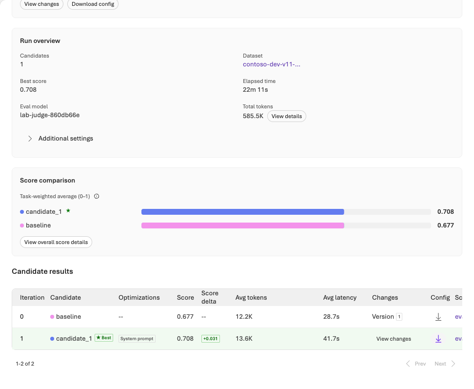

# 검증 기록과 한계

**2026-09-30 신규 Azure 환경에서 실제 실행했습니다. 최종 운영 판단은 HOLD입니다.**

리소스·서비스 실행 성공과 품질 합격은 다릅니다. 실제 Agent Optimizer와 SFT는 종료했지만 중요 실패·Judge 교정 불일치·미승인 사람 검토가 남았습니다. 합격선을 낮추거나 실패 응답을 재추첨하지 않았습니다.

정리한 근거는 [`evidence/integration-20260930/`](../evidence/integration-20260930/)에, 가공 전 API 응답·승인·전체 ID·환경 파일은 비공개 `.lab/lab-20260930-live/`에 있습니다. DEMO와 이전 v1 기록을 신규 LIVE 결과로 사용하지 않았습니다.

## 1. 실행과 품질 상태 {#status}

| 대상 | 실제 결과 | 판정 경계 |
|---|---|---|
| 새 RG·인프라 | `rg-foundry-eval-v11-20260930-eca723`, North Central US. ARM `Succeeded`, bootstrap의 리소스·연결·역할 소유 기록 25개 | 기존 환경 재사용 아님. 이후 SFT 모델 배포는 별도 소유 원장 |
| 모델 smoke | 새 gpt-4.1-mini 배포에서 실제 response ID, 입력 21/출력 2 토큰, 약 3.03초 | 연결 확인이지 품질 평가 아님 |
| 기준선 Agent | Foundry Agent Service 고정 버전에서 dev 3건 응답 | 지식 없는 기준선. 인용/업무 실패 보존 |
| Foundry IQ | 실제 embedding, 벡터 인덱스, vector/hybrid 질의, IQ 계획·출처, Agent의 MCP 호출 실행 | 직접 검색 진단과 Agent에 실제 제공된 근거를 분리 |
| IQ dev | 12건 캡처 완료. JSON 10/12, route 6/12, 인용 6/12, 중요 규칙 실패 3건 | 로컬 규칙도 통과하지 못함 |
| 업무 Judge | 실제 정책/관련성/검색 근거성 채점. IQ dev의 API·형식 오류/누락 8건을 분모에 유지 | 성공한 행만 평균 내어 통과 처리하지 않음 |
| 관리형 평가 | 실제 cloud eval/run 완료, 3건 수집 | 검색 없는 행의 서비스 groundedness 숫자는 검색 근거성으로 인정하지 않음 |
| Prompt Optimizer | 실제 서비스 제안과 변경 이유를 보존하고 새 Agent에서 3건 재평가 | 3건 모두 JSON 계약 실패. 서비스 완료 ≠ 개선 |
| Agent Optimizer | 실제 `succeeded`, 후보 1개, native baseline/candidate 각 12건 | 내장 순위는 개선됐으나 실습의 중요 규칙 실패는 남음 |
| SFT | 학습 전 기준선 → 파일 processed → 1 epoch 학습 succeeded → 실제 학습 모델 배포 Succeeded → paired 12×2 평가 | 일반 SFT이며 Frontier가 아님. 중요 실패가 남아 운영 합격 아님 |
| 대화형 진단 | 실제로 확인 질문을 했으나 JSON 밖 문장이 있어 첫 턴 형식 실패 | scripted follow-up을 실행한 것으로 꾸미지 않고 중단 |
| freeze·fresh12 | 후보/모델/검색/Judge/게이트/데이터를 동결한 **뒤** 12건 생성·등록 | 교정 HOLD 때문에 최종 유료 추론은 제출 전 차단 |
| Control Plane | 실제 IQ Agent의 모델 span 24개, 도구 span 11개를 response ID로 연결 | cloud evaluation event와의 자동 연결은 미확인. 정책 적용을 주장하지 않음 |
| 다음 데이터 | 실제 dev 실패 12건을 response ID와 연결한 검토 대기열 생성 | 정답은 비어 있고 사람 검토 PENDING, 자동 학습/승격 없음 |
| 사람 승인·Frontier | 사람 운영 승인 없음. Frontier 지원·참여 경로는 NOT_VERIFIED | 과금 승인, 일반 SFT, AI 검토가 대신하지 못함 |

원본은 Contoso 정책 8개와 사례 100건입니다. **train 56 / validation 12 / dev 12 / test 20**을 보존했습니다. 별도의 교정 16건과 대화 진단 1건은 원본 100건에 덮어쓰지 않았습니다.

## 2. 실제 작업 ID와 비교 {#observed}

### 관리형 cloud 평가

- Evaluation: `eval_42db44f4d5174b018cd4d00387638c9c`
- Run: `evalrun_415db05c42e744948446769ba2150dd5`
- 서비스 `completed`, 3건 전부 수집. 관련성 평균 **3.333/5**.
- 입력의 `retrieved_context`는 비어 있었습니다. 일부 서비스 grader 입력에서 답변이 context로 채워진 것도 관측했습니다. 로컬 수집기는 이를 실제 검색으로 인정하지 않아 groundedness를 **scored 0 / missing 3 / mean null**로 기록했습니다.

**서비스가 높은 groundedness를 반환해도 무엇을 근거로 채점했는지 확인해야 합니다.** 정답 정책을 Agent 검색 결과인 것처럼 주입하지 않았습니다.

### Judge 교정 — 실패를 보존한 변경

| 교정 | 실행 | 정책/관련성 일치 | 검색 근거성 일치 | 결과 |
|---|---|---|---|---|
| `cal-01` | 요청 메시지 type 누락으로 HTTP 400 | 점수 없음 | 점수 없음 | 오류 보존 |
| `cal-02-protocol` | 프로토콜만 수정한 새 실행 | 각각 16/16 | 14/15 | HOLD |
| `cal-03-boundaries` | 검색 Judge 1.1.0, 경계 모순을 더 엄격히 명시 | 각각 16/16 | 14/15 | HOLD |

1.0.0 Judge는 “엄격히 이전”에 정확히 같은 시각이 포함된다는 잘못된 답에 4점을 줬습니다. **holdout 생성 전** 1.1.0에서 이런 모순은 사소한 누락이 아니라고 명시했습니다. 합격선 4와 교정 요구 100%는 그대로이며 레이블·사례를 바꾸지 않았습니다. 새 교정에는 다른 불일치가 남아 **HOLD를 유지**했습니다. 같은 결과를 점수가 잘 나올 때까지 반복하지 않았습니다.

교정 참조도 AI 보조 작성 합성 자료입니다. 일치율이 높아도 전문가의 독립적인 정답 검토를 대신하지 않습니다.

### 두 Optimizer는 별도 실행

Prompt Optimizer는 일시적 제안 기능으로 원본·응답 JSON·변경 이유·후보 SHA-256을 보존했습니다. 이 응답에는 영구 작업 ID가 없어 만들어 넣지 않았습니다. 후보는 별도 Agent 버전으로 검사했고 3건 모두 형식 실패를 보였습니다.

Agent Optimizer:

- Run: `opt_e2a5acd01eb34e4b9248ba6305241e11`
- Best candidate: `cand_opt_e2a5acd01eb34e4b9248ba6305241e11_0001`
- Native evaluation: `eval_18177e4e0b114845806ae3b1a90cb030`
- Baseline run: `evalrun_0cb063a98c6546f0b39da75ebba5ca1d`
- Candidate run: `evalrun_ae7f020943174782a22906ffcbda84e3`

동일 dev 12건, Relevance v14와 Task Adherence v17, 합격선 4, instruction-only, 후보 1개였습니다. 서비스 task-weighted 평균은 **0.677083 → 0.708333**, native 통과 행은 **7/12 → 8/12**, 서비스 오류 행은 양쪽 모두 0입니다.

원본 native 응답을 다시 생성하지 않고 동일한 로컬 규칙으로 검사했습니다.

| 로컬 규칙 | Native baseline | Native candidate |
|---|---:|---:|
| 행 수 | 12 | 12 |
| JSON 계약 | 11/12 | 11/12 |
| route | 7/12 | 7/12 |
| 필수 인용 | 6/12 | 6/12 |
| 중요 규칙 실패 | 4 | 4 |

**서비스 순위가 올라도 업무 게이트 개선은 확인되지 않았습니다.** 0–1 순위, 1–5 Judge, 결정적 통과율을 섞지 않습니다. 실제 native 입력 템플릿과 각 행을 확인했으며 Agent의 user 입력은 `query`만이고 `ground_truth`는 평가용으로 분리되어 있었습니다.

별도 클라이언트 재실행 `optimized-dev`는 7번째 요청에서 429를 반환해 중단했습니다. 6건의 성공과 오류 1건만으로 12건 평균을 만들지 않았고 원본 요청/응답과 미시도 상태를 보존했습니다. 위 표는 이 부분 실행이 아니라 **서비스에서 완료한 native 12×2 응답**입니다.



### 일반 SFT의 실제 종료와 paired 평가

- Job: `ftjob-5c768d4bc0e44b6a8e66cbe21aa10813`
- 기반: `gpt-4.1-mini-2025-04-14`
- 실제 모델: `gpt-4.1-mini-2025-04-14.ft-5c768d4bc0e44b6a8e66cbe21aa10813`
- 배포: `lab-sft-860db66e`, Standard, capacity 20
- 56 train / 12 validation, 1 epoch, **30,722 trained tokens**.

같은 system·query/context·temperature 0·seed 105·Standard capacity 20에서 dev 12건씩 비교했습니다. JSON은 양쪽 12/12, route는 **10/12 → 11/12**, 인용은 **9/12 → 11/12**, 중요 실패는 **2 → 1**, API 오류는 양쪽 0입니다. 총 관측 토큰은 **7,385 → 7,226**입니다.

이는 **정적 정책 문맥을 제공한 동일 모델 계열의 작은 합성 dev 비교**입니다. 실제 IQ 검색 품질이나 미노출 실세계 개선율, Frontier 성과로 부르지 않습니다. 자세한 재개 명령은 [SFT 부록](sft-appendix.md)에 있습니다.

## 3. 동결·보류와 다음 평가 {#not-run}

`selected-v2`를 **2026-09-30 02:25:52.396539 UTC**에 동결한 뒤 `fresh-01` 12건을 생성·등록했습니다. 원본 100건, 교정 16건, 별도 대화 1건을 포함한 기존 **117건**과 비교했고 1,470쌍 검사에서 ID·상황 그룹·동일/고유사 질문 겹침이 검출되지 않았습니다.

이는 NFKC 정규화·숫자 masking·문자열/토큰 유사도 0.88 기준의 **어휘 검사**입니다. 템플릿에서 만든 합성 변형이며 독립 실세계 표본이나 의미상 무누출을 보증하지 않습니다.

최종 명령의 gate를 실제 확인했습니다. **교정 HOLD 때문에 model 요청 전에 종료 코드 1**로 차단됐고, `optimized-fresh` run 및 최종 attempt가 생성되지 않았습니다. 점수는 미측정입니다. 원래 test20의 최소 행 수·합격선을 줄여 통과시키지 않았습니다.

사람 검토, 교정 불일치 해결과 새 실험 설계가 필요합니다. 이 holdout을 보고 Judge를 유리하게 수정하거나 재채점하지 않습니다. 변경이 필요하면 실패·동결 기록을 보존하고 새 freeze와 새 holdout을 사용합니다.

대화 진단은 실제 확인 질문 뒤에 JSON 밖 설명 문장이 붙어 형식 gate에서 중단됐습니다. **사용자 후속 입력과 최종 답변까지 성공했다고 보고하지 않습니다.** scripted 입력은 실제 사용자나 사람의 승인도 아닙니다.

## 4. 인증·검색·관측에서 확인한 함정

| 실제 관측 | 반영한 조치 |
|---|---|
| 폐기 모델이 catalog/쿼터 조회에는 남음 | 실제 Provider validation을 추가하고 생성 전 명시적으로 모델을 다시 선택 |
| 프로젝트와 모델 생성이 충돌 | 계정 하위 작업을 순서대로 생성. 동일 ID/설정의 의존성 수정만 이력으로 보존 |
| MI App Insights 연결에 라우팅 메타데이터 필요 | 같은 새 관측 자원을 참조하도록 추가. key 인증이나 local auth를 켜지 않음 |
| Search 상태가 소문자 `succeeded` | 실제 응답 표현을 처리하되 누락/오류 상태는 성공으로 간주하지 않음 |
| Azure MCP 관리 도구의 데이터 평면 테넌트 불일치 | 해당 호출 거부를 보존. 검증한 CLI/SDK/브라우저를 사용. Agent 내부 Search MCP의 프로젝트 MI와는 다른 경로 |
| 장시간 실행 뒤 CAE/MFA 갱신 요구 | 정상 로그인/MFA 후 주체를 다시 확인. 명시한 Graph audience·구독으로 원래 provisioner ID가 일치하는지 검증. 정책 완화 없음 |
| 긴 검색/SDK 봉투로 토큰 제한 | 원본 429 보존, 명시적 pacing과 문답 전용 Judge projection. 이미 실패한 Judge를 다른 경로로 재채점하지 않음 |
| 빈 관측 화면/누락된 evaluation event | 실제 response ID별 model/tool span만 확인. 연결되지 않은 항목은 PARTIAL/NOT_VERIFIED |

실제 embedding은 `text-embedding-3-small` v1, 1,536차원이고 인덱스는 HNSW/cosine입니다. vector와 hybrid는 실제 문서를 반환했으며 IQ 응답의 계획·출처·활동도 보존했습니다. 실제 Agent는 기존 Foundry Agent Service 버전과 `knowledge_base_retrieve` MCP 도구를 사용했습니다.

Control Plane에서는 IQ dev의 model span 24개와 tool span 11개를 관측했습니다. 평가와의 자동 event 연결·공유 정책 적용은 완료로 표시하지 않습니다. 실제 dev 실패는 response ID가 포함된 **검토 전용 대기열**로 내보냈고, 정답/사람 검토/학습 승격은 자동 생성하지 않았습니다.

## 5. 비용과 보존

실제 Cost Management 조회는 성공했지만 아직 비용 행이 없었습니다. **0원이라는 뜻이 아닙니다.** 사용량은 SDK/서비스가 반환한 토큰·지연으로 기록하고 청구액은 미관측으로 둡니다.

| 보존 중 과금 항목 | 조회한 참고 단가 |
|---|---:|
| Search Basic 1 replica × 1 partition | USD 0.101/시간 |
| SFT Standard 모델 호스팅 | USD 1.70/시간 |
| 위 두 호스팅 항목 합계 | 약 USD 1.801/시간, USD 43.224/24시간 |

추론·IQ planner·평가·최적화·학습·로그 사용량은 별도입니다. 이 소매 참고 단가는 실제 청구서·세금 포함 확정액이 아니며 가격/계약은 변할 수 있습니다. Azure Budget은 지출 차단 장치가 아닙니다.

**금액 상한 없음이 승인되었으며, 새 RG는 검토를 위해 보존합니다. 삭제는 승인되지 않았습니다.** 기존 그룹·배포·다른 프로젝트 권한을 줄이거나 삭제하지 않았습니다.

## 6. 로컬·출판 검증 {#local}

전체 자동 검사, 원본 데이터 byte/hash·누출 검사, 실제 문서 CLI 문법, 링크·목차·코드 복사·모바일·인쇄 검사를 구분해 수행했습니다. Playwright **headless**로 웹 검증과 PDF 생성을 진행했습니다. Foundry 포털은 headless 세션에 인증이 없어 정상 로그인/MFA가 있는 브라우저를 사용했으며 자격 증명을 복사하지 않았습니다.

좌측 상단과 파비콘은 Microsoft 공식 Azure 아이콘 패키지의 Foundry SVG를 동일 파일로 사용합니다. 원본 모양/색상을 바꾸지 않았고 [출처·사용 조건](../web/assets/NOTICE.txt)을 포함했습니다.

```bash
python -m lab validate
python -m unittest discover -s tests -q
python scripts/build_guide.py
python scripts/build_guide.py --check
python scripts/verify_pdf.py Foundry-Learning-Loop-Lab-KO.pdf
python scripts/package_lab.py
```

독립 ZIP을 새 폴더에 풀어 SDK·자격 증명·네트워크·subprocess 없이 DEMO를 실행했고 원본 100건 검사도 통과했습니다. v1 실행 파일/README가 필요하지 않습니다.

## 7. 재개할 때 지킬 기준 {#checks}

| 상태 | 재개 |
|---|---|
| 원격 ID가 있는 작업 | 같은 ID의 status/collect. create/submit 반복 금지 |
| 429·연결 단절 후 response ID 없음 | 원본 보존, 결과 불명. 성공한 일부 행으로 통과 처리하지 않음 |
| 교정 HOLD | 전문가 검토·새 실험 설계. 현재 final gate 우회 금지 |
| Frontier NOT_VERIFIED | 공식 지원 경로와 해당 계정 참여 확인 전 제출하지 않음 |
| 관측 PARTIAL | 실제 response ID와 MI/ingestion/평가 연결을 확인. 빈 화면을 무오류로 해석하지 않음 |
| 미승인 운영 전환 | 실제 책임자의 별도 승인. AI가 작성한 검토는 AI로 유지 |

## 기록 갱신 원칙 {#update}

원본 API 응답, 실패, remote ID, 코드 커밋/해시, 데이터·프롬프트·모델·검색·평가기·게이트를 연결합니다. 출판물에는 안전하게 정리한 증거만 포함하며 키·토큰·MFA 정보·개인정보는 넣지 않습니다. 현재 v1 저장소의 Private 상태와 작업 브랜치를 유지하고, 보관 원본의 상태 변경 및 외부 공유는 소유자의 별도 결정으로 남깁니다.
